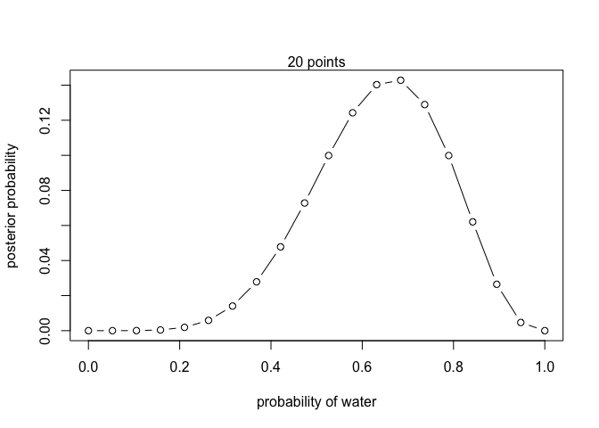
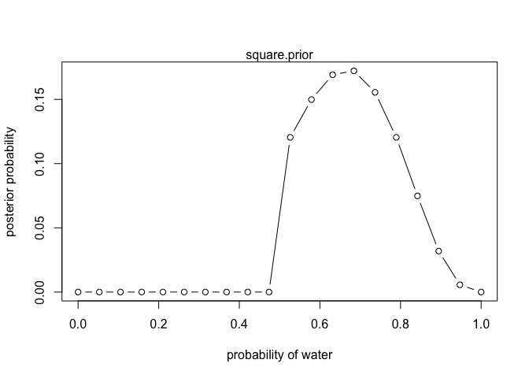
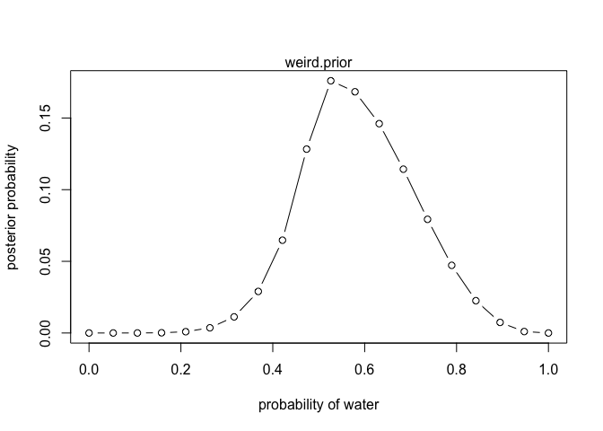
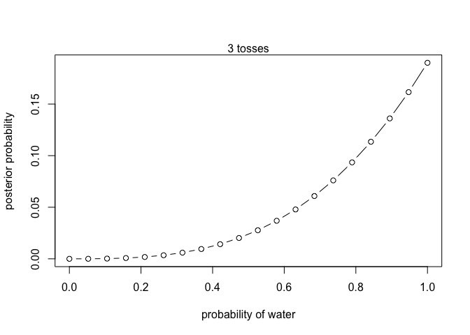
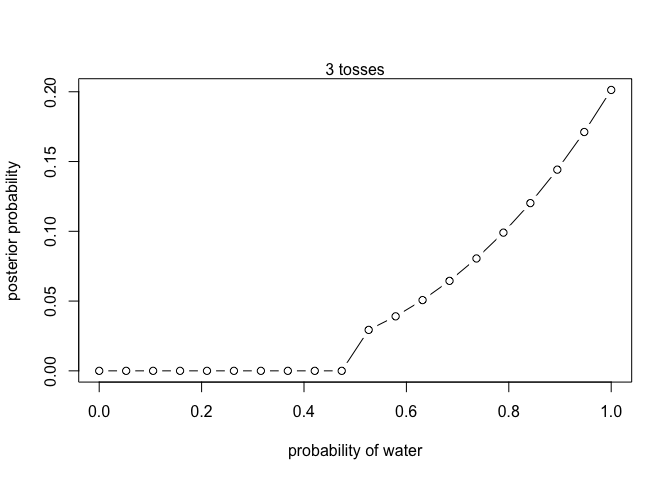

Assignment: 
* Watch Lecture 2
* Read Chapter 2
(The lecture moves on into Chapter 3, but we will limit our reading to chapter 2).

*Chapter 2 problems:
*2 E1, 2E2, 2E3
* 2M1, 2M2, 2M3, 2M4, 2M5

Optional: the rest of the problems.


#### Notes, video Lecture 02

stopped around minute 49.  Got a bit confused with grid approximations; hope reading helps

##### Notes, Chapter 2 - p 19
p 23  Notice that the number of ways to produce the data, for each conjecture, can be computed
by first counting the number of paths in each “ring” of the garden and then by multiplying
these counts together. This is just a computational device.

using a prior: it must be "logically independent of the previous observations"
(in his example, it was an indpendnet repeat of the same procedure) but the prior data and new data can be of different types. 

counts are usually transformed to probabilities to make them easier to use. 

p27:  So it’ll be helpful to define p as the proportion of marbles that are blue. For [
], p = 1=4 = 0:25.  

I guess p in this case is simply the fraction of marbles in bag that are blue.  (Yes, that is the proportion!)


```r
9+27+32
```

```
## [1] 68
```

```r
9/68
```

```
## [1] 0.1323529
```
in this case, plausibility is the new estimate for hte proporiton of marbles in bag that are blue.

#### does it work the following way?


```r
ways <- 3 + 8 + 9
3/ways  #0.15
```

```
## [1] 0.15
```

```r
8/ways # 0.4
```

```
## [1] 0.4
```
Yes, this is the same thing!
See bottom of page 27 to finish
here, p = parameter value.
likelihood = # ways you can get observed outcome

## Section 2.2 (page 28)

parameter = unobserved variable; can be inferred from other variables.
"likelihood" won't be used much. but would be distribution function applied to observed variable.
binomial distributin = coin tossing distribution. every toss independent, probability same on each toss


```r
dbinom( 6 , size=9 , prob=0.5 )
```

```
## [1] 0.1640625
```

```r
dbinom( 6 , size=9 , prob=0.7 )
```

```
## [1] 0.2668279
```
so below: just tested 1000 values for probability.  

maximum entropy = 2 events possible, total proportion = 1

p 37  - Bayes theorem

Bayesian approaches get to use Bayes’ theorem more generally, to quantify uncertainty about theoretical entities that cannot be observed, like parameters and models.

R code 2.3


```r
# define grid
p_grid <- seq( from=0 , to=1 , length.out=20 )
# define prior
prior <- rep( 1 , 20 )
# compute likelihood at each value in grid
likelihood <- dbinom( 6 , size=9 , prob=p_grid )
# compute product of likelihood and prior
unstd.posterior <- likelihood * prior
# standardize the posterior, so it sums to 1
posterior <- unstd.posterior / sum(unstd.posterior)
```

plot it

```r
plot( p_grid , posterior , type="b" ,
xlab="probability of water" , ylab="posterior probability" ) + mtext( "20 points" )
```

<!-- -->

```
## integer(0)
```

Rcode 2.5


```r
prior <- ifelse( p_grid < 0.5 , 0 , 1 ) 
likelihood <- dbinom( 6 , size=9 , prob=p_grid )
# compute product of likelihood and prior
unstd.posterior <- likelihood * prior
# standardize the posterior, so it sums to 1
posterior <- unstd.posterior / sum(unstd.posterior)
plot( p_grid , posterior , type="b" ,
xlab="probability of water" , ylab="posterior probability" ) + mtext( "square.prior" )
```

<!-- -->

```
## integer(0)
```

```r
prior <- exp( -5*abs( p_grid - 0.5 ) )
likelihood <- dbinom( 6 , size=9 , prob=p_grid )
# compute product of likelihood and prior
unstd.posterior <- likelihood * prior
# standardize the posterior, so it sums to 1
posterior <- unstd.posterior / sum(unstd.posterior)
plot( p_grid , posterior , type="b" ,
xlab="probability of water" , ylab="posterior probability" ) + mtext( "weird.prior" )
```

<!-- -->

```
## integer(0)
```

quadratic approximations - p 42
Gaussian distribution is convenient, because it can be completely described by only two numbers: the location of its center (mean) and its spread (variance).


```r
?dbinom
p_grid <- seq(0, 1, length.out = 1000)
prob_p <- rep(1,1000)
prob_data <- dbinom(6, 9, prob = p_grid)
posterior <- prob_data *prob_p
posterior <- posterior/sum(posterior)
```
Rcode 2.6

```r
library(rethinking)
```

```
## Loading required package: rstan
```

```
## Loading required package: ggplot2
```

```
## Loading required package: StanHeaders
```

```
## rstan (Version 2.18.2, GitRev: 2e1f913d3ca3)
```

```
## For execution on a local, multicore CPU with excess RAM we recommend calling
## options(mc.cores = parallel::detectCores()).
## To avoid recompilation of unchanged Stan programs, we recommend calling
## rstan_options(auto_write = TRUE)
```

```
## Loading required package: parallel
```

```
## rethinking (Version 1.88)
```

```r
globe.qa <- quap(
  alist(
    W ~ dbinom( W+L ,p) , # binomial likelihood
    p ~ dunif(0,1) # uniform prior
    ) ,
  data=list(W=6,L=3) )

# display summary of quadratic approximation
precis( globe.qa )  # gives me 89% percentile interval
```

```
##        mean        sd      5.5%     94.5%
## p 0.6666664 0.1571338 0.4155362 0.9177966
```

```r
?alist
```
Rcode 2.7

```r
W <- 6
L <- 3
curve( dbeta( x , W+1 , L+1 ) , from=0 , to=1 )
# quadratic approximation
curve( dnorm( x , 0.67 , 0.16 ) , lty=2 , add=TRUE )
```

<!-- -->
This doesn't plot as expcted.    p 44

MCMC example

Rcode 2.8

```r
n_samples <- 1000 
p <- rep( NA , n_samples )
p[1] <- 0.5
W <- 6
L <- 3
# ok, started out with .5 (as first prior)
for ( i in 2:n_samples ) {
  p_new <- rnorm( 1 , p[i-1] , 0.1 )
  if ( p_new < 0 ) p_new <- abs( p_new )
  if ( p_new > 1 ) p_new <- 2 - p_new
  q0 <- dbinom( W , W+L , p[i-1] )
  q1 <- dbinom( W , W+L , p_new )
  p[i] <- ifelse( runif(1) < q1/q0 , p_new , p[i-1] )
}

#dens( p , xlim=c(0,1) )
#curve( dbeta( x , W+1 , L+1 ) , lty=2 , add=TRUE )
```

# Problems

*Chapter 2 problems:
*2 E1, 2E2, 2E3
* 2M1, 2M2, 2M3, 2M4, 2M5

**See p 37**

### 2E1. Which of the expressions below correspond to the statement: the probability of rain on Monday?
(2) Pr(rain| Monday)

### 2E2. Which of the following statements corresponds to the expression: Pr(Monday|rain)?
(3) The probability that it is Monday, given that it is raining.  (I think)

### 2E3. Which of the expressions below correspond to the statement: the probability that it is Monday, given that it is raining?
(1) Pr(Monday|rain)  see above as well.


### 2M1. Recall the globe tossing model from the chapter. Compute and plot the grid approximate posterior distribution for each of the following sets of observations. In each case, assume a uniform prior for p.
(1) W, W, W
(2) W, W, W, L
(3) L, W, W, L, W, W, W


```r
# define first grid, with 3 W selected
p_grid <- seq( from=0 , to=1 , length.out=20 )
# define prior
prior <- rep( 1 , 20 )
# compute likelihood at each value in grid
likelihood.1 <- dbinom( 3 , size=3 , prob=p_grid )
# compute product of likelihood and prior
unstd.posterior.1 <- likelihood.1 * prior
# standardize the posterior, so it sums to 1
posterior.1 <- unstd.posterior.1 / sum(unstd.posterior.1)

plot( p_grid , posterior.1 , type="b" , xlab="probability of water" , ylab="posterior probability" ) + mtext( "3 tosses" )
```

<!-- -->

```
## integer(0)
```
4 tosses, W, W, W, L

```r
# define first grid, with 3 W selected
p_grid <- seq( from=0 , to=1 , length.out=20 )
# define prior
prior <- rep( 1 , 20 )
# compute likelihood at each value in grid
likelihood.2 <- dbinom( 3 , size=4 , prob=p_grid )
# compute product of likelihood and prior
unstd.posterior.2 <- likelihood.2 * prior
# standardize the posterior, so it sums to 1
posterior.2 <- unstd.posterior.2 / sum(unstd.posterior.2)

plot( p_grid , posterior.2 , type="b" , xlab="probability of water" , ylab="posterior probability" ) + mtext( "4 tosses" )
```

<!-- -->

```
## integer(0)
```

7 tosses, L, W, W, L, W, W, W

```r
# define first grid, with 3 W selected
p_grid <- seq( from=0 , to=1 , length.out=20 )
# define prior
prior <- rep( 1 , 20 )
# compute likelihood at each value in grid
likelihood.3 <- dbinom( 5 , size=7 , prob=p_grid )
# compute product of likelihood and prior
unstd.posterior.3 <- likelihood.3 * prior
# standardize the posterior, so it sums to 1
posterior.3 <- unstd.posterior.3 / sum(unstd.posterior.3)

plot( p_grid , posterior.3 , type="b" , xlab="probability of water" , ylab="posterior probability" ) + mtext( "7 tosses" )
```

<!-- -->

```
## integer(0)
```
That is a little bit narrower than the preceding chart.

### 2M2. Now assume a prior for p that is equal to zero when p < 0.5 and is a positive constant when p >= 0:5. Again compute and plot the grid approximate posterior distribution for each of the sets of observations in the problem just above.

As above, but change the formula for the prior

```r
# define first grid, with 3 W selected
p_grid <- seq( from=0 , to=1 , length.out=20 )
# define prior
prior.2 <- c(rep( 0 , 10 ), rep(1, 10))
# compute likelihood at each value in grid
likelihood.1 <- dbinom( 3 , size=3 , prob=p_grid )
# compute product of likelihood and prior
unstd.posterior.1 <- likelihood.1 * prior.2
# standardize the posterior, so it sums to 1
posterior.1 <- unstd.posterior.1 / sum(unstd.posterior.1)

plot( p_grid , posterior.1 , type="b" , xlab="probability of water" , ylab="posterior probability" ) + mtext( "3 tosses" )
```

<!-- -->

```
## integer(0)
```

4 tosses, W, W, W, L

```r
# compute likelihood at each value in grid
likelihood.2 <- dbinom( 3 , size=4 , prob=p_grid )
# compute product of likelihood and prior
unstd.posterior.2 <- likelihood.2 * prior.2
# standardize the posterior, so it sums to 1
posterior.2 <- unstd.posterior.2 / sum(unstd.posterior.2)

plot( p_grid , posterior.2 , type="b" , xlab="probability of water" , ylab="posterior probability" ) + mtext( "4 tosses" )
```

<!-- -->

```
## integer(0)
```

7 tosses, L, W, W, L, W, W, W

```r
# compute likelihood at each value in grid
likelihood.3 <- dbinom( 5 , size=7 , prob=p_grid )
# compute product of likelihood and prior
unstd.posterior.3 <- likelihood.3 * prior.2
# standardize the posterior, so it sums to 1
posterior.3 <- unstd.posterior.3 / sum(unstd.posterior.3)

plot( p_grid , posterior.3 , type="b" , xlab="probability of water" , ylab="posterior probability" ) + mtext( "7 tosses" )
```

<!-- -->

```
## integer(0)
```
### 2M3. Suppose there are two globes, one for Earth and one for Mars. 
The Earth globe is 70% covered in water. The Mars globe is 100% land. Further suppose that one of these globes—you don’t know which—was tossed in the air and produced a “land” observation. Assume that each globe was equally likely to be tossed. Show that the posterior probability that the globe was the Earth, conditional on seeing “land” (Pr(Earth|land)), is 0.23.

Look at p37 again.

Want: Pr(Earth)

We know:
observation: land 
Pr(land|Earth) = 0.3   (prob land, given Earth, is 0.3)
Pr(land|Mars) = 1.0   (prob land, given Mars, is 1.0)

The prior expectation that Earth was tossed = 0.5

Using the binomical, if earth was tossed, Pr(land|Earth) = 


```r
prior.earth <- 0.5
likelihood.earth <- dbinom(1, size = 1, prob = .3)
unstd.posterior <- likelihood.earth * prior.earth # 0.15
avg.post <- (1 + 0.3)/2

post.prob <- unstd.posterior/avg.post 
post.prob  # 0.23
```

```
## [1] 0.2307692
```
Tricky bit: properly calculate the average probability of getting the result 'land' with one throw

### 2M2M4. Suppose you have a deck with only three cards. Each card has two sides, and each side is either black or white. 
One card has two black sides. The second card has one black and one white side. The
third card has two white sides. Now suppose all three cards are placed in a bag and shuffled. Someone
reaches into the bag and pulls out a card and places it flat on a table. A black side is shown facing up,
but you don’t know the color of the side facing down. Show that the probability that the other side is
also black is 2/3. Use the counting method (Section 2 of the chapter) to approach this problem. This
means counting up the ways that each card could produce the observed data (a black side facing up
on the table).

OK, let's think about this.  Overall, there are 6 card sides to consider. The ways to obtain a black side initially are:

Bb, Bw, ww  - so there are 2 out of 3 ways to get this initial result (1st side is black).  Of these 3 possible outcomes, 2 ways for BB to be selected, and only 1 way for BW to be selected.  

Thus the Pr(BB) = 2/3

### 2M5. Now suppose there are four cards: B/B, B/W, W/W, and another B/B. 
Again suppose a card is drawn from the bag and a black side appears face up. Again calculate the probability that the other side is black.

Now, there are 8 sides:  2 BB, 1 BW, 1 WW.  Possible ways to get a B side = 5 (2 * 2 + 1)
Of these 5 ways, 4 of them are from the BB cards.  So 4/5.
The probability the second side is also B is 0.8  (4 out of 5)


