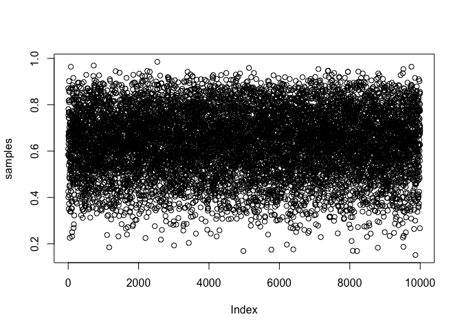
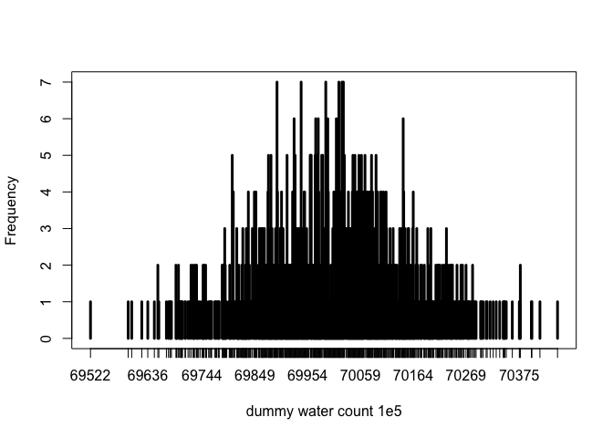
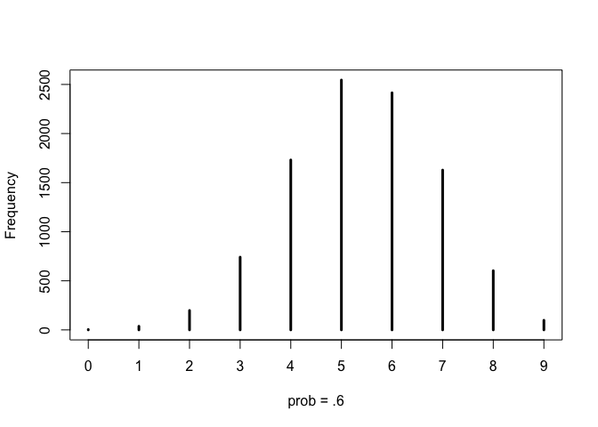

*Problems:*
3E1 - 3E7
3M1 - 3M4

https://github.com/rmcelreath/statrethinking_winter2019

### Lecture 2, starting around minute 48

intervals:
percentile intervals - usually we put certain amount in each tail.
nice for symmetric disributions

HDPI = highest posterior density interval.  this is the narrowest interval containing the specified mass.  Makes sense, esp. for asymetric distributions.  

point estimates: usually not so useful!

what to call CI?  credible interval?  compatibility interval?

merge together all the possible p values


sampling from posterior.
probabilities come from the samples
posterior probability from each value p.  use proper weights for each value of p.
posterior predictive distribution.

overdispersed binomial distribution

'probabilites come from the samples in the posterior distribution'

### Chapter 3
The posterior distribution is a probability distribution! 
MCMC, for example, only produce samples from the computed posterior.

##### 3.1  Sampling from grid-approximate posterior

Posterior = probability of p, conditional on the data

code 3.2

```r
p_grid <- seq( from=0 , to=1 , length.out=1000 )
prob_p <- rep( 1 , 1000 )
prob_data <- dbinom( 6 , size=9 , prob=p_grid )
posterior <- prob_data * prob_p
posterior <- posterior / sum(posterior)
```
Now, draw 10,000 samples from this posterior.  the values of these samples will have same proportions as in the exact posterior density.

Code 3.3

```r
samples <- sample( p_grid , prob=posterior , size=1e4 , replace=TRUE )
# sample, pulls values from vector p_grid.  probability of each value determined by the posterior.
```
3.4, 3.5

```r
plot(samples)
library(rethinking)
```

```
## Loading required package: rstan
```

```
## Loading required package: ggplot2
```

```
## Loading required package: StanHeaders
```

```
## rstan (Version 2.18.2, GitRev: 2e1f913d3ca3)
```

```
## For execution on a local, multicore CPU with excess RAM we recommend calling
## options(mc.cores = parallel::detectCores()).
## To avoid recompilation of unchanged Stan programs, we recommend calling
## rstan_options(auto_write = TRUE)
```

```
## Loading required package: parallel
```

```
## rethinking (Version 1.88)
```

<!-- -->

```r
dens(samples)
```

<!-- -->
I have replicated my original, posterior density.

##### 3.2  Sampling to summarize

code 3.6

```r
# add up posterior probability where p < 0.5 
sum( posterior[ p_grid < 0.5 ] )
```

```
## [1] 0.1718746
```
Now do the same with my sampled 10k

code 3.7

```r
sum(samples < 0.5)/1e4
```

```
## [1] 0.1667
```
code 3.8

```r
sum( samples > 0.5 & samples < 0.75 ) / 1e4
```

```
## [1] 0.6102
```

```r
# samples < 0.5
# sum(samples > 0.5 & samples < 0.75) # 6082
# sum(samples > 0.5) # 8306
```
confidence interval = interval of defined mass

code 3.9

```r
quantile(samples, 0.8)
```

```
##       80% 
## 0.7617618
```
code 3.10

```r
quantile(samples, c(0.1, 0.9))
```

```
##       10%       90% 
## 0.4524525 0.8138138
```
equal probability mass assigned to each tail.  

code 3.11, 3.12

```r
p_grid <- seq( from=0 , to=1 , length.out=1000 )
prior <- rep(1,1000)
likelihood <- dbinom( 3 , size=3 , prob=p_grid )  # 3 tosses, all water
posterior <- likelihood * prior
posterior <- posterior / sum(posterior)
samples <- sample( p_grid , size=1e4 , replace=TRUE , prob=posterior )

PI(samples, prob = 0.5)
```

```
##       25%       75% 
## 0.7067067 0.9329329
```
PI is percentile interval.  not a great choice in this case!
instead, highest posterior density interval (HDPI) is a better choice


```r
HPDI(samples, prob = 0.5)
```

```
##      |0.5      0.5| 
## 0.8428428 1.0000000
```
What if the probablitly mass is .8?


```r
PI(samples, prob = 0.8)  # .56 to .97
```

```
##       10%       90% 
## 0.5575576 0.9759760
```

```r
HPDI(samples, prob = 0.8) #.67 to 1
```

```
##      |0.8      0.8| 
## 0.6666667 1.0000000
```

What if the probablitly mass is .95?


```r
PI(samples, prob = 0.95)  # .56 to .97
```

```
##        3%       98% 
## 0.3923924 0.9939940
```

```r
HPDI(samples, prob = 0.95) #.67 to 1
```

```
##     |0.95     0.95| 
## 0.4674675 1.0000000
```
Differences become smaller.

what if I want to provide a single summary number?
Maximum a posteriori estimate (MAP)
code 3.14

```r
p_grid[which.max(posterior)]
```

```
## [1] 1
```
or pull out the mode from samples

```r
chainmode(samples, adj = 0.01)
```

```
## [1] 0.9939948
```

```r
mean(samples)
```

```
## [1] 0.8008939
```

```r
median(samples)
```

```
## [1] 0.8428428
```

Or instead, choose a LOSS FUNCTION, a rule telling cost associated with using any single point estimate
(loss is proportional to distace of my estimate from the true value)
loss is minimized if we choose median of posterior.

to calculate expected loss, use posterior to average over uncertainty in tru value.

code 3.18

```r
loss <- sapply( p_grid , function(d) sum( posterior*abs( d - p_grid ) ) )
```
somehow, this gives me 1,000 values for loss.  I don't get the 'd' part of the above

above: absolute loss.  another choice is quadratic loss (d - p)2


##### 3.3  sampling to simulate prediction
samples also can be used to simulate model; can help with model checks

###### 3.3.1  Dummy data
Dummy data: what model predicts you'd see at specific parameters

```r
rbinom( 1 , size=2 , prob=0.7 )
```

```
## [1] 1
```
code 3.23

```r
dummy_w <- rbinom( 1e5 , size=2 , prob=0.7 )
table(dummy_w)/1e5
```

```
## dummy_w
##       0       1       2 
## 0.09082 0.41904 0.49014
```

code 3.24

```r
dummy_w <- rbinom( 1e5 , size=9 , prob=0.7 ) #100k samples
table(dummy_w)/1e5
```

```
## dummy_w
##       0       1       2       3       4       5       6       7       8 
## 0.00003 0.00050 0.00418 0.02095 0.07309 0.17139 0.26776 0.26540 0.15677 
##       9 
## 0.03993
```

```r
simplehist( dummy_w , xlab="dummy water count" )
```

<!-- -->

OK, what if my sample size is much bigger?  I assume I'll have tighter distribution

```r
dummy_test <- rbinom( 1e5 , size=1e3 , prob=0.7 ) #1000 samples
simplehist( dummy_test, xlab="dummy water count 1e3" )
```

<!-- -->

```r
# better
dummy_test <- rbinom( 1e5 , size=1e5 , prob=0.7 ) #100k samples
simplehist( dummy_test, xlab="dummy water count 1e5" )
```

<!-- -->

```r
# as above, but reduce number of pulls
dummy_test <- rbinom( 1e3 , size=1e5 , prob=0.7 ) #100k samples
simplehist( dummy_test, xlab="dummy water count 1e5" )
```

<!-- -->
OK, this is just a way to simulate observations given a particular model.  


###### 3.3.2  model checking 
p. 64

'retrodictions' - make sure model produces samples that look like the data used to fit model. 

want to comine sampling of simulated observations with sampling parameters from posterior distribution. (that is, use entire posterior, not just one point estimate derived from it)

Two ways model can be uncertain:
first, even if probability is known for sure, you can't determine what next outcome of trial will be with certainty.  
second, there is uncertainty about the true probability. the posterior distribution over p is this.  

* posterior predictive distribution* is simply computation of sampling distribution of outcomes at every value of p.  See Figure 3.6.

R code 3.25, 3.26

```r
w <- rbinom( 1e4 , size=9 , prob=0.6 )
table(w)
```

```
## w
##    0    1    2    3    4    5    6    7    8    9 
##    4   37  198  741 1731 2545 2415 1628  603   98
```

```r
simplehist( w , xlab="prob = .6" )
```

<!-- -->


```r
# but now replace prob of .6 with **samples from the posterior**
w <- rbinom( 1e4 , size=9 , prob=samples )
table(w)
```

```
## w
##    0    1    2    3    4    5    6    7    8    9 
##    7   50  134  318  508  810 1093 1643 2315 3122
```

```r
simplehist( w , xlab="prob = samples" )
```

<!-- -->

## Homework
3E1 - 3E7
### Easy
code 3.27

```r
p_grid <- seq( from=0 , to=1 , length.out=1000 ) 
prior <- rep( 1 , 1000 )
likelihood <- dbinom( 6 , size=9 , prob=p_grid )
posterior <- likelihood * prior
posterior <- posterior / sum(posterior)
set.seed(100)
samples <- sample( p_grid , prob=posterior , size=1e4 , replace=TRUE )
```

First, let's look at samples

```r
library(rethinking)
dens( samples )
```

<!-- -->
### 3E1.
How much posterior probability lies below p = 0.2?


```r
sum( samples < 0.2 ) / 1e4
```

```
## [1] 5e-04
```

```r
# that is a small value: 5 e-4
```

### 3E2
 How much posterior probability lies above p = 0.8?
 

```r
sum( samples > 0.8 ) / 1e4
```

```
## [1] 0.1117
```

```r
# larger value:  0.12
```
### 3E3
How much posterior probability lies between p = 0.2 and p = 0.8?
 

```r
sum( samples > 0.2 & samples < 0.8 ) / 1e4
```

```
## [1] 0.8878
```

```r
# large value:  0.8773
```
### 3E4
20% of the posterior probability lies below which value of p?

```r
quantile( samples , 0.2 )
```

```
##       20% 
## 0.5195195
```

```r
#  0.514
```

### 3E5
20% of the posterior probability lies above which value of p?

Here, calculate 80% quantile and then subtract from 1

```r
quantile( samples , 0.8 )
```

```
##       80% 
## 0.7567568
```

```r
# 0.76
```
### 3E6. 
Which values of p contain the narrowest interval equal to 66% of the posterior probability?
the narrowest interval containing the specified probability mass is HPDI


```r
HPDI(samples, prob = 0.66)
```

```
##     |0.66     0.66| 
## 0.5205205 0.7847848
```
### 3E7. 
Which values of p contain 66% of the posterior probability, assuming equal posterior probability both below and above the interval?

This is asking for the tails to be of equal weight

```r
PI( samples , prob=0.66 ) # short way
```

```
##       17%       83% 
## 0.5005005 0.7687688
```

```r
quantile( samples , c( (.34/2) , (1 - (.34/2) ) ))  # this is same
```

```
##       17%       83% 
## 0.5005005 0.7687688
```

### 3M1. 
Suppose the globe tossing data had turned out to be 8 water in 15 tosses. Construct the posterior distribution, using grid approximation. Use the same flat prior as before.

Just modify previous block


```r
p_grid <- seq( from=0 , to=1 , length.out=1000 ) 
prior <- rep( 1 , 1000 )
likelihood.M <- dbinom( 8 , size=15 , prob=p_grid )
posterior.M <- likelihood.M * prior
posterior.M <- posterior.M / sum(posterior.M)
```
That seems OK to me.

### 3M2. 
Draw 10,000 samples from the grid approximation from above. Then use the samples to calculate the 90% HPDI for p.
(Here, I am generating a vector of probabilities that describe my data)

```r
set.seed(100)
samples.M <- sample( p_grid , prob=posterior.M , size=1e4 , replace=TRUE )
```
and look at it

```r
dens(samples.M)
```

<!-- -->
then calculate the 90% HPDI for p.

```r
HPDI(samples.M, prob = 0.9)
```

```
##      |0.9      0.9| 
## 0.3243243 0.7157157
```
That seems OK

###  3M3. 
Construct a posterior predictive check for this model and data. This means simulate the distribution of samples, averaging over the posterior uncertainty in p. What is the probability of observing 8 water in 15 tosses?

I think that I make dummy data using the model, and then see how the 8 water picks is distributed
(Here, I am using my vector of probabilities, derived from real data, to generate faux data)

generate 100,000 dummy observations, for prob using my samples from posterior

```r
dummy_3M3 <- rbinom( 1e5 , size=15 , prob = samples.M )

# now, what fraction of samples have n = 8?
sum( dummy_3M3 == 8 ) / 1e5
```

```
## [1] 0.14628
```
About 15%.  Not as high as it might be?  But what about values of 7, 8, 9? 

```r
sum( dummy_3M3 > 6 & dummy_3M3 < 10 ) / 1e5
```

```
## [1] 0.41914
```
so about 42% of values are in that range of 3 possible picks.  that seems reasonable.

Overall, this method seems really circular

###  3M4. 
Using the posterior distribution constructed from the new (8/15) data, now calculate the probability  of observing 6 water in 9 tosses.

Again, use my dummy data.  What is probability of 6 water in 9 tosses?

the posterior is posterior.M; I used it to generate my dummy probability density:
samples.M <- sample( p_grid , prob=posterior.M , size=1e4 , replace=TRUE )
and I used this to generate dummy samples
dummy_3M3 <- rbinom( 1e5 , size=15 , prob = samples.M )

Now, do the same, except that size is 9


```r
dummy_3M4 <- rbinom( 1e5 , size=9 , prob = samples.M )

# now, what fraction of samples have n = 6?
sum( dummy_3M4 == 6 ) / 1e5
```

```
## [1] 0.17435
```

So 17.7% of the draws.
