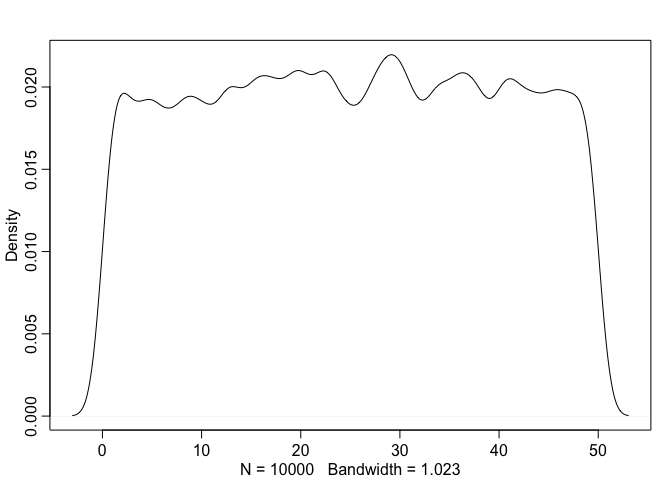
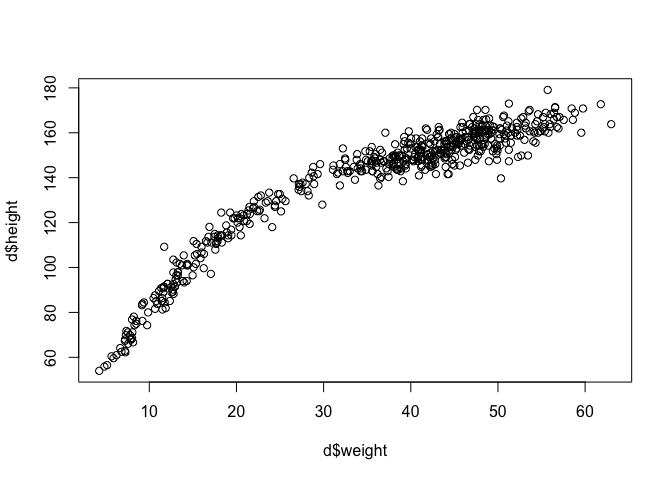

## Video 4 

line = 1st order polynomial
parabola = 2nd order polynomial

almost always: center predictor, and then divide by SD to make Z scores.  value 1 means 1 SD from mean

(Read up more on Z scores)

splines
spline is a bar with metal weight attached to bend it (knots); make smooth curves. 
locally wiggly!  basis function is a local function. (basis means component, here)

can tune individual local functions. 

predictor variables are 'synthetic data' that defines range of curve.
actual predictor of interest is not in your model!!
B define ranges that each parameter is releveant to; that parement is w, or weight.  like slope.
B variables turn on parameters over differnt ranges of x axis 

degree 1 basis funciton = straight line

cubic splines - flexible but not crazy.  commonly used. 

spline slides - I don't understand the middle graph in figure 4.13.  


## Reading: Finish chapter 4  (I need to start on page 80)


```r
library(rethinking)
```

```
## Loading required package: rstan
```

```
## Loading required package: ggplot2
```

```
## Loading required package: StanHeaders
```

```
## rstan (Version 2.18.2, GitRev: 2e1f913d3ca3)
```

```
## For execution on a local, multicore CPU with excess RAM we recommend calling
## options(mc.cores = parallel::detectCores()).
## To avoid recompilation of unchanged Stan programs, we recommend calling
## rstan_options(auto_write = TRUE)
```

```
## Loading required package: parallel
```

```
## rethinking (Version 1.88)
```

```r
data(Howell1)

d <- Howell1
precis(d)
```

```
##               mean         sd      5.5%     94.5%     histogram
## height 138.2635963 27.6024476 81.108550 165.73500 ▁▁▁▁▁▁▁▂▁▇▇▅▁
## weight  35.6106176 14.7191782  9.360721  54.50289 ▁▂▃▂▂▂▂▅▇▇▃▂▁
## age     29.3443934 20.7468882  1.000000  66.13500     ▇▅▅▃▅▂▂▁▁
## male     0.4724265  0.4996986  0.000000   1.00000    ▇▁▁▁▁▁▁▁▁▇
```

```r
d2 <- d[ d$age >= 18 ,]
plot(d2$height)
```

<!-- -->

```r
dens(d2$height)
```

<!-- -->


```r
curve( dnorm(x, 178, 20), from = 100, to=250)
```

<!-- -->

```r
curve( dunif(x, 0, 50), -10, 60)
```

<!-- -->
p 83
Now, simulate heights by sampling from prior
code 4.14

```r
sample_mu <- rnorm(1e4, 178, 20)
sample_sigma <- runif(1e4, 0, 50)
prior_h <- rnorm(1e4, sample_mu, sample_sigma)
dens(prior_h)
```

<!-- -->
### section 4.3.3  grid approximation


```r
mu.list <- seq( from=140, to=160 , length.out=200 ) 
sigma.list <- seq( from=4 , to=9 , length.out=200 )
post <- expand.grid( mu=mu.list , sigma=sigma.list )

post$LL <- sapply( 1:nrow(post) , function(i) sum( dnorm(
  d2$height ,
  mean=post$mu[i] ,
  sd=post$sigma[i] ,
  log=TRUE ) ) )

post$prod <- post$LL + dnorm( post$mu , 178 , 20 , TRUE ) +
  dunif( post$sigma , 0 , 50 , TRUE )

post$prob <- exp( post$prod - max(post$prod) )

contour_xyz(post$mu, post$sigma, post$prob)
```

<!-- -->

```r
image_xyz(post$mu, post$sigma, post$prob)
```

<!-- -->

OK, now sample from this posterior distribution. randomly sample row numbers in proportion to values in post$prob


```r
sample.rows <- sample( 1:nrow(post) , size=1e4 , replace=TRUE ,
  prob=post$prob )
?sample
```

```
## Help on topic 'sample' was found in the following packages:
## 
##   Package               Library
##   dplyr                 /Library/Frameworks/R.framework/Versions/3.5/Resources/library
##   base                  /Library/Frameworks/R.framework/Resources/library
## 
## 
## Using the first match ...
```

```r
sample.mu <- post$mu[ sample.rows ]
sample.sigma <- post$sigma[ sample.rows ]

plot( sample.mu , sample.sigma , cex=0.5 , pch=16 , col=col.alpha(rangi2,0.1) )
```

<!-- -->
summarize samples (paramaters)
These (sample.mu) are marginal posterior densities; marginal here means averaging over other parameters


```r
dens(sample_mu)
```

<!-- -->

```r
dens(sample.mu)  # weird.  plotting artifact?
```

<!-- -->

```r
dens(sample_sigma)
```

<!-- -->

```r
dens(sample.sigma)
```

<!-- -->

```r
HPDI(sample.mu)
```

```
##    |0.89    0.89| 
## 153.8693 155.1759
```

```r
HPDI(sample.sigma)
```

```
##    |0.89    0.89| 
## 7.266332 8.195980
```

### 4.3.5  Quap
p 88
quadratic approximation as way to make inferences about shape of posterior.  


```r
precis(d2)
```

```
##             mean         sd     5.5%     94.5%       histogram
## height 154.59709  7.7423321 142.8750 167.00500       ▁▃▇▇▅▇▂▁▁
## weight  44.99049  6.4567081  35.1375  55.76588         ▁▅▇▇▃▂▁
## age     41.13849 15.9678551  20.0000  70.00000 ▂▅▇▅▃▇▃▃▂▂▂▁▁▁▁
## male     0.46875  0.4997328   0.0000   1.00000      ▇▁▁▁▁▁▁▁▁▇
```
code 4.27

```r
flist <- alist(
    height ~ dnorm( mu , sigma ) ,
    mu ~ dnorm( 178 , 20 ) ,
    sigma ~ dunif( 0 , 50 )
)

m4.1 <- quap(flist, data = d2)
precis(m4.1)
```

```
##             mean        sd       5.5%      94.5%
## mu    154.606986 0.4119919 153.948543 155.265429
## sigma   7.731282 0.2913812   7.265598   8.196965
```

```r
HPDI(sample.mu)
```

```
##    |0.89    0.89| 
## 153.8693 155.1759
```

```r
HPDI(sample.sigma)
```

```
##    |0.89    0.89| 
## 7.266332 8.195980
```
list vs alist - list executes code, but alist does not.  
so for list of formulas, use alist!
p 89  (p 98 is end of previous assignment .. . )


```r
m4.2 <- quap(
    alist(
      height ~ dnorm( mu , sigma ) ,
      mu ~ dnorm( 178 , 0.1 ) ,
      sigma ~ dunif( 0 , 50 )
    ) , data=d2 )

precis( m4.2 )
```

```
##            mean        sd      5.5%     94.5%
## mu    177.86375 0.1002354 177.70356 178.02395
## sigma  24.51756 0.9289235  23.03297  26.00216
```

multi-dimenstional Gaussian distribution

```r
vcov( m4.1)
```

```
##                mu       sigma
## mu    0.169737348 0.000217199
## sigma 0.000217199 0.084902995
```

```r
diag( vcov( m4.1 ) )
```

```
##        mu     sigma 
## 0.1697373 0.0849030
```

```r
cov2cor( vcov( m4.1 ) )
```

```
##                mu       sigma
## mu    1.000000000 0.001809287
## sigma 0.001809287 1.000000000
```

to sample from multi-dimensional posterior, need to sample vectors of vlues


```r
post <- extract.samples( m4.1, n = 1e4)
head(post)
```

```
##         mu    sigma
## 1 153.7860 7.933645
## 2 154.2141 7.587646
## 3 154.4812 8.215657
## 4 154.8734 7.592491
## 5 154.2283 7.724032
## 6 154.9175 7.872795
```

```r
precis(post)
```

```
##             mean        sd       5.5%      94.5%     histogram
## mu    154.600653 0.4136342 153.942707 155.258071       ▁▁▅▇▂▁▁
## sigma   7.732287 0.2901373   7.270972   8.198375 ▁▁▁▁▂▅▇▇▃▁▁▁▁
```
### 4.4  - add predictor.  
how is an outcome (height) related to predictor (weight) ?


```r
plot( d2$height ~ d2$weight)
```

<!-- -->
linear model


```r
set.seed(2971) 
N <- 100 # 100 lines
a <- rnorm( N , 178 , 20 )
b <- rnorm( N , 0 , 10 )
```
plot

```r
plot( NULL , xlim=range(d2$weight) , ylim=c(-100,400) , 
    xlab="weight" , ylab="height" )
abline( h=0 , lty=2 )
abline( h=272 , lty=1 , lwd=0.5 )
mtext( "b ~ dnorm(0,10)" )
xbar <- mean(d2$weight)
for ( i in 1:N ) curve( a[i] + b[i]*(x - xbar) ,
  from=min(d2$weight) , to=max(d2$weight) , add=TRUE ,
  col=col.alpha("black",0.2) )
```

<!-- -->
make sure beta is always positive.  to do this, use log normal!!
thta is, claim log of beta has normal distribution


```r
b <- rlnorm(1e4, 0, 1)
dens(b, xlim=c(0,5), adj = 0.1)
```

<!-- -->

```r
plot( NULL , xlim=range(d2$weight) , ylim=c(-100,400) , 
    xlab="weight" , ylab="height" )
abline( h=0 , lty=2 )
abline( h=272 , lty=1 , lwd=0.5 )
mtext( "b ~ dnorm(0,10)" )
xbar <- mean(d2$weight)
for ( i in 1:N ) curve( a[i] + b[i]*(x - xbar) ,
  from=min(d2$weight) , to=max(d2$weight) , add=TRUE ,
  col=col.alpha("black",0.2) )
```

<!-- -->


```r
set.seed(2971)
N <- 100 # 100 lines
a <- rnorm( N , 178 , 20 )
b <- rlnorm( N , 0 , 1 )
```

4.4.2   posterior


```r
# load data again, since it's a long way back
library(rethinking)
data(Howell1)
d <- Howell1
d2 <- d[ d$age >= 18 , ]

# define the average weight, x-bar
xbar <- mean(d2$weight)

# fit model
m4.3 <- quap(
  alist(
    height ~ dnorm( mu , sigma ) ,
    mu <- a + b*( weight - xbar ) ,
    a ~ dnorm( 178 , 20 ) ,
    b ~ dlnorm( 0 , 1 ) ,
    sigma ~ dunif( 0 , 50 )
  ) ,
  data=d2 )
precis(m4.3)
```

```
##              mean         sd        5.5%       94.5%
## a     154.6013671 0.27030766 154.1693633 155.0333710
## b       0.9032807 0.04192363   0.8362787   0.9702828
## sigma   5.0718809 0.19115478   4.7663786   5.3773831
```

4.4.3

plotting!


```r
plot( height ~ weight , data=d2 , col=rangi2 ) 
post <- extract.samples( m4.3 )
a_map <- mean(post$a)
b_map <- mean(post$b)
curve( a_map + b_map*(x - xbar) , add=TRUE ) 
```

<!-- -->

## why did this work?  where did x come from in above plot?  how did R know x was weight?

estimate model with only 10 samples from original dataset

```r
N <- 10
dN <- d2[ 1:N , ]

mN <- quap(
  alist(
    height ~ dnorm( mu , sigma ) ,
    mu <- a + b*( weight - mean(weight) ) ,
    a ~ dnorm( 178 , 20 ) ,
    b ~ dlnorm( 0 , 1 ) ,
    sigma ~ dunif( 0 , 50 )
  ) , data=dN )
```

now plot 20 lines from resulting model (sampling from posterior) 

```r
# extract 20 samples from the posterior
post <- extract.samples( mN , n=20 )

# display raw data and sample size
plot( dN$weight , dN$height ,
      xlim=range(d2$weight) , ylim=range(d2$height) ,
      col=rangi2 , xlab="weight" , ylab="height" )
mtext(concat("N = ",N))

# plot the lines, with transparency
for ( i in 1:20 )
  curve( post$a[i] + post$b[i]*(x-mean(dN$weight)) ,
       col=col.alpha("black",0.3) , add=TRUE )
```

<!-- -->
Mess around with additional datapoints

```r
N <- 200
dN <- d2[ 1:N , ]

mN <- quap(
  alist(
    height ~ dnorm( mu , sigma ) ,
    mu <- a + b*( weight - mean(weight) ) ,
    a ~ dnorm( 178 , 20 ) ,
    b ~ dlnorm( 0 , 1 ) ,
    sigma ~ dunif( 0 , 50 )
  ) , data=dN )

# extract 20 samples from the posterior
post <- extract.samples( mN , n=20 )

# display raw data and sample size
plot( dN$weight , dN$height ,
      xlim=range(d2$weight) , ylim=range(d2$height) ,
      col=rangi2 , xlab="weight" , ylab="height" )
mtext(concat("N = ",N))

# plot the lines, with transparency
for ( i in 1:20 )
  curve( post$a[i] + post$b[i]*(x-mean(dN$weight)) ,
       col=col.alpha("black",0.3) , add=TRUE )
```

<!-- -->

Say I want to display uncertainty in height around a single weight

```r
post <- extract.samples( m4.3 )
mu_at_50 <- post$a + post$b * ( 50 - xbar )

dens( mu_at_50 , col=rangi2 , lwd=2 , xlab="mu|weight=50" )
```

<!-- -->
Note that adding Gaussian distributions always produces Gaussian distributions.

OK, repeat this for every weight value
link function makes this easy


```r
mu <- link( m4.3 ) 
str(mu)
```

```
##  num [1:1000, 1:352] 157 157 157 157 157 ...
```

```r
# head(mu)
```

## link takes quap approximation, samples from posterior distribution, and computes mu for each case in the data and sample from the poterior distribution

HUH?  Well, returns matrix.  each row is sample from posterior (1k is default); each column represents a case in the data (original data).  

```r
mu[1:10, 1:10]
```

```
##           [,1]     [,2]     [,3]     [,4]     [,5]     [,6]     [,7]
##  [1,] 157.0548 146.7919 142.6098 161.7758 151.1280 170.7815 148.3827
##  [2,] 156.8167 147.0341 143.0477 161.3167 151.1673 169.9010 148.5504
##  [3,] 157.4723 146.6984 142.3080 162.4283 151.2504 171.8824 148.3684
##  [4,] 156.9377 145.9795 141.5140 161.9785 150.6093 171.5943 147.6780
##  [5,] 157.2345 147.3204 143.2804 161.7950 151.5091 170.4946 148.8571
##  [6,] 157.4789 147.0813 142.8442 162.2618 151.4742 171.3856 148.6929
##  [7,] 157.2991 146.9658 142.7550 162.0525 151.3317 171.1199 148.5675
##  [8,] 157.2712 146.7890 142.5175 162.0930 151.2177 171.2912 148.4137
##  [9,] 156.6640 147.6092 143.9194 160.8292 151.4349 168.7747 149.0127
## [10,] 157.4589 147.0187 142.7643 162.2614 151.4297 171.4227 148.6369
##           [,8]     [,9]    [,10]
##  [1,] 163.9823 145.3294 163.0843
##  [2,] 163.4200 145.6401 162.5640
##  [3,] 164.7447 145.1631 163.8020
##  [4,] 164.3345 144.4180 163.3757
##  [5,] 163.9265 145.9076 163.0590
##  [6,] 164.4972 145.5996 163.5874
##  [7,] 164.2741 145.4933 163.3700
##  [8,] 164.3467 145.2953 163.4295
##  [9,] 162.7759 146.3189 161.9836
## [10,] 164.5061 145.5309 163.5925
```

```r
head(d2)  # these are systematically smaller than in mu
```

```
##    height   weight age male
## 1 151.765 47.82561  63    1
## 2 139.700 36.48581  63    0
## 3 136.525 31.86484  65    0
## 4 156.845 53.04191  41    1
## 5 145.415 41.27687  51    0
## 6 163.830 62.99259  35    1
```

## Why don't the values in 'mu' match the values in d2 better????


```r
# define sequence of weights to compute predictions for 
# these values will be on the horizontal axis
weight.seq <- seq( from=25 , to=70 , by=1 )
# use link to compute mu
# for each sample from posterior
# and for each weight in weight.seq
mu <- link( m4.3 , data=data.frame(weight=weight.seq) )
str(mu)
```

```
##  num [1:1000, 1:46] 136 138 136 136 137 ...
```
plot

```r
# use type="n" to hide raw data 4.55
plot( height ~ weight , d2 , type="n" )
# loop over samples and plot each mu value
for ( i in 1:100 )
points( weight.seq , mu[i,] , pch=16 , col=col.alpha(rangi2,0.1) )
```

<!-- -->

summarize


```r
# summarize the distribution of mu
mu.mean <- apply( mu , 2 , mean )
mu.HPDI <- apply( mu , 2 , HPDI , prob=0.89 )
```
plot


```r
# plot raw data
# fading out points to make line and interval more visible
plot( height ~ weight , data=d2 , col=col.alpha(rangi2,0.5) )
# plot the MAP line, aka the mean mu for each weight
lines( weight.seq , mu.mean )
# plot a shaded region for 89% HPDI
shade( mu.HPDI , weight.seq )
```

<!-- -->
p 107 - nice summary of process.  

#### 4.4.3.5  Prediction intervals
prediction intervals for actual heights, not just average height.  need to use sigma for this.

sim will do this, using mu and sigma from posteriod distribution


```r
sim.height <- sim(m4.3, data = list(weight = weight.seq))
str(sim.height)
```

```
##  num [1:1000, 1:46] 135 136 145 146 140 ...
```

```r
height.PI <- apply( sim.height , 2 , PI , prob=0.89 )
```

plot it all

```r
# plot raw data 4
plot( height ~ weight , d2 , col=col.alpha(rangi2,0.5) )

# draw MAP line
lines( weight.seq , mu.mean )

# draw HPDI region for line
shade( mu.HPDI , weight.seq )

# draw PI region for simulated heights
shade( height.PI , weight.seq)
```

<!-- -->

## 4.5   Curves!!


```r
library(rethinking) 
data(Howell1)
d <- Howell1
str(d)
```

```
## 'data.frame':	544 obs. of  4 variables:
##  $ height: num  152 140 137 157 145 ...
##  $ weight: num  47.8 36.5 31.9 53 41.3 ...
##  $ age   : num  63 63 65 41 51 35 32 27 19 54 ...
##  $ male  : int  1 0 0 1 0 1 0 1 0 1 ...
```

```r
plot(d$weight, d$height)
```

<!-- -->
to fit polynomial, first standardize predictor (weight)

how to assign prior for beta-2? He asserts we don't want oto limit to a positive number


```r
d$weight_s <- ( d$weight - mean(d$weight) )/sd(d$weight)  # Z scores

d$weight_s2 <- d$weight_s^2

m4.5 <- quap(
  alist(
    height ~ dnorm( mu , sigma ) ,
    mu <- a + b1*weight_s + b2*weight_s2 ,
    a ~ dnorm( 178 , 20 ) ,
    b1 ~ dlnorm( 0 , 1 ) ,
    b2 ~ dnorm( 0 , 1 ) ,
    sigma ~ dunif( 0 , 50 )
    ) ,
  data=d )
```


```r
precis(m4.5)
```

```
##             mean        sd       5.5%      94.5%
## a     146.057416 0.3689756 145.467722 146.647110
## b1     21.733061 0.2888891  21.271361  22.194762
## b2     -7.803272 0.2741839  -8.241471  -7.365073
## sigma   5.774476 0.1764652   5.492450   6.056501
```
Note that value of a no longer = mean height in the sample.

plot

```r
weight.seq <- seq( from=-2.2 , to=2 , length.out=30 ) 
pred_dat <- list( weight_s=weight.seq , weight_s2=weight.seq^2 )
mu <- link( m4.5 , data=pred_dat )
mu.mean <- apply( mu , 2 , mean )
mu.PI <- apply( mu , 2 , PI , prob=0.89 )
sim.height <- sim( m4.5 , data=pred_dat )
height.PI <- apply( sim.height , 2 , PI , prob=0.89 )
```
plot

```r
plot( height ~ weight_s , d , col=col.alpha(rangi2,0.5) ) 
lines( weight.seq , mu.mean )
shade( mu.PI , weight.seq )
shade( height.PI , weight.seq )
```

<!-- -->
And now a cubic version!

```r
d$weight_s3 <- d$weight_s^3

m4.6 <- quap(
  alist(
    height ~ dnorm( mu , sigma ) ,
    mu <- a + b1*weight_s + b2*weight_s2 + b3*weight_s3 ,
    a ~ dnorm( 178 , 20 ) ,
    b1 ~ dlnorm( 0 , 1 ) ,
    b2 ~ dnorm( 0 , 10 ) ,
    b3 ~ dnorm( 0 , 10 ) ,
    sigma ~ dunif( 0 , 50 )
    ) ,
  data=d )
```

Bonus:  plot data on original scale, not z scores

```r
plot( height ~ weight_s , d , col=col.alpha(rangi2,0.5) , xaxt="n" )  # x axis not plotted
at <- c(-2,-1,0,1,2) 
labels <- at*sd(d$weight) + mean(d$weight)
axis( side=1 , at=at , labels=round(labels,1) )
```

<!-- -->

### Splines!  


```r
library(rethinking) 
data(cherry_blossoms)
d <- cherry_blossoms
precis(d)
```

```
##                   mean          sd      5.5%      94.5%       histogram
## year       1408.000000 350.8845964 867.77000 1948.23000   ▇▇▇▇▇▇▇▇▇▇▇▇▁
## doy         104.540508   6.4070362  94.43000  115.00000        ▁▂▅▇▇▃▁▁
## temp          6.141886   0.6636479   5.15000    7.29470        ▁▃▅▇▃▂▁▁
## temp_upper    7.185151   0.9929206   5.89765    8.90235 ▁▂▅▇▇▅▂▂▁▁▁▁▁▁▁
## temp_lower    5.098941   0.8503496   3.78765    6.37000 ▁▁▁▁▁▁▁▃▅▇▃▂▁▁▁
```


```r
plot(d$year, d$temp)
```

<!-- -->
B-splines - invent new, synthetic predictor values. Each is applied within specific range, and is called a basis function.
The B variables (basis functions) tell you which 'knot' you are close to.

the parameter 'w' determines influence of each basis function.  these weight parameters were obtained by fitting the model to the data! These can be positive or negative. 

Note: instead of linear approximations for the B variables, we could use polynomials! 

First, make model with knots placed at quantiles of predictor variable

```r
d2 <- d[ complete.cases(d$temp) , ] # complete cases on temp 
num_knots <- 15
knot_list <- quantile( d2$year , probs=seq(0,1,length.out=num_knots) )
length(knot_list)
```

```
## [1] 15
```

Now for splines, must choose polynomial degree.  Degree 1 was our first example; here, 2 basis functions combine at each point.  Let's try cubic spline (4 basis functions combine per point)


```r
library(splines)
B <- bs(d2$year,
        knots=knot_list[-c(1,num_knots)] ,
        degree=3 , intercept=TRUE )

B[1:10, 1:17]
```

```
##               1          2            3            4 5 6 7 8 9 10 11 12 13
##  [1,] 1.0000000 0.00000000 0.0000000000 0.000000e+00 0 0 0 0 0  0  0  0  0
##  [2,] 0.9697645 0.03006521 0.0001700700 2.206279e-07 0 0 0 0 0  0  0  0  0
##  [3,] 0.9401447 0.05917776 0.0006757944 1.765023e-06 0 0 0 0 0  0  0  0  0
##  [4,] 0.9111342 0.08734939 0.0015104442 5.956954e-06 0 0 0 0 0  0  0  0  0
##  [5,] 0.8827268 0.11459183 0.0026672909 1.412019e-05 0 0 0 0 0  0  0  0  0
##  [6,] 0.8549160 0.14091682 0.0041396056 2.757849e-05 0 0 0 0 0  0  0  0  0
##  [7,] 0.8276956 0.16633611 0.0059206597 4.765563e-05 0 0 0 0 0  0  0  0  0
##  [8,] 0.8010592 0.19086143 0.0080037244 7.567537e-05 0 0 0 0 0  0  0  0  0
##  [9,] 0.7750005 0.21450451 0.0103820711 1.129615e-04 0 0 0 0 0  0  0  0  0
## [10,] 0.7495131 0.23727710 0.0130489708 1.608377e-04 0 0 0 0 0  0  0  0  0
##       14 15 16 17
##  [1,]  0  0  0  0
##  [2,]  0  0  0  0
##  [3,]  0  0  0  0
##  [4,]  0  0  0  0
##  [5,]  0  0  0  0
##  [6,]  0  0  0  0
##  [7,]  0  0  0  0
##  [8,]  0  0  0  0
##  [9,]  0  0  0  0
## [10,]  0  0  0  0
```

## WHY are there 17 columns here?  there were 15 knots (which start at beginning and end at end of data, I believe )

Now try this model


```r
m4.7 <- quap( 
  alist(
    T ~ dnorm( mu , sigma ) ,
    mu <- a + B %*% w ,
    a ~ dnorm(6,10),
    w ~ dnorm(0,1),
    sigma ~ dexp(1)
    ),
  data=list( T=d2$temp , B=B ) ,
  start=list( w=rep( 0 , ncol(B) ) ) )
```


```r
precis(m4.7, depth = 2)
```

```
##              mean         sd       5.5%      94.5%
## w[1]   0.09747948 0.26767379 -0.3303149  0.5252739
## w[2]   0.23888189 0.27907084 -0.2071272  0.6848910
## w[3]   1.20069982 0.27168479  0.7664951  1.6349046
## w[4]  -0.82198039 0.25928709 -1.2363712 -0.4075895
## w[5]   0.10175744 0.25744810 -0.3096943  0.5132092
## w[6]  -1.40469545 0.25709287 -1.8155795 -0.9938114
## w[7]   1.15649825 0.25690767  0.7459102  1.5670863
## w[8]  -1.91586091 0.25691229 -2.3264564 -1.5052655
## w[9]   2.34740487 0.25687622  1.9368671  2.7579427
## w[10] -2.32070518 0.25692448 -2.7313201 -1.9100902
## w[11]  0.93548433 0.25691470  0.5248850  1.3460836
## w[12] -1.61488242 0.25720045 -2.0259384 -1.2038264
## w[13]  0.18054142 0.25766854 -0.2312627  0.5923455
## w[14] -1.24146851 0.26046625 -1.6577439 -0.8251931
## w[15]  0.03146222 0.27038229 -0.4006609  0.4635853
## w[16]  0.99681253 0.27475662  0.5576984  1.4359267
## w[17]  2.03579103 0.26839683  1.6068411  2.4647410
## a      6.32227294 0.24276564  5.9342866  6.7102593
## sigma  0.34423632 0.00726227  0.3326298  0.3558428
```

OK, plot posterior predictions


```r
post <- extract.samples(m4.7)
w <- apply( post$w , 2 , mean )
plot( NULL , xlim=range(d2$year) , ylim=c(-2,2) ,
      xlab="year" , ylab="basis * weight" )
for ( i in 1:ncol(B) ) lines( d2$year , w[i]*B[,i] )
```

<!-- -->
And now determine posterior intervals for mu


```r
mu <- link(m4.7)

mu_PI <- apply(mu, 2, PI, 0.97)
plot(d2$year, d2$temp, col = col.alpha(rangi2, 0.3), pch = 16)
shade(mu_PI, d2$year, col = col.alpha("black", 0.5))
```

<!-- -->

### OK, as above, but increase # knots to 30


```r
d2 <- d[ complete.cases(d$temp) , ] # complete cases on temp 
num_knots <- 30
knot_list <- quantile( d2$year , probs=seq(0,1,length.out=num_knots) )
length(knot_list)
```

```
## [1] 30
```

```r
B <- bs(d2$year,
        knots=knot_list[-c(1,num_knots)] ,
        degree=3 , intercept=TRUE )

B[1:10, 1:17]
```

```
##               1          2            3            4 5 6 7 8 9 10 11 12 13
##  [1,] 1.0000000 0.00000000 0.0000000000 0.000000e+00 0 0 0 0 0  0  0  0  0
##  [2,] 0.9480393 0.05141175 0.0005475286 1.376578e-06 0 0 0 0 0  0  0  0  0
##  [3,] 0.8979105 0.09991460 0.0021638434 1.101262e-05 0 0 0 0 0  0  0  0  0
##  [4,] 0.8495807 0.14557256 0.0048095381 3.716760e-05 0 0 0 0 0  0  0  0  0
##  [5,] 0.8030170 0.18844967 0.0084452062 8.810098e-05 0 0 0 0 0  0  0  0  0
##  [6,] 0.7581865 0.22860995 0.0130314414 1.720722e-04 0 0 0 0 0  0  0  0  0
##  [7,] 0.7150564 0.26611740 0.0185288372 2.973408e-04 0 0 0 0 0  0  0  0  0
##  [8,] 0.6735938 0.30103606 0.0248979873 4.721662e-04 0 0 0 0 0  0  0  0  0
##  [9,] 0.6337658 0.33342994 0.0320994853 7.048079e-04 0 0 0 0 0  0  0  0  0
## [10,] 0.5955395 0.36336306 0.0400939248 1.003525e-03 0 0 0 0 0  0  0  0  0
##       14 15 16 17
##  [1,]  0  0  0  0
##  [2,]  0  0  0  0
##  [3,]  0  0  0  0
##  [4,]  0  0  0  0
##  [5,]  0  0  0  0
##  [6,]  0  0  0  0
##  [7,]  0  0  0  0
##  [8,]  0  0  0  0
##  [9,]  0  0  0  0
## [10,]  0  0  0  0
```

```r
m4.8 <- quap( 
  alist(
    T ~ dnorm( mu , sigma ) ,
    mu <- a + B %*% w ,
    a ~ dnorm(6,10),
    w ~ dnorm(0,1),
    sigma ~ dexp(1)
    ),
  data=list( T=d2$temp , B=B ) ,
  start=list( w=rep( 0 , ncol(B) ) ) )

mu <- link(m4.8)

mu_PI <- apply(mu, 2, PI, 0.97)
plot(d2$year, d2$temp, col = col.alpha(rangi2, 0.3), pch = 16)
shade(mu_PI, d2$year, col = col.alpha("black", 0.5))
```

<!-- -->
Indeed, it is wigglier now.


## Problems: 4M4, 4M5, 4M6, 4H1, 4H2

I think I'd better start with 4M1

### 4M1
For the model definition below, simulate observed heights from the prior (not the posterior).


```r
sample_mu <- rnorm(1e4, 0,10 )
sample_sigma <- runif(1e4, 0, 10)

prior_y <- rnorm(1e4, sample_mu, sample_sigma)

dens(prior_y)
```

<!-- -->

### 4M2
Make the above a quap function.  What to do about data?

```r
#m4.m2 <- quap(
#  alist(
#    y ~ dnorm(mu, sigma),
#   mu ~ dnorm(0, 10),
#    sigma ~ dunif(0, 10)
#  )
#)

# can't actually run without data
```
### 4M3
Translate quap below into mathematical definitions


```r
flist <- alist(
    y ~ dnorm( mu , sigma ),
    mu <- a + b*x,
    a ~ dnorm( 0 , 50 ),
    b ~ dunif( 0 , 10 ),
    sigma ~ dunif( 0 , 50 )
)
```


$$ y_i \sim Normal (\mu_i, \sigma) \ mu_i = \alpha + \beta x_i \ \alpha \sim Normal(0, 50) \ \beta \sim Uniform(0, 10) \ \sigma \sim Uniform(0, 50) $$
y ~ normal(mu, sigma)
mu = a + beta * x
a ~ normal(0, 50)
b ~ uniform(0, 10)
sigma ~ uniform(0, 50)

### 4M4
A sample of students is measured for height each year for 3 years. After the third year, you want to fit a linear regression predicting height using year as a predictor. Write down the mathematical model definition for this regression, using any variable names and priors you choose. Be prepared to defend your choice of priors.

height ~ Normal(mu, sigma)
mu ~ a + beta*year
a ~ Normal(150, 20)       
*I'm assuming that students are about 12 years old; internet search shows mean height in US about 150 cm. SD of 20 seems pretty generous*
beta ~ Log-Normal(0, 1)  
*I'm assuming there is no shrinkage over time, and that most students don't grow much over three years*
sigma ~ dunif(0, 50)
*This seems pretty broad to me; maybe should be more restricted?*

### 4M5
Now suppose I tell you that the average height in the first year was 120 cm and that every student got taller each year. Does this information lead you to change your choice of priors? How?

Yes, now I would change my a prior to be:
a ~ Normal(120, 20)     
And maybe I'd change my beta as well, since beta should always be > 0
beta ~ Log-Normal(0.1, 1) 

How different is that prior?


```r
dens(rlnorm( 1e4 , 0 , 1 )) 
```

<!-- -->

```r
dens(rlnorm( 1e4 , 0.1 , 1 ))
```

<!-- -->
Subtle difference by eye.

### 4M6
Now suppose I tell you that the variance among heights for students of the same age is never more than 64cm. How does this lead you to revise your priors?

I'd want to limit my sigma value so absolute max is 64
So now I'd have:

height ~ Normal(mu, sigma)
mu ~ a + beta*year
a ~ Normal(120, 20)       
*mean value provided*
beta ~ Log-Normal(0.1, 1)  
*I'm assuming there is no shrinkage over time, and that all students grow at least some*
sigma ~ dunif(0, 64)
*using suggested max variance*


### 4H1
The weights listed below were recorded in the !Kung census, but heights were not recorded for these individuals. Provide predicted heights and 89% intervals (either HPDI or PI) for each of these individuals.

I think that I need to regenerate models from the chapter, and then retrieve mu and HPDI for each of the 5 given weights.
Given these weights, I will stick to the over 18 subset of the data


```r
library(rethinking) 
data(Howell1)
d <- Howell1
d.4h1 <- d[ d$age >= 18 , ]
precis(d.4h1)
```

```
##             mean         sd     5.5%     94.5%       histogram
## height 154.59709  7.7423321 142.8750 167.00500       ▁▃▇▇▅▇▂▁▁
## weight  44.99049  6.4567081  35.1375  55.76588         ▁▅▇▇▃▂▁
## age     41.13849 15.9678551  20.0000  70.00000 ▂▅▇▅▃▇▃▃▂▂▂▁▁▁▁
## male     0.46875  0.4997328   0.0000   1.00000      ▇▁▁▁▁▁▁▁▁▇
```
In my case, I'll use the population mean as the prior; why not?  mean height is 155; 

my linear model will be mu = a + beta*weight.  I'll use quap  (see p 98)


```r
# avg weight defined
xbar <- mean(d.4h1$weight)  # about 45 kg

m.4h1 <- quap(
  alist(
    height ~ dnorm(mu, sigma),
    mu <- a + b*(weight - xbar),
    a ~ dnorm(155, 20),
    b ~ dlnorm(0, 1),
    sigma ~ dunif(0, 50)
  ),
  data = d.4h1
)

precis(m.4h1)
```

```
##              mean         sd        5.5%       94.5%
## a     154.5971651 0.27030746 154.1651615 155.0291686
## b       0.9032806 0.04192363   0.8362785   0.9702826
## sigma   5.0718808 0.19115474   4.7663786   5.3773830
```
Now I think that I want to extract samples from the posterior.

```r
post.4h1 <- extract.samples( m.4h1 , n=1e4 )
```
And now I want to determine what intervals are for given weights

First one is 46.95; test it

```r
mu.1 <- post.4h1$a + post.4h1$b * ( 46.95 - xbar )
length(mu.1) # 1e4, vector I believe
```

```
## [1] 10000
```

```r
dens( mu.1 , col=rangi2 , lwd=2 , xlab="mu|weight=1st" )
```

<!-- -->
and

```r
chainmode( mu.1 , adj=0.01 ) # 156.35 is the 'most expected' height
```

```
## [1] 156.3159
```

```r
HPDI( mu.1 , prob=0.89 )
```

```
##    |0.89    0.89| 
## 155.9102 156.8143
```
Can I do this systematically for all 5 values?
I am sure there is clever loop way to do this, but how to set it up?

Or why not try sapply instead???


```r
cases <- c(46.95, 43.72, 64.78, 32.59, 54.63)

samples.all <- sapply( cases , function(c) post.4h1$a + post.4h1$b * ( c - xbar ) )  # I think that looks right

# now determine 'most expected' from each column; 

apply(samples.all, 2, function(x) chainmode(x, adj=0.01 ))
```

```
## [1] 156.3159 153.5216 172.6191 143.2463 163.3658
```

```r
# and now determine HPDI

apply(samples.all, 2, function(x) HPDI(x, prob=0.89 ))
```

```
##           [,1]     [,2]     [,3]     [,4]     [,5]
## |0.89 155.9102 153.0178 171.0351 142.4406 162.5145
## 0.89| 156.8143 153.9007 173.8116 144.2943 164.0558
```

Not pretty, but seemed to work

### 4H2
Select out all the rows in the Howell1 data with ages below 18 years of age. If you do it right, you should end up with a new data frame with 192 rows in it.


```r
data(Howell1)
d <- Howell1
d.4h2 <- d[ d$age < 18 , ]
precis(d.4h2) # mean height is 108; SD is 26
```

```
##               mean         sd      5.5%     94.5%   histogram
## height 108.3188531 25.7451390 66.360675 147.63432 ▁▃▂▅▅▃▇▇▃▅▁
## weight  18.4141931  8.9393135  7.243439  35.16429   ▁▅▇▅▅▃▁▁▁
## age      7.7218750  5.3662354  0.303000  16.00000   ▇▃▅▃▂▃▂▃▂
## male     0.4791667  0.5008718  0.000000   1.00000  ▇▁▁▁▁▁▁▁▁▇
```
(a) Fit a linear regression to these data, using quap. Present and interpret the estimates. For every 10 units of increase in weight, how much taller does the model predict a child gets?


```r
# avg weight defined
xbar.h2 <- mean(d.4h2$weight)  # about 18.4 kg

m.4h2 <- quap(
  alist(
    height ~ dnorm(mu, sigma),
    mu <- a + b*(weight - xbar.h2),
    a ~ dnorm(100, 40),   #kind of wide prior
    b ~ dlnorm(0, 1),
    sigma ~ dunif(0, 50)
  ),
  data = d.4h2
)

precis(m.4h2)
```

```
##             mean         sd       5.5%      94.5%
## a     108.316915 0.60882916 107.343888 109.289941
## b       2.716657 0.06831537   2.607476   2.825838
## sigma   8.437161 0.43056300   7.749039   9.125284
```
The population mean is estimated as 108.32 (same as in actual data), with 89% interval between 107.4 and 109.3
beta is estimated at 2.72.  So for every 10 units more weight, we'd expect child to be 10*2.72 = 27.2 units taller.

(b) Plot the raw data, with height on the vertical axis and weight on the horizontal axis. Superimpose the MAP regression line and 89% HPDI for the mean. Also superimpose the 89% HPDI for predicted heights.

see p 109

```r
# first, extract samples from posterior
post.4h2 <- extract.samples(m.4h2)
mu.link <- function(weight) post.4h2$a + post.4h2$b*( weight - xbar.h2 )

# define range of weights for plotting
weight.seq <- seq( from=0 , to=50 , by=1 )

mu.4h2 <- sapply( weight.seq , mu.link )
mu.mean.4h2 <- apply( mu.4h2 , 2 , mean )
mu.HPDI.4h2 <- apply( mu.4h2 , 2 , HPDI , prob=0.89 )


# and obtain simulated/predicted heights
sim.height.4h2 <- sim( m.4h2 , data=list(weight=weight.seq) )
str(sim.height.4h2)
```

```
##  num [1:1000, 1:51] 49 54.8 56.4 46.4 42.9 ...
```

```r
# summarize simulated heights
height.HPDI.4h2 <- apply( sim.height.4h2 , 2 , HPDI , prob=0.89 )
```

OK, do I have all I need now?


```r
# plot raw data 
plot( height ~ weight , d.4h2 , col=col.alpha(rangi2,0.5) )

# draw MAP line
lines( weight.seq , mu.mean.4h2 )

# draw HPDI region for line
shade( mu.HPDI.4h2 , weight.seq )

# draw HPDI region for simulated heights
shade( height.HPDI.4h2 , weight.seq )
```

<!-- -->
(c) What aspects of the model fit concern you? Describe the kinds of assumptions you would change, if any, to improve the model. You don’t have to write any new code. Just explain what the model appears to be doing a bad job of, and what you hypothesize would be a better model.

The data don't fit the line well; the relationship between weight and height clearly isn't linear over the entire range.  (Seems at low weights, rapid increases in height but not weight; at high weights, the opposite. )  So the model is doing a very poor job of predicting relationships at both the high and the low ends of the data range.

For a better model, I might try using B-spline, or perhaps quadratic regression.  


