Chapter 5
## Video 5 (Spurious Waffles )
DAGs - directed acyclic graphs.  not mechanistic, but useful. arrow means causal relationship.  no loops (represent only a single time point)  Nodes (varaiables) and edges.  have directionality!  unlike Bayesian networks, which learn associations but don't have causality.

paths: direction from nodes to arrows.  (path can go either with or against arrows (?))  

Read pipe as 'conditional on'  | 

multiple regression - add more than one variable to hte model.  

standardize variables (make them Z scores) to make priors easier to set.  So now, alpha shoudl be close to zero.  Outcome is also standardized!!!  SD should be small.  (DON'T USe the data twice - don't use it to set priors)

slopes.  

R code 5.3 and 5.4.  Extract prior - extracts from the prior distribution.  
link - generate predictions from the prior. good way to see if your prior is ridiculous or not.  really important for complicated models!!

figure 5.3 - prior may be too strong.  age can affect divorce rate by 2 Standard Dev (flat prior thinks infinity is a resonable slope)

remember: linear means additive!  
Here, using exponential prior for SD (always positive, but skeptical of very large values)

predictor residual plots - how does model 'see' relationships beween things?  DO NOT analyze residual plots.
    examines residuals and outcomes.   (marriage rate conditional on age at marriage)  residual = diff between          expected and observed values.
(he then looked for correlation between residuals and divorce rate.  DON"T DO THIS!  but look at it)

Statistical 'control'  -  no experimental intervention. control means checking if one causes another.  need a DAG or something similar.  

Counterfactual plots.  manipulate one varialble; hold others unchanged.  (all hypothetical)

posterior prediction checks.  did approximation of posterior work?  compare predicitons to raw data.  useful for seeing outliers. 

masked association - if one predictor is associated with another, or it two affect outcome in opposite directions.

log of mass = magnitude, not just amount. (bigger primates have more neocortex)

priors - 'default priors' are problematic!  contract alpha, so SD is smaller.  
single predictor models:  kcal per g vs neocortex, or kcal per g vs body mass.  BUT now add both!
display with counterfactual plots.  uncouples them to see relationship.  display via DAG.
U is unobserved confound.  

categorical variables. discrete categories, unordered.  not continuous!  
dummy vs index variables.  dummy effectively makes two intercepts.  (but doesn't work so well if more than two cats) have to set priors for all.  and effectively assigns more uncertainty to one vs another.

index variables: easier! start next video. here, unordered categorical data not 0, 1 but instead would be 1, 2. (index starts at 1, and counts up from there).  can assign same prior to all indices.  model looks same no matter how many indices there are.  foundation of multilevel models.  Stopped at minute 7

## Chapter 5  
p 123
Multiple regression: using more than one predictor variable to model an outcome.
Main effects = additive combinations of variables

code 5.1

```r
# load data and copy 
library(rethinking)
```

```
## Loading required package: rstan
```

```
## Loading required package: ggplot2
```

```
## Loading required package: StanHeaders
```

```
## rstan (Version 2.18.2, GitRev: 2e1f913d3ca3)
```

```
## For execution on a local, multicore CPU with excess RAM we recommend calling
## options(mc.cores = parallel::detectCores()).
## To avoid recompilation of unchanged Stan programs, we recommend calling
## rstan_options(auto_write = TRUE)
```

```
## Loading required package: parallel
```

```
## rethinking (Version 1.88)
```

```r
data(WaffleDivorce)
d <- WaffleDivorce

# standardize variables
d$A <- scale( d$MedianAgeMarriage )
d$D <- scale( d$Divorce )
# summary(d)
```
code 5.3

```r
m5.1 <- quap(
  alist(
    D ~ dnorm( mu , sigma ) ,
    mu <- a + bA * A ,
    a ~ dnorm( 0 , 0.2 ) ,
    bA ~ dnorm( 0 , 0.5 ) ,
    sigma ~ dexp( 1 )
    ) , data = d )
```

Remmber that to simulate from priors, we use extract.prior and link!!!!!

```r
set.seed(10)
prior <- extract.prior( m5.1 )
mu <- link( m5.1 , post=prior , data=list( A=c(-2,2) ) )
plot( NULL , xlim=c(-2,2) , ylim=c(-2,2) )
for ( i in 1:50 ) lines( c(-2,2) , mu[i,] , col=col.alpha("black",0.4) )
```

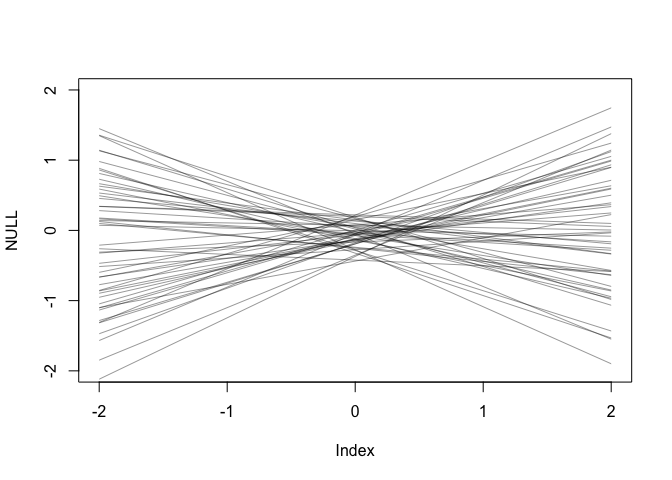<!-- -->
try with flatter priors

```r
m5.1.flatter <- quap(
  alist(
    D ~ dnorm( mu , sigma ) ,
    mu <- a + bA * A ,
    a ~ dnorm( 0 , 0.8 ) ,
    bA ~ dnorm( 0 , 1 ) ,
    sigma ~ dexp( 1 )
    ) , data = d )

set.seed(10)
prior.flatter <- extract.prior( m5.1.flatter )
mu.flatter <- link( m5.1.flatter , post=prior.flatter , data=list( A=c(-2,2) ) )  # restricting range to 2 SD above/below
plot( NULL , xlim=c(-2,2) , ylim=c(-2,2) )
for ( i in 1:50 ) lines( c(-2,2) , mu.flatter[i,] , col=col.alpha("black",0.4) )
```

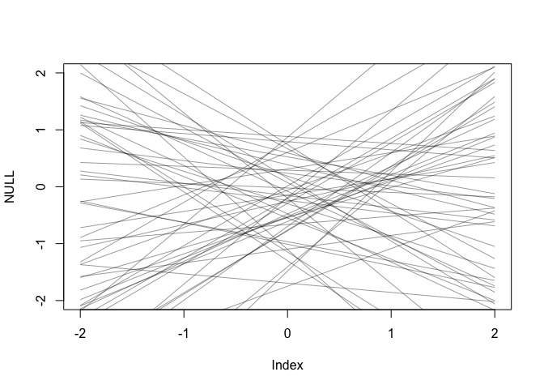<!-- -->

posterior predictions
code 5.5


```r
# compute percentile interval of mean 5.5
A_seq <- seq( from=-3 , to=3.2 , length.out=30 )
mu <- link( m5.1 , data=list(A=A_seq) ) # remember A is standardized
mu.mean <- apply( mu , 2, mean )
mu.PI <- apply( mu , 2 , PI )

# plot it all
plot( D ~ A , data=d , col=rangi2 )
lines( A_seq , mu.mean , lwd=2 )
shade( mu.PI , A_seq )
```

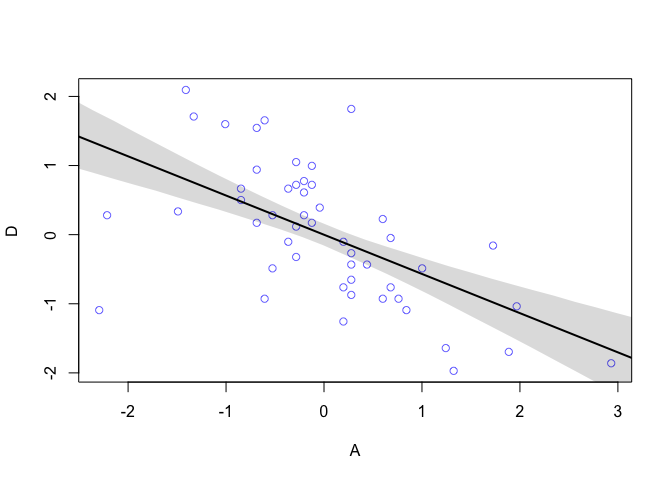<!-- -->

```r
precis(m5.1)
```

```
##                mean         sd       5.5%      94.5%
## a     -3.242382e-07 0.09737806 -0.1556293  0.1556286
## bA    -5.684071e-01 0.10999877 -0.7442063 -0.3926078
## sigma  7.883182e-01 0.07800947  0.6636439  0.9129924
```

code 5.6

```r
d$M <- scale( d$Marriage ) 
m5.2 <- quap(
  alist(
    D ~ dnorm( mu , sigma ) ,
    mu <- a + bM * M ,
    a ~ dnorm( 0 , 0.2 ) ,
    bM ~ dnorm( 0 , 0.5 ) ,
    sigma ~ dexp( 1 )
) , data = d )
```
You can draw DAGs with dagitty.


```r
# install.packages('dagitty') 
library(dagitty)
dag5.1 <- dagitty( "dag {
  A -> D
  A -> M
  M -> D
}")
coordinates(dag5.1) <- list( x=c(A=0,D=1,M=2) , y=c(A=0,D=1,M=0) )
plot( dag5.1 )
```

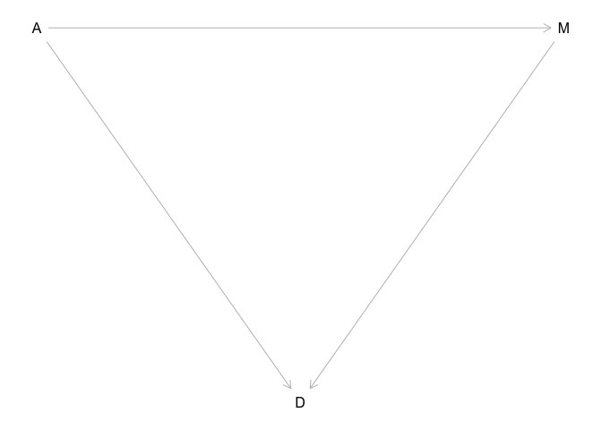<!-- -->

```r
plot(graphLayout(dag5.1))
```

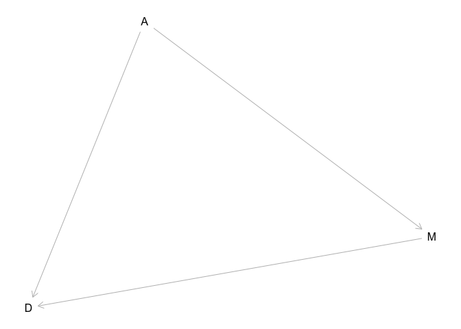<!-- -->
code 5.8

```r
m5.3 <- quap( 
  alist(
    D ~ dnorm( mu , sigma ) ,
    mu <- a + bM*M + bA*A ,
    a ~ dnorm( 0 , 0.2 ) ,
    bM ~ dnorm( 0 , 0.5 ) ,
    bA ~ dnorm( 0 , 0.5 ) ,
    sigma ~ dexp( 1 )
    ) , data = d )
precis( m5.3 )
```

```
##                mean         sd       5.5%      94.5%
## a     -2.828642e-05 0.09707123 -0.1551669  0.1551103
## bM    -6.553086e-02 0.15076312 -0.3064794  0.1754177
## bA    -6.136370e-01 0.15097351 -0.8549218 -0.3723521
## sigma  7.850672e-01 0.07783076  0.6606786  0.9094558
```
and plot

```r
plot( coeftab(m5.1,m5.2,m5.3), par=c("bA","bM") )
```

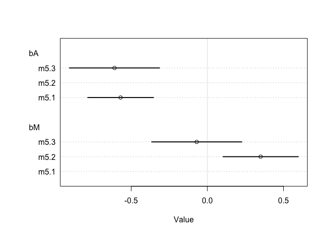<!-- -->

predictor residual plots - p 133

```r
m5.4 <- quap(
alist(
M ~ dnorm( mu , sigma ) ,
mu <- a + bAM * A ,
a ~ dnorm( 0 , 0.2 ) ,
bAM ~ dnorm( 0 , 0.5 ) ,
sigma ~ dexp( 1 )
) , data = d )
```


```r
mu <- link(m5.4)
mu_mean <- apply( mu , 2 , mean )
mu_resid <- d$M - mu_mean
```
p 134 - I think I get the concept of 'control' here!

counterfactual plots  p 136
see how predictions change as you cahnge one predictor at a time


```r
# prepare new counterfactual data
M_seq <- seq( from=-2 , to=3 , length.out=30 )
pred_data <- data.frame( M = M_seq , A = 0 )

# compute counterfactual mean divorce (mu) 
# here, have forced age to be 0.  That is, all marry at same age
mu <- link( m5.3 , data=pred_data )
mu_mean <- apply( mu , 2 , mean )
mu_PI <- apply( mu , 2 , PI )

# simulate counterfactual divorce outcomes
D_sim <- sim( m5.3 , data=pred_data , n=1e4 )
D_PI <- apply( D_sim , 2 , PI )

# display predictions, hiding raw data with type="n"
plot( D ~ M , data=d , type="n" )
mtext( "Median age marriage (std) = 0" )
lines( M_seq , mu_mean )
shade( mu_PI , M_seq )
shade( D_PI , M_seq )
```

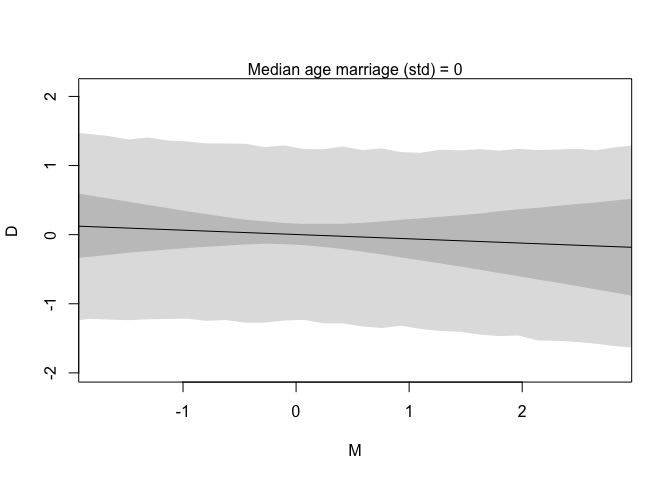<!-- -->
posterior prediction plots p  138
simulate predictions, averaging over posterior


```r
# call link without specifying new data
# so it uses original data
mu <- link( m5.3 )

# summarize samples across cases
mu_mean <- apply( mu , 2 , mean )
mu_PI <- apply( mu , 2 , PI )

# simulate observations
# again no new data, so uses original data
D_sim <- sim( m5.3 , n=1e4 )
D_PI <- apply( D_sim , 2 , PI )
```
plot


```r
plot( mu_mean ~ d$D , col=rangi2 , ylim=range(mu_PI) ,
      xlab="Observed divorce" , ylab="Predicted divorce" )
abline( a=0 , b=1 , lty=2 )
for ( i in 1:nrow(d) ) lines( rep(d$D[i],2) , mu_PI[,i] , col=rangi2 )
identify( x=d$D , y=mu_mean , labels=d$Loc )
```

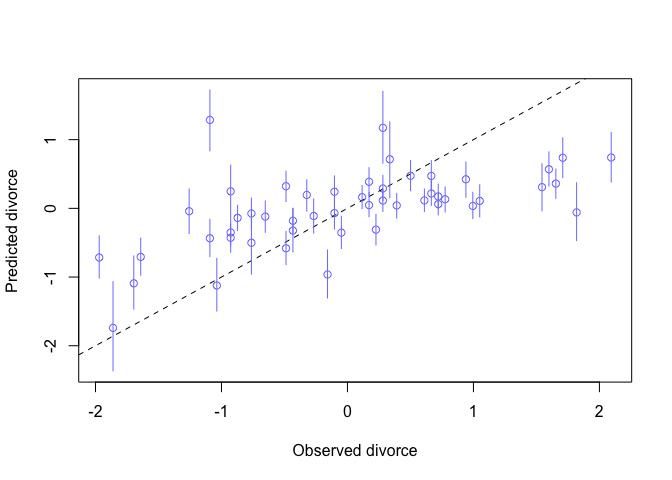<!-- -->

```
## integer(0)
```

```r
# maybe this doesn't work in Rstudio?
```
Masked relationships - p 140


```r
library(rethinking)
data(milk)
d <- milk
str(d)
```

```
## 'data.frame':	29 obs. of  8 variables:
##  $ clade         : Factor w/ 4 levels "Ape","New World Monkey",..: 4 4 4 4 4 2 2 2 2 2 ...
##  $ species       : Factor w/ 29 levels "A palliata","Alouatta seniculus",..: 11 8 9 10 16 2 1 6 28 27 ...
##  $ kcal.per.g    : num  0.49 0.51 0.46 0.48 0.6 0.47 0.56 0.89 0.91 0.92 ...
##  $ perc.fat      : num  16.6 19.3 14.1 14.9 27.3 ...
##  $ perc.protein  : num  15.4 16.9 16.9 13.2 19.5 ...
##  $ perc.lactose  : num  68 63.8 69 71.9 53.2 ...
##  $ mass          : num  1.95 2.09 2.51 1.62 2.19 5.25 5.37 2.51 0.71 0.68 ...
##  $ neocortex.perc: num  55.2 NA NA NA NA ...
```

standardize variabels


```r
d$K <- scale( d$kcal.per.g ) 
d$N <- scale( d$neocortex.perc )
d$M <- scale( log(d$mass) )
```

I must remmeber that function! 


```r
#m5.5_draft <- quap( 
#  alist(
#    K ~ dnorm( mu , sigma ) ,
#    mu <- a + bN*N ,
#    a ~ dnorm( 0 , 1 ) ,
#    bN ~ dnorm( 0 , 1 ) ,
#    sigma ~ dexp( 1 )
#) , data=d )
```

```r
d$neocortex.perc
```

```
##  [1] 55.16    NA    NA    NA    NA 64.54 64.54 67.64    NA 68.85 58.85
## [12] 61.69 60.32    NA    NA 69.97    NA 70.41    NA 73.40    NA 67.53
## [23]    NA 71.26 72.60    NA 70.24 76.30 75.49
```
clean up the data - drop cases with missing values

```r
dcc <- d[ complete.cases(d$K,d$N,d$M) , ]
```


```r
m5.5_draft <- quap(
  alist(
    K ~ dnorm( mu , sigma ) ,
    mu <- a + bN*N ,
    a ~ dnorm( 0 , 1 ) ,
    bN ~ dnorm( 0 , 1 ) ,
    sigma ~ dexp( 1 )
  ) , data=dcc )
```

check htese priors - simulate and plot 50 regresion lines


```r
prior <- extract.prior( m5.5_draft )
xseq <- c(-2,2)
mu <- link( m5.5_draft , post=prior , data=list(N=xseq) )
plot( NULL , xlim=xseq , ylim=xseq )
for ( i in 1:50 ) lines( xseq , mu[i,] , col=col.alpha("black",0.3) )
```

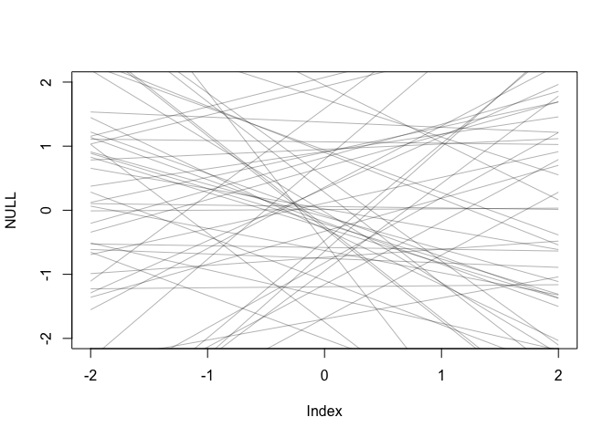<!-- -->

Tighten alpha prior; tighten slope Bn too


```r
m5.5 <- quap( 
  alist(
    K ~ dnorm( mu , sigma ) ,
    mu <- a + bN*N ,
    a ~ dnorm( 0 , 0.2 ) ,
    bN ~ dnorm( 0 , 0.5 ) ,
    sigma ~ dexp( 1 )
  ) , data=dcc )
```

plot these priors

```r
prior <- extract.prior( m5.5 )
xseq <- c(-2,2)
mu <- link( m5.5_draft , post=prior , data=list(N=xseq) )
plot( NULL , xlim=xseq , ylim=xseq )
for ( i in 1:50 ) lines( xseq , mu[i,] , col=col.alpha("black",0.3) )
```

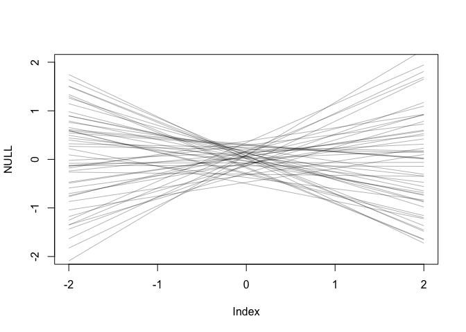<!-- -->
examine posterior

```r
precis( m5.5 )
```

```
##             mean        sd       5.5%     94.5%
## a     0.03994692 0.1544966 -0.2069684 0.2868623
## bN    0.13335794 0.2237624 -0.2242575 0.4909734
## sigma 0.99991388 0.1647459  0.7366180 1.2632097
```


```r
xseq <- seq( from=min(dcc$N)-0.15 , to=max(dcc$N)+0.15 , length.out=30 )
mu <- link( m5.5 , data=list(N=xseq) )
mu_mean <- apply(mu,2,mean)
mu_PI <- apply(mu,2,PI)
plot( K ~ N , data=dcc )
lines( xseq , mu_mean , lwd=2 )
shade( mu_PI , xseq )
```

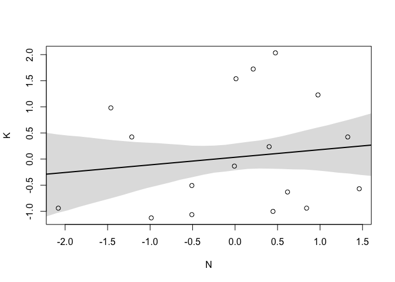<!-- -->
not very explanatory.  let's add adult body mass, using log(mass) as predicor.


```r
m5.6 <- quap(
  alist(
    K ~ dnorm( mu , sigma ) ,
    mu <- a + bM*M ,
    a ~ dnorm( 0 , 0.2 ) ,
    bM ~ dnorm( 0 , 0.5 ) ,
    sigma ~ dexp( 1 )
 ) , data=dcc )

precis(m5.6)
```

```
##              mean        sd       5.5%      94.5%
## a      0.04659887 0.1512897 -0.1951912 0.28838897
## bM    -0.28250981 0.1929080 -0.5908140 0.02579437
## sigma  0.94942713 0.1571222  0.6983156 1.20053869
```
try to plot this;  M is already log scaled


```r
xseq <- seq( from=min(dcc$M)-0.15 , to=max(dcc$M)+0.15 , length.out=30 )
mu <- link( m5.6 , data=list(M=xseq) )
mu_mean <- apply(mu,2,mean)
mu_PI <- apply(mu,2,PI)
plot( K ~ M , data=dcc )
lines( xseq , mu_mean , lwd=2 )
shade( mu_PI , xseq )
```

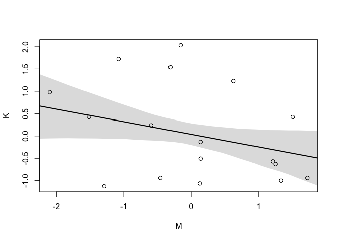<!-- -->

```r
m5.7 <- quap(
alist(
K ~ dnorm( mu , sigma ) ,
mu <- a + bN*N + bM*M ,
a ~ dnorm( 0 , 0.2 ) ,
bN ~ dnorm( 0 , 0.5 ) ,
bM ~ dnorm( 0 , 0.5 ) ,
sigma ~ dexp( 1 )
) , data=dcc )
precis(m5.7)
```

```
##              mean        sd       5.5%      94.5%
## a      0.06799192 0.1339987 -0.1461639  0.2821477
## bN     0.67511755 0.2482986  0.2782884  1.0719467
## bM    -0.70299139 0.2207870 -1.0558516 -0.3501312
## sigma  0.73801428 0.1324618  0.5263147  0.9497139
```
compare mocels

```r
plot( coeftab( m5.5 , m5.6 , m5.7 ) , pars=c("bM","bN") )
```

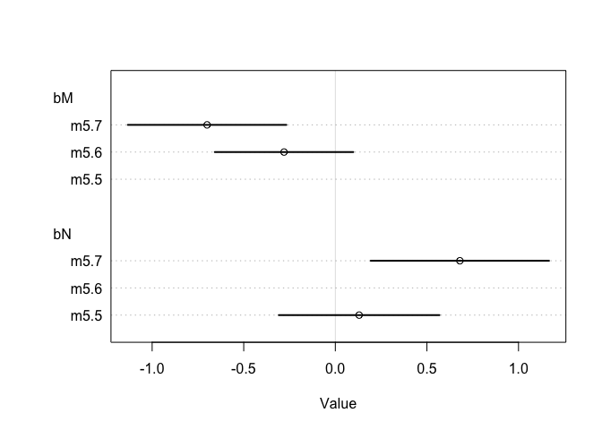<!-- -->
pairs plot

```r
pairs( ~K + M + N, dcc)
```

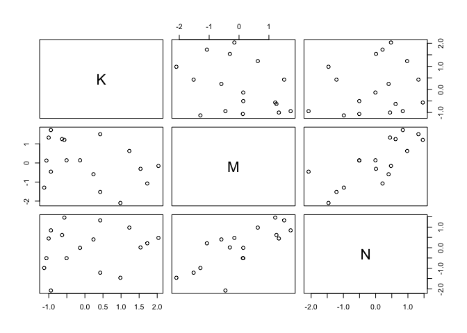<!-- -->
counterfactual plot


```r
xseq <- seq( from=min(dcc$M)-0.15 , to=max(dcc$M)+0.15 , length.out=30 ) 
mu <- link( m5.7 , data=data.frame( M=xseq , N=0 ) )
mu_mean <- apply(mu,2,mean)
mu_PI <- apply(mu,2,PI)
plot( NULL , xlim=range(dcc$M) , ylim=range(dcc$K) )
lines( xseq , mu_mean , lwd=2 )
shade( mu_PI , xseq )
```

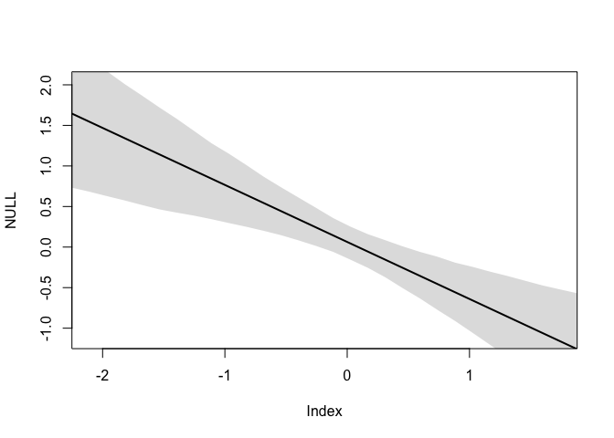<!-- -->
Categorical variables


```r
data(Howell1) 
d <- Howell1
str(d)
```

```
## 'data.frame':	544 obs. of  4 variables:
##  $ height: num  152 140 137 157 145 ...
##  $ weight: num  47.8 36.5 31.9 53 41.3 ...
##  $ age   : num  63 63 65 41 51 35 32 27 19 54 ...
##  $ male  : int  1 0 0 1 0 1 0 1 0 1 ...
```


```r
mu_female <- rnorm(1e4,178,20)
mu_male <- rnorm(1e4,178,20) + rnorm(1e4,0,10)
precis( data.frame( mu_female , mu_male ) )
```

```
##               mean       sd     5.5%    94.5% histogram
## mu_female 177.9808 19.97042 145.9988 209.6022  ▁▁▃▇▇▂▁▁
## mu_male   177.7408 22.60541 141.3354 213.9011 ▁▁▃▇▇▃▁▁▁
```
index varaibles
Create a list of alpha parameters, one for each unique value in index variable.


```r
d$sex <- ifelse( d$male==1 , 2 , 1 )
str( d$sex )
```

```
##  num [1:544] 2 1 1 2 1 2 1 2 1 2 ...
```

```r
m5.8 <- quap( 
  alist(
    height ~ dnorm( mu , sigma ) ,
    mu <- a[sex] ,
    a[sex] ~ dnorm( 178 , 20 ) ,
    sigma ~ dunif( 0 , 50 )
) , data=d )

precis( m5.8 , depth=2 ) # note deptht!
```

```
##            mean        sd      5.5%     94.5%
## a[1]  134.90975 1.6068727 132.34166 137.47785
## a[2]  142.57850 1.6974094 139.86571 145.29129
## sigma  27.30894 0.8279645  25.98569  28.63218
```
comapre categoreis


```r
post <- extract.samples(m5.8) 
post$diff_fm <- post$a[,1] - post$a[,2]
precis( post , depth=2 )
```

```
##               mean        sd      5.5%      94.5%       histogram
## sigma    27.312110 0.8158104  26.01393  28.619166   ▁▁▁▁▃▇▇▇▃▂▁▁▁
## a[1]    134.867421 1.5804078 132.31361 137.383479        ▁▁▁▃▇▃▁▁
## a[2]    142.549702 1.6950070 139.83401 145.231748 ▁▁▁▁▂▃▇▇▇▃▂▁▁▁▁
## diff_fm  -7.682281 2.3207520 -11.40877  -3.994294      ▁▁▁▂▇▇▃▁▁▁
```

```r
data(milk)
d <- milk
unique(d$clade)
```

```
## [1] Strepsirrhine    New World Monkey Old World Monkey Ape             
## Levels: Ape New World Monkey Old World Monkey Strepsirrhine
```
coerce factors to integer

```r
d$clade_id <- as.integer( d$clade )
```


```r
d$K <- scale( d$kcal.per.g )
m5.9 <- quap(
  alist(
    K ~ dnorm( mu , sigma ),
    mu <- a[clade_id],
    a[clade_id] ~ dnorm( 0 , 0.5 ),
    sigma ~ dexp( 1 )
) , data=d )

labels <- paste( "a[" , 1:4 , "]:" , levels(d$clade) , sep="" )
plot( precis( m5.9 , depth=2 , pars="a" ) , labels=labels ,
xlab="expected kcal (std)" )
```

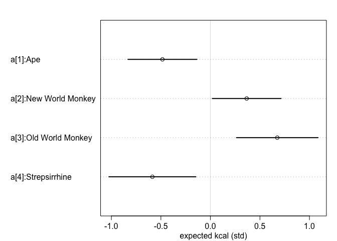<!-- -->


```r
set.seed(63) 
d$house <- sample( rep(1:4,each=8) , size=nrow(d) )
```


```r
m5.10 <- quap( 
  alist(
    K ~ dnorm( mu , sigma ),
    mu <- a[clade_id] + h[house],
    a[clade_id] ~ dnorm( 0 , 0.5 ),
    h[house] ~ dnorm( 0 , 0.5 ),
    sigma ~ dexp( 1 )
) , data=d )
```

plot?

```r
labels <- paste( "a[" , 1:4 , "]:" , levels(d$house) , sep="" )
plot( precis( m5.10 , depth=2 , pars="a" ) , labels=labels ,
xlab="expected kcal (std)" )
```

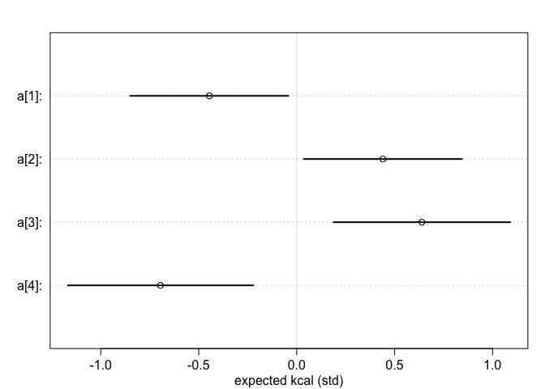<!-- -->

## Problems
p 154

### 5E1
Multiple linear regression:  model 2 and 4  (two slopes)

### 5E3
Time to PhD depends on amount of funding and the size of laboratory (that is, longer tiem if more money or mor funding)

PhD.time <-  alpha + funding.amt*bF + lab.size*bL

I expect both b values to be positive

### 5M2 
Invent a masked relationship.  outcome correlated with both predictors, the two predictors correlated with each other, and both predictors having opposite effects on outcome

OK, imagine the following.  Rain promotes plant growth.  Plant mass provides fuel for wildfires. But rain inhibits wildfires.  

wildfire.rate <- alpha + rain * bR + plant * bP

Expect bR to be negative, and bP to be positive

### 5M3  
Marriage and divorce.  In the chapter, he discarded the idea that marriage causes divorce.  But instead, could we argue that divorce causes marriage?

Yes, you could imagine that if there was a high divorce rate that would incresae marraige rate as well.  You'd have lots of people able to marry more than one time, so your 'effective marriageable population' would be higher than in an area with low divorce rate.

marriage.rate <- alpha + divorce.rate * bD

I don't think that I need to add any other factors given the wording of the problem

### 5M4
States with lots f Mormons have lower divorce rates than predicted.  Find a list of LDS poulation by state, and use these numbers as a predictor variable.

OK, where to find data?


```r
library(rethinking)
data("WaffleDivorce")
?WaffleDivorce
divorce <- WaffleDivorce
#  str(divorce)
head(divorce)
```

```
##     Location Loc Population MedianAgeMarriage Marriage Marriage.SE Divorce
## 1    Alabama  AL       4.78              25.3     20.2        1.27    12.7
## 2     Alaska  AK       0.71              25.2     26.0        2.93    12.5
## 3    Arizona  AZ       6.33              25.8     20.3        0.98    10.8
## 4   Arkansas  AR       2.92              24.3     26.4        1.70    13.5
## 5 California  CA      37.25              26.8     19.1        0.39     8.0
## 6   Colorado  CO       5.03              25.7     23.5        1.24    11.6
##   Divorce.SE WaffleHouses South Slaves1860 Population1860 PropSlaves1860
## 1       0.79          128     1     435080         964201           0.45
## 2       2.05            0     0          0              0           0.00
## 3       0.74           18     0          0              0           0.00
## 4       1.22           41     1     111115         435450           0.26
## 5       0.24            0     0          0         379994           0.00
## 6       0.94           11     0          0          34277           0.00
```
This returns state, divorce rate, population, median age of marriage, marriage rate.

I got LDS data from wikipedia (as of 2018)

```r
LDS <- read.csv("LDS.rate.wikipedia.csv")
head(LDS)
```

```
##        state LDS.membership population LDS.percent
## 1    Alabama         37,913  4,887,871        0.78
## 2     Alaska         33,298    737,438        4.52
## 3    Arizona        432,161  7,171,646        6.03
## 4   Arkansas         31,765  3,013,825        1.05
## 5 California        761,054 39,557,045        1.92
## 6   Colorado        150,958  5,695,564        2.65
```
I see that population from the Waffle data are lower (they are in millions).  I will simply extract LDS.percent from my new dataset and add it to the waffle divorce data


```r
library(tidyverse)
```

```
## ── Attaching packages ─────────────────────────────────────── tidyverse 1.2.1 ──
```

```
## ✔ tibble  2.1.1       ✔ purrr   0.3.2  
## ✔ tidyr   0.8.3       ✔ dplyr   0.8.0.1
## ✔ readr   1.3.1       ✔ stringr 1.4.0  
## ✔ tibble  2.1.1       ✔ forcats 0.4.0
```

```
## ── Conflicts ────────────────────────────────────────── tidyverse_conflicts() ──
## ✖ tidyr::extract() masks rstan::extract()
## ✖ dplyr::filter()  masks stats::filter()
## ✖ dplyr::lag()     masks stats::lag()
## ✖ purrr::map()     masks rethinking::map()
```

```r
divorce.LDS <- divorce %>%
  select(Location, MedianAgeMarriage, Marriage,Divorce)

divorce.LDS <- divorce.LDS %>%
  left_join(LDS, by = c("Location" = "state"))
```

```
## Warning: Column `Location`/`state` joining factors with different levels,
## coercing to character vector
```

```r
divorce.LDS <- divorce.LDS %>%
  select(-LDS.membership, - population)
```
Now I have location, median age marriage, marriage rate, divorce rate, and LDS.percent

Predict divorce rate using marriage rate, median age at marriage, and percent LDS population (standardized).  Consider transforming raw percent LDS variable (before standardizing, I assume).  So three terms.


```r
# first, make LDS.percent log version. Then standardize all varaibles of interest

divorce.LDS <- divorce.LDS %>%
  mutate(LDS.log = log(LDS.percent))

divorce.std <- divorce.LDS %>%
  mutate(Age=scale(MedianAgeMarriage),
         M.rate = scale(Marriage),
         D.rate = scale(Divorce),
         LDS.std = scale(LDS.percent),
         LDS.log.std = scale(LDS.log))

divorce.std
```

```
##                Location MedianAgeMarriage Marriage Divorce LDS.percent
## 1               Alabama              25.3     20.2    12.7        0.78
## 2                Alaska              25.2     26.0    12.5        4.52
## 3               Arizona              25.8     20.3    10.8        6.03
## 4              Arkansas              24.3     26.4    13.5        1.05
## 5            California              26.8     19.1     8.0        1.92
## 6              Colorado              25.7     23.5    11.6        2.65
## 7           Connecticut              27.6     17.1     6.7        0.44
## 8              Delaware              26.6     23.1     8.9        0.58
## 9  District of Columbia              29.7     17.7     6.3        0.40
## 10              Florida              26.4     17.0     8.5        0.74
## 11              Georgia              25.9     22.1    11.5        0.82
## 12               Hawaii              26.9     24.9     8.3        5.26
## 13                Idaho              23.2     25.8     7.7       26.02
## 14             Illinois              27.0     17.9     8.0        0.45
## 15              Indiana              25.7     19.8    11.0        0.68
## 16                 Iowa              25.4     21.5    10.2        0.90
## 17               Kansas              25.0     22.1    10.6        1.31
## 18             Kentucky              24.8     22.2    12.6        0.80
## 19            Louisiana              25.9     20.6    11.0        0.64
## 20                Maine              26.4     13.5    13.0        0.82
## 21             Maryland              27.3     18.3     8.8        0.73
## 22        Massachusetts              28.5     15.8     7.8        0.40
## 23             Michigan              26.4     16.5     9.2        0.45
## 24            Minnesota              26.3     15.3     7.4        0.59
## 25          Mississippi              25.8     19.3    11.1        0.72
## 26             Missouri              25.6     18.6     9.5        1.17
## 27              Montana              25.7     18.5     9.1        4.74
## 28             Nebraska              25.4     19.6     8.8        1.30
## 29        New Hampshire              26.8     16.7    10.1        0.65
## 30           New Jersey              27.7     14.8     6.1        0.38
## 31           New Mexico              25.8     20.4    10.2        3.31
## 32             New York              28.4     16.8     6.6        0.42
## 33       North Carolina              25.7     20.4     9.9        0.85
## 34         North Dakota              25.3     26.7     8.0        1.50
## 35                 Ohio              26.3     16.9     9.5        0.53
## 36             Oklahoma              24.4     23.8    12.8        1.22
## 37               Oregon              26.0     18.9    10.4        3.66
## 38         Pennsylvania              27.1     15.5     7.7        0.41
## 39         Rhode Island              28.2     15.0     9.4        0.39
## 40       South Carolina              26.4     18.1     8.1        0.80
## 41         South Dakota              25.6     20.1    10.9        1.21
## 42            Tennessee              25.2     19.4    11.4        0.77
## 43                Texas              25.2     21.5    10.0        1.25
## 44                 Utah              23.3     29.6    10.2       66.74
## 45              Vermont              26.9     16.4     9.6        0.74
## 46             Virginia              26.4     20.5     8.9        1.13
## 47           Washington              25.9     21.4    10.0        3.84
## 48        West Virginia              25.0     22.2    10.9        0.94
## 49            Wisconsin              26.3     17.2     8.3        0.46
## 50              Wyoming              24.2     30.7    10.3       11.67
##        LDS.log         Age       M.rate      D.rate     LDS.std
## 1  -0.24846136 -0.60628951  0.022644060  1.65420530 -0.26225607
## 2   1.50851199 -0.68669925  1.549801620  1.54436431  0.11273923
## 3   1.79674701 -0.20424076  0.048974363  0.61071590  0.26414107
## 4   0.04879016 -1.41038699  1.655122831  2.09356925 -0.23518421
## 5   0.65232519  0.59985673 -0.266989270 -0.92705795 -0.14795269
## 6   0.97455964 -0.28465051  0.891544051  1.05007986 -0.07475842
## 7  -0.82098055  1.24313471 -0.793595325 -1.64102438 -0.29634655
## 8  -0.54472718  0.43903723  0.786222840 -0.43277350 -0.28230929
## 9  -0.91629073  2.93173944 -0.635613508 -1.86070636 -0.30035719
## 10 -0.30110509  0.27821773 -0.819925628 -0.65245548 -0.26626671
## 11 -0.19845094 -0.12383101  0.522919813  0.99515936 -0.25824542
## 12  1.66013103  0.68026647  1.260168290 -0.76229646  0.18693616
## 13  3.25886547 -2.29489423  1.497141014 -1.09181943  2.26846084
## 14 -0.79850770  0.76067622 -0.582952903 -0.92705795 -0.29534389
## 15 -0.38566248 -0.28465051 -0.082677151  0.72055689 -0.27228268
## 16 -0.10536052 -0.52587976  0.364937996  0.28119293 -0.25022413
## 17  0.27002714 -0.84751875  0.522919813  0.50087491 -0.20911502
## 18 -0.22314355 -1.00833825  0.549250115  1.59928480 -0.26025074
## 19 -0.44628710 -0.12383101  0.127965271  0.72055689 -0.27629332
## 20 -0.19845094  0.27821773 -1.741486224  1.81896678 -0.25824542
## 21 -0.31471074  1.00190547 -0.477631692 -0.48769399 -0.26726937
## 22 -0.91629073  1.96682245 -1.135889261 -1.03689894 -0.30035719
## 23 -0.79850770  0.27821773 -0.951577141 -0.26801201 -0.29534389
## 24 -0.52763274  0.19780798 -1.267540774 -1.25658092 -0.28130663
## 25 -0.32850407 -0.20424076 -0.214328664  0.77547738 -0.26827203
## 26  0.15700375 -0.36506026 -0.398640784 -0.10325053 -0.22315228
## 27  1.55603714 -0.28465051 -0.424971086 -0.32293251  0.13479777
## 28  0.26236426 -0.52587976 -0.135337756 -0.48769399 -0.21011768
## 29 -0.43078292  0.59985673 -0.898916536  0.22627244 -0.27529066
## 30 -0.96758403  1.32354446 -1.399192288 -1.97054734 -0.30236252
## 31  1.19694819 -0.20424076  0.075304666  0.28119293 -0.00858278
## 32 -0.86750057  1.88641270 -0.872586233 -1.69594487 -0.29835187
## 33 -0.16251893 -0.28465051  0.075304666  0.11643145 -0.25523744
## 34  0.40546511 -0.60628951  1.734113739 -0.92705795 -0.19006446
## 35 -0.63487827  0.19780798 -0.846255930 -0.10325053 -0.28732260
## 36  0.19885086 -1.32997724  0.970534959  1.70912579 -0.21813897
## 37  1.29746315 -0.04342126 -0.319649875  0.39103392  0.02651036
## 38 -0.89159812  0.84108597 -1.214880169 -1.09181943 -0.29935453
## 39 -0.94160854  1.72559321 -1.346531683 -0.15817102 -0.30135985
## 40 -0.22314355  0.27821773 -0.530292297 -0.87213745 -0.26025074
## 41  0.19062036 -0.36506026 -0.003686242  0.66563639 -0.21914164
## 42 -0.26136476 -0.68669925 -0.187998362  0.94023887 -0.26325873
## 43  0.22314355 -0.68669925  0.364937996  0.17135194 -0.21513099
## 44  4.20080447 -2.21448448  2.497692519  0.28119293  6.35129731
## 45 -0.30110509  0.68026647 -0.977907444 -0.04833004 -0.26626671
## 46  0.12221763  0.27821773  0.101634969 -0.43277350 -0.22716292
## 47  1.34547237 -0.12383101  0.338607693  0.17135194  0.04455826
## 48 -0.06187540 -0.84751875  0.549250115  0.66563639 -0.24621349
## 49 -0.77652879  0.19780798 -0.767265022 -0.76229646 -0.29434123
## 50  2.45702145 -1.49079674  2.787325849  0.33611343  0.82964200
##     LDS.log.std
## 1  -0.390880315
## 2   1.197909479
## 3   1.458553644
## 4  -0.122082734
## 5   0.423679830
## 6   0.715068889
## 7  -0.908595993
## 8  -0.658786544
## 9  -0.994782753
## 10 -0.438484808
## 11 -0.345657065
## 12  1.335015014
## 13  2.780713076
## 14 -0.888274316
## 15 -0.514948071
## 16 -0.261477578
## 17  0.077976671
## 18 -0.367986015
## 19 -0.569769495
## 20 -0.345657065
## 21 -0.450788080
## 22 -0.994782753
## 23 -0.888274316
## 24 -0.643328449
## 25 -0.463261058
## 26 -0.024227728
## 27  1.240885350
## 28  0.071047315
## 29 -0.555749422
## 30 -1.041166076
## 31  0.916169638
## 32 -0.950662952
## 33 -0.313164591
## 34  0.200450052
## 35 -0.740308066
## 36  0.013613632
## 37  1.007062957
## 38 -0.972453802
## 39 -1.017677053
## 40 -0.367986015
## 41  0.006170985
## 42 -0.402548561
## 43  0.035580944
## 44  3.632486421
## 45 -0.438484808
## 46 -0.055683997
## 47  1.050476568
## 48 -0.222155012
## 49 -0.868399306
## 50  2.055624330
```
Modify model m5.3


```r
# first, using non-transformed LDS data
m5M4.a <- quap(
  alist(
    D.rate ~ dnorm( mu, sigma),
    mu <- a + bM*M.rate + bA*Age + bLDS*LDS.std ,
    a ~ dnorm(0, 0.2) ,
    bM ~ dnorm(0, 0.5) ,
    bA ~ dnorm(0, 0.5) ,
    bLDS ~ dnorm(0, 0.5) ,
    sigma ~ dexp(1)
  ), data = divorce.std
)

# and then, with transformed LDS data

m5M4.b <- quap(
  alist(
    D.rate ~ dnorm( mu, sigma),
    mu <- a + bM*M.rate + bA*Age + bLDS*LDS.log.std ,
    a ~ dnorm(0, 0.2) ,
    bM ~ dnorm(0, 0.5) ,
    bA ~ dnorm(0, 0.5) ,
    bLDS ~ dnorm(0, 0.5) ,
    sigma ~ dexp(1)
  ), data = divorce.std
)
```
How do they look?


```r
precis(m5M4.a)
```

```
##                mean         sd       5.5%      94.5%
## a      3.900253e-07 0.09189917 -0.1468722  0.1468730
## bM     3.701437e-02 0.14743854 -0.1986209  0.2726496
## bA    -6.893508e-01 0.14430859 -0.9199838 -0.4587178
## bLDS  -3.152707e-01 0.11958346 -0.5063882 -0.1241533
## sigma  7.316369e-01 0.07264835  0.6155308  0.8477430
```
For non-transformed LDS, Age has negative effect and LDS does also.

```r
precis(m5M4.b)
```

```
##                mean         sd       5.5%       94.5%
## a     -7.111921e-05 0.09384898 -0.1500599  0.14991768
## bM     7.482238e-02 0.16231290 -0.1845850  0.33422975
## bA    -7.009855e-01 0.15137938 -0.9429190 -0.45905203
## bLDS  -2.943025e-01 0.14969432 -0.5335429 -0.05506203
## sigma  7.514851e-01 0.07467721  0.6321365  0.87083371
```
Simlar to above


```r
plot( coeftab(m5M4.a, m5M4.b))
```

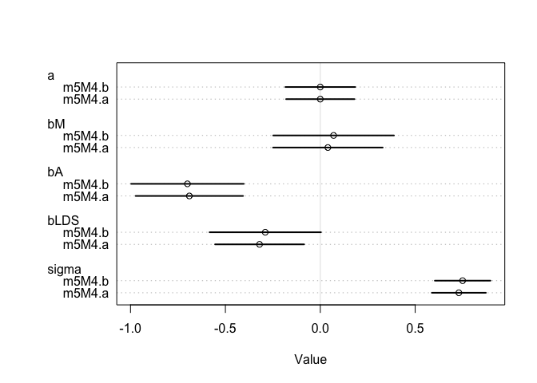<!-- -->
Log transformation doesn't change things much. Age likely has stronger effect than LDS, but both seem useful.

Let's simulate predictions averaged over posterior.  

```r
# use original data and model
mu.divorce <- link(m5M4.b)

# summarize
mu_divorce_mean <- apply( mu.divorce , 2 , mean )
mu_divorce_PI <- apply( mu.divorce , 2 , PI )

# and now simulate observations (from original data)

divorce_sim <- sim( m5M4.b , n=1e4 )
divorce_PI <- apply( divorce_sim , 2 , PI )

# and now plot

plot( mu_divorce_mean ~ divorce.std$D.rate , col=rangi2 , ylim=range(mu_divorce_PI) , 
xlab="Observed divorce" , ylab="Predicted divorce" )
abline( a=0 , b=1 , lty=2 )
for ( i in 1:nrow(d) ) lines( rep(divorce.std$D.rate[i],2) , divorce_PI[,i] , col=rangi2 )
```

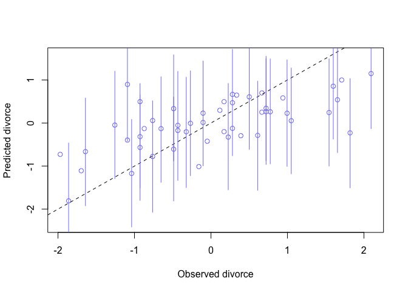<!-- -->
That doesn't look very good.  the PI are really big. But on other hand, seems like most PI cross the diagonal.

### 5H1
Urban foxes

```r
data(foxes)
?foxes

fox <- foxes #116 rows.  one row per fox.  max group size is 8, min is 2
```
I'm asked to fit two regressions.  weight = a + area*bA    
AND  
weight = a + groupsize*bG

I'll first standardize body weight, area, group size


```r
fox.std <- fox %>%
  mutate(GS = scale(groupsize),
                    A = scale(area),
                    W = scale(weight))
```
Now, fit regressions

First, weight = a + area*bA  

```r
m5H1.a <- quap(
  alist(
    W ~ dnorm( mu, sigma),
    mu <- a +  bA*A ,
    a ~ dnorm(0, 0.2) ,
    bA ~ dnorm(0, 0.5) ,
    sigma ~ dexp(1)
  ), data = fox.std
)

precis(m5H1.a)
```

```
##                mean         sd       5.5%     94.5%
## a     -3.870852e-07 0.08361449 -0.1336325 0.1336317
## bA     1.883038e-02 0.09090324 -0.1264506 0.1641113
## sigma  9.913497e-01 0.06468009  0.8879784 1.0947210
```
Not very useful.

Now, weight = a + groupsize*bGS

```r
m5H1.b <- quap(
  alist(
    W ~ dnorm( mu, sigma),
    mu <- a +  bGS*GS ,
    a ~ dnorm(0, 0.2) ,
    bGS ~ dnorm(0, 0.5) ,
    sigma ~ dexp(1)
  ), data = fox.std
)

precis(m5H1.b)
```

```
##                mean         sd       5.5%       94.5%
## a      1.388528e-07 0.08272319 -0.1322075  0.13220777
## bGS   -1.558042e-01 0.08977326 -0.2992792 -0.01232922
## sigma  9.785870e-01 0.06384615  0.8765486  1.08062551
```
not any better.  generally, group size negatively associated with weight.

Plots  - MAP regression line, and 95% interval of the mean  (so this is PI ( samples, prob = .95)). For the latter, need seamples from posterior density.

MAP line is mean mu for each weight.  I think this is like Figure 4.9


```r
# first model - weight by area
## (Should I have used nonscaled weight?)

# use link to compute mu for each sample from posterior and for each Area

#calculate  mean mu for each Area using link function (which samples from posterior for me)

# now define a sequence of areas to define weights for (standardized)
area.seq <- seq(from = -2.2, to = 2.2, by = .2)
# now calculate mu from model across these areas
mu.areas.5H1a <- link(m5H1.a, data = data.frame(A=area.seq))
dim(mu.areas.5H1a) # 1000 by 23
```

```
## [1] 1000   23
```

```r
mu.areas.5H1a.mean <- apply(mu.areas.5H1a, 2 , mean)
mu.areas.5H1a.PI <- apply(mu.areas.5H1a, 2, PI, prob = 0.95)

plot( W ~ A, fox.std, col = col.alpha(rangi2, 0.5) )  # raw data
# plot MAP line and shaded ares for 95% PI
lines( area.seq , mu.areas.5H1a.mean )
shade( mu.areas.5H1a.PI , area.seq )
```

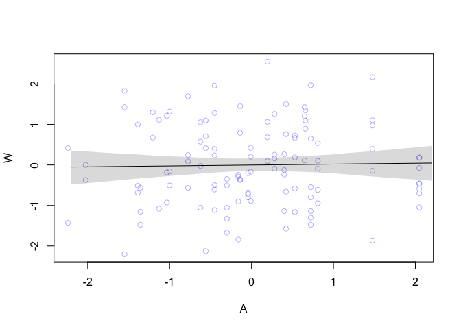<!-- -->
Not explanatory!

Now for second model, weight = a + groupsize*bGS  (GS range from -1.5 to 2.5)

```r
# second model - weight by groupsize
## (Should I have used nonscaled weight?)

# use link to compute mu for each sample from posterior and for each Area

#calculate  mean mu for each Area using link function (which samples from posterior for me)

# now define a sequence of areas to define weights for (standardized)
groupsize.seq <- seq(from = -1.5, to = 2.5, by = .2)
# now calculate mu from model across these areas
mu.groupsize.5H1b <- link(m5H1.b, data = data.frame(GS=groupsize.seq))

mu.groupsize.5H1b.mean <- apply(mu.groupsize.5H1b, 2 , mean)
mu.groupsize.5H1b.PI <- apply(mu.groupsize.5H1b, 2, PI, prob = 0.95)

plot( W ~ GS, fox.std, col = col.alpha(rangi2, 0.5) )  # raw data
# plot MAP line and shaded ares for 95% PI
lines( groupsize.seq , mu.groupsize.5H1b.mean )
shade( mu.groupsize.5H1b.PI , groupsize.seq )
```

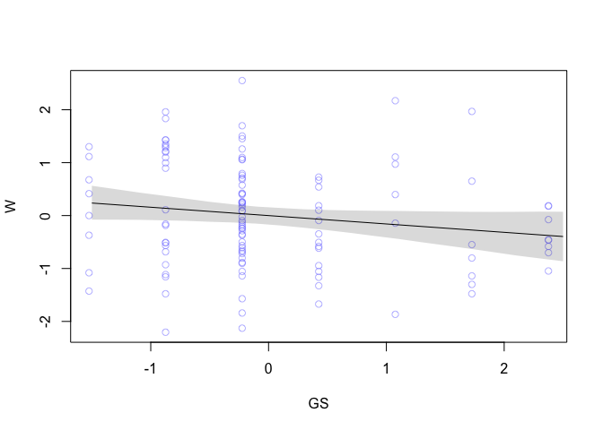<!-- -->
Also not great!!!

### 5H2
Now fit a multiple linear regression with weight as the outcome and both area and groupsize as predictor variables.

weight = a + groupsize*bGS + area*bA

```r
m5H2 <- quap(
  alist(
    W ~ dnorm( mu, sigma),
    mu <- a +  bA*A +  bGS*GS ,
    a ~ dnorm(0, 0.2) ,
    bA ~ dnorm(0, 0.5) ,
    bGS ~ dnorm(0, 0.5) ,
    sigma ~ dexp(1)
  ), data = fox.std
)

precis(m5H2)
```

```
##                mean         sd       5.5%      94.5%
## a      4.684138e-08 0.08013103 -0.1280648  0.1280649
## bA     4.058528e-01 0.14536256  0.1735354  0.6381703
## bGS   -4.820002e-01 0.14537259 -0.7143337 -0.2496667
## sigma  9.419454e-01 0.06159406  0.8435062  1.0403846
```

```r
plot(coeftab(m5H2))
```

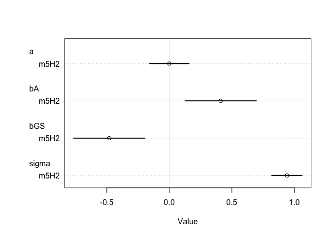<!-- -->
Now, bA is largely positive and bGS negative.  
So larger territory positively associated with larger weight, but larger groupsize negatively associated.  makes intuitive sense.  Confounding varaibles.

Now, plot the predictions of the model for each predictor, holding the other predictor
constant at its mean.  (This is 'counterfactual'plotting - see Fig 5.8) and p 147.


```r
# Determine means
fox.std.A.mean <- mean(fox.std$A)
fox.std.GS.mean <- mean(fox.std$GS)
```

See R code 5.31

First, counterfactual holding Area at the mean (very close to 0) and sampling predicted weight across different group sizes


```r
x_GS <- seq( from = min(fox.std$GS)-0.15, to = max(fox.std$GS) + 0.15, length.out = 30)
mu.GS <- link(m5H2, data = data.frame(GS = x_GS, A = fox.std.A.mean))
mu.GS.mean <- apply(mu.GS, 2, mean)
mu.GS.PI <- apply(mu.GS,2, PI, prob = 0.95)

plot( NULL, xlim = range(fox.std$GS), ylim=range(fox.std$W), xlab="groupsize (std)" , ylab="weights (std)")
lines(x_GS, mu.GS.mean, lwd = 2)
shade(mu.GS.PI, x_GS)
```

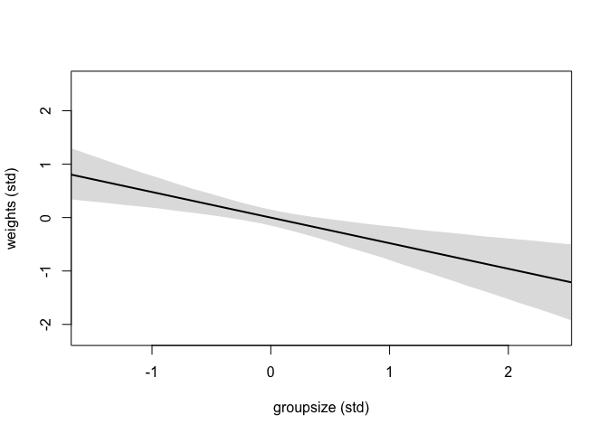<!-- -->
That looks pretty good.  trends towards lower weight in a larger  group.

Now the same, but this time hold groupsize at mean (near 0) and sampling predicted weight across different areas


```r
x_A <- seq( from = min(fox.std$A)-0.15, to = max(fox.std$A) + 0.15, length.out = 30)
mu.A <- link(m5H2, data = data.frame(A = x_A, GS = fox.std.GS.mean))
mu.A.mean <- apply(mu.A, 2, mean)
mu.A.PI <- apply(mu.A, 2, PI, prob = 0.95)

plot( NULL, xlim = range(fox.std$A), ylim=range(fox.std$A), xlab="area (std)" , ylab="weights (std)")
lines(x_A, mu.A.mean, lwd = 2)
shade(mu.A.PI, x_A)
```

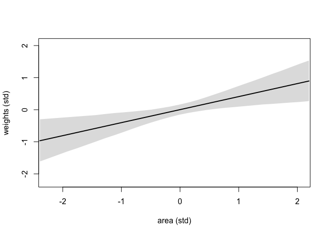<!-- -->
And looser trend towards greater weight with larger range area.


