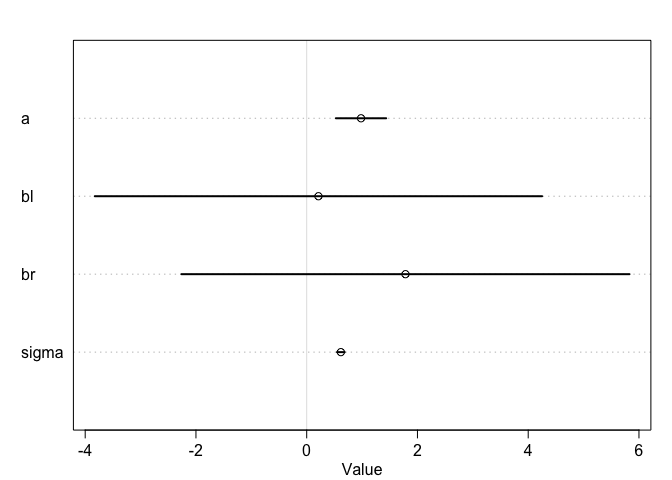
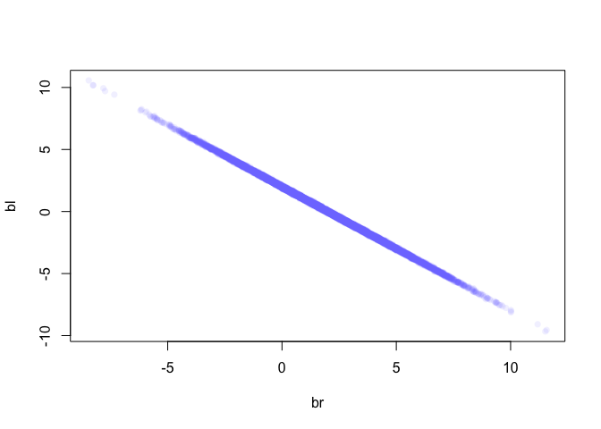
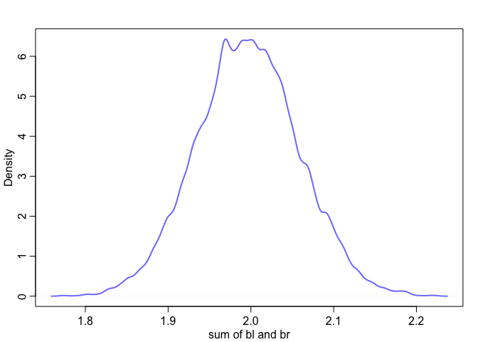
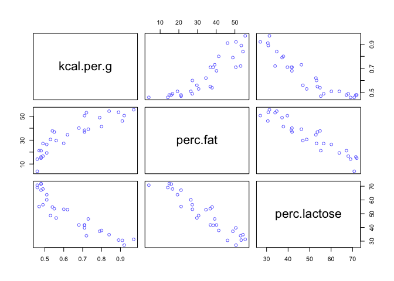
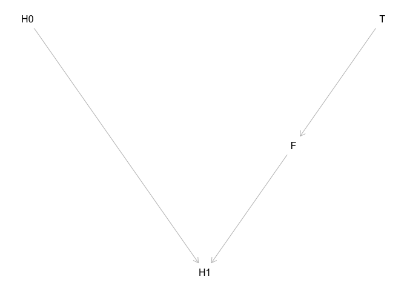

Video: 06-Jan 11: Haunted DAG <slides> <video>

Reading: Chapter 6

Problems: 6H1, 6H2


Lecture 06 - 

index variables.  see end of chapter 5

chapter 6 - spurious correlations!
be careful when
selection distortion effect.
also, be careful to not add excess variables to model.  

4 types of confounds (for directed acyclic graphs - DAGs)
a method for de-confounding each.

*confounding fork*.  Z causes both X and Y.   X <- Z -> Y
'condition on Z' to remove dependency between X and Y.  weird notation:  X _||_ Y|Z
(X is indepenent of Y if you account for Z)

*Pipe*.   X ->  Z -> Y  
here, Z mediates assocaition between X and Y.  Again, conditioning on Z removes dependency between X and Y.
(X is indepenent of Y if you account for Z)  
Note that Data don't distinguish between this and a fork!

example: post-treatment bias.  if you were to control for conseuence of treatment, you may remove treatment as well.  then outcome not rleated to treatment.  (measure the various parameters, but don't necessarily use them all in your model)

observational study: gender gap in income
(if you condition on job, everything upstream of 'job' disappears)

*explosive collider*
X -> Z <- Y
X and Y jointly cause Z.  X and Y are indepdnent.  But if you condition on Z, you create a (spurious) dependency between X and Y!!!
Learning both X and Z reveals Y.  (works for continuous and discrete examples)
Common, and hazardous.  

basketball:  'conditional on being a pro player' there is no effect of height on scoring.  (that is, the selection for pro player took away effect of height)

collider confounding.  idea that age causes marriage, and happiness causes marriage.  Doe Age affect happiness?  
when you control for happiness, creating index variable (0 or 1).  
(regression models don't have arrows!  no directionality in this information)
We stratified by marriage status and in the process found huge correlation with happiness.
now, find negative correlation between age and happiness.

'haunted DAG'.   unobserved confound can screw you.  
example of grandparents (G) and parents (P) on education of children (C)
U, unobserved variable, may make parents a collider.  here, conditiniong on parents generates collider bias with U.
model: G have no effect on C. 
conditioning on collider 'opens a backdoor' throuhg U to C.
stratified on educational outcome of parents (bad neighborhood + good G, or good hood + bad G)
so here, U is neighborhood.  

*back-door criterion*
to de-counfound, must shut all bock door paths.  

*descendent*
X -> Z -> Y
     |
     V
     A
     
This is tricky too. if you condition on A, you're weakly conditioning on Z.       
 
Video 7
arrows are about inforamtion and can flow either way. but causation only goes one way (with arrows)
if your confoundign fork U is unobserved, you're sunk.  
(two arrows to P means information gets stuck there. take away one and then you're confounded)
minute 12 was helpful in understanding. 
**why does conditioning on A help?  This was about minute 15.**
(if we coudl condition on U that would also work)
(waffles: could condition on S.  Or condition on A and M)

test your DAG.  
causal inference.  Hume: correlation is not enough! STOPPED at minute 36 minutes.

# Chapter 6
Hazards:  multicollinearity, post-treatment bias, and collider bias.
(then: instrumental variables)

example - code 6.1

```r
set.seed(1914)
N <- 200 # num grant proposals
p <- 0.1 # proportion to select
# uncorrelated newsworthiness and trustworthiness
nw <- rnorm(N)
tw <- rnorm(N)
# select top 10% of combined scores
s <- nw + tw # total score
q <- quantile( s , 1-p ) # top 10% threshold
selected <- ifelse( s >= q , TRUE , FALSE )
cor( tw[selected] , nw[selected] )
```

```
## [1] -0.7680083
```

## 6.1  Multicollinearity
that is, a strong correlation between two or more predictor variables.

Example, code 6.2

```r
N <- 100 # number of individuals 
set.seed(909)
height <- rnorm(N,10,2) # sim total height of each
leg_prop <- runif(N,0.4,0.5) # leg as proportion of height
leg_left <- leg_prop*height + # sim left leg as proportion + error
rnorm( N , 0 , 0.02 )
leg_right <- leg_prop*height + # sim right leg as proportion + error
rnorm( N , 0 , 0.02 )
# combine into data frame
d <- data.frame(height,leg_left,leg_right)
```

use both legs as predictors.  

code 6.3

```r
library(rethinking)
```

```
## Loading required package: rstan
```

```
## Loading required package: ggplot2
```

```
## Loading required package: StanHeaders
```

```
## rstan (Version 2.18.2, GitRev: 2e1f913d3ca3)
```

```
## For execution on a local, multicore CPU with excess RAM we recommend calling
## options(mc.cores = parallel::detectCores()).
## To avoid recompilation of unchanged Stan programs, we recommend calling
## rstan_options(auto_write = TRUE)
```

```
## Loading required package: parallel
```

```
## rethinking (Version 1.88)
```

```r
m6.1 <- quap(
  alist(
    height ~ dnorm( mu , sigma ) ,
    mu <- a + bl*leg_left + br*leg_right ,
    a ~ dnorm( 10 , 100 ) ,
    bl ~ dnorm( 2 , 10 ) ,
    br ~ dnorm( 2 , 10 ) ,
    sigma ~ dexp( 1 )
    ) ,
  data=d )
precis(m6.1)
```

```
##            mean         sd       5.5%     94.5%
## a     0.9812791 0.28395540  0.5274635 1.4350947
## bl    0.2118585 2.52703706 -3.8268348 4.2505518
## br    1.7836774 2.53125061 -2.2617500 5.8291047
## sigma 0.6171026 0.04343427  0.5476862 0.6865189
```

```r
plot(precis(m6.1))
```

<!-- -->

```r
?dnorm
```
This tells us that left leg length isn't a useful predictor of height if you know right leg length. 


```r
post <- extract.samples(m6.1) 
plot( bl ~ br , post , col=col.alpha(rangi2,0.1) , pch=16 )
```

<!-- -->
If two of your predictors are too closely correlated, only the sum of the two beta parameters matters, not each identical one.

code 6.6

```r
sum_blbr <- post$bl + post$br
dens( sum_blbr , col=rangi2 , lwd=2 , xlab="sum of bl and br" )
```

<!-- -->

now run proper model, code 6.7

```r
m6.2 <- quap(
  alist(
    height ~ dnorm( mu , sigma ) ,
    mu <- a + bl*leg_left,
    a ~ dnorm( 10 , 100 ) ,
    bl ~ dnorm( 2 , 10 ) ,
    sigma ~ dexp( 1 )
    ) ,
  data=d )
precis(m6.2)
```

```
##            mean         sd      5.5%    94.5%
## a     0.9979326 0.28364620 0.5446112 1.451254
## bl    1.9920676 0.06115704 1.8943269 2.089808
## sigma 0.6186038 0.04353998 0.5490185 0.688189
```

###  Milk and muticollinearity


```r
data(milk)

d <- milk
d$K <- scale( d$kcal.per.g )
d$F <- scale( d$perc.fat )
d$L <- scale( d$perc.lactose )
```
first, model kcal.p.g as function of perc.fat and perc.lactose

code 6.9

```r
# kcal.per.g regressed on perc.fat 
m6.3 <- quap(
  alist(
    K ~ dnorm( mu , sigma ) ,
    mu <- a + bF*F ,
    a ~ dnorm( 0 , 0.2 ) ,
    bF ~ dnorm( 0 , 0.5 ) ,
    sigma ~ dexp( 1 )
    ) , data=d )

# kcal.per.g regressed on perc.lactose
m6.4 <- quap(
  alist(
    K ~ dnorm( mu , sigma ) ,
    mu <- a + bL*L ,
    a ~ dnorm( 0 , 0.2 ) ,
    bL ~ dnorm( 0 , 0.5 ) ,
    sigma ~ dexp( 1 )
    ) , data=d )
precis( m6.3 )
```

```
##               mean         sd       5.5%     94.5%
## a     1.535526e-07 0.07725195 -0.1234634 0.1234637
## bF    8.618970e-01 0.08426088  0.7272318 0.9965621
## sigma 4.510179e-01 0.05870756  0.3571919 0.5448440
```

```r
precis( m6.4 )
```

```
##                mean         sd       5.5%      94.5%
## a      7.438895e-07 0.06661633 -0.1064650  0.1064665
## bL    -9.024550e-01 0.07132848 -1.0164517 -0.7884583
## sigma  3.804653e-01 0.04958259  0.3012227  0.4597078
```
now both

code 6.10


```r
m6.5 <- quap(
  alist(
    K ~ dnorm( mu , sigma ) ,
    mu <- a + bF*F + bL*L ,
    a ~ dnorm( 0 , 0.2 ) ,
    bF ~ dnorm( 0 , 0.5 ) ,
    bL ~ dnorm( 0 , 0.5 ) ,
    sigma ~ dexp( 1 )
    ) ,
data=d )
precis( m6.5 )
```

```
##                mean         sd        5.5%      94.5%
## a     -3.172136e-07 0.06603577 -0.10553823  0.1055376
## bF     2.434983e-01 0.18357865 -0.04989579  0.5368925
## bL    -6.780825e-01 0.18377670 -0.97179320 -0.3843719
## sigma  3.767418e-01 0.04918394  0.29813637  0.4553472
```
strong inverse reltationship between fat and lactose


```r
pairs( ~ kcal.per.g + perc.fat + perc.lactose , data=d , col=rangi2 )
```

<!-- -->
correlations: problem is hte amount of corelation that remains after accounting for any other predictors.  

Figure 6.4 is pretty wild.  problem really seen when corr > 0.8.  pairs plots are handy.

## 6.2  post-treatment bias

code 6.14

```r
set.seed(71)
# number of plants
N <- 100
# simulate initial heights
h0 <- rnorm(N,10,2)
# assign treatments and simulate fungus and growth
treatment <- rep( 0:1 , each=N/2 )
fungus <- rbinom( N , size=1 , prob=0.5 - treatment*0.4 )
h1 <- h0 + rnorm(N, 5 - 3*fungus)
# compose a clean data frame
d <- data.frame( h0=h0 , h1=h1 , treatment=treatment , fungus=fungus )

precis(d)
```

```
##               mean        sd      5.5%    94.5%    histogram
## h0         9.95978 2.1011623  6.570328 13.07874 ▁▂▂▂▇▃▂▃▁▁▁▁
## h1        14.39920 2.6880870 10.618002 17.93369     ▁▁▃▇▇▇▁▁
## treatment  0.50000 0.5025189  0.000000  1.00000   ▇▁▁▁▁▁▁▁▁▇
## fungus     0.23000 0.4229526  0.000000  1.00000   ▇▁▁▁▁▁▁▁▁▂
```
want to normalize height to starting height. 
recall that log-normal distributions are always positive.

code 6.15

```r
sim_p <- rlnorm( 1e4 , 0 , 0.25 ) 
precis( data.frame(sim_p) )
```

```
##          mean        sd     5.5%    94.5%    histogram
## sim_p 1.03699 0.2629894 0.670683 1.496397 ▁▁▃▇▇▃▁▁▁▁▁▁
```
now make model

code 6.16

```r
m6.6 <- quap( 
  alist(
    h1 ~ dnorm( mu , sigma ),
    mu <- h0*p,
    p ~ dlnorm( 0 , 0.25 ),
    sigma ~ dexp( 1 )
    ), data=d )
precis(m6.6)
```

```
##           mean         sd     5.5%    94.5%
## p     1.426626 0.01760992 1.398482 1.454770
## sigma 1.793286 0.12517262 1.593236 1.993336
```
This model didn't take into account the fungus, nor the treatment

now make model including both of them within p, the proportion of growth

code 6.17

```r
m6.7 <- quap(
  alist(
    h1 ~ dnorm( mu , sigma ),
    mu <- h0 * p,
    p <- a + bt*treatment + bf*fungus,
    a ~ dlnorm( 0 , 0.2 ) ,
    bt ~ dnorm( 0 , 0.5 ),
    bf ~ dnorm( 0 , 0.5 ),
    sigma ~ dexp( 1 )
    ), data=d )
precis(m6.7)
```

```
##               mean         sd        5.5%       94.5%
## a      1.481391468 0.02451069  1.44221865  1.52056429
## bt     0.002412222 0.02986965 -0.04532525  0.05014969
## bf    -0.266718915 0.03654772 -0.32512923 -0.20830860
## sigma  1.408797442 0.09862070  1.25118251  1.56641237
```

since fungus is downstream of treatment, it isnt useful
"Once we know if a plant developed fungus, treatment information isn't useful"

simpler model, cod 6.18


```r
m6.8 <- quap( 
  alist(
    h1 ~ dnorm( mu , sigma ),
    mu <- h0 * p,
    p <- a + bt*treatment,
    a ~ dlnorm( 0 , 0.2 ),
    bt ~ dnorm( 0 , 0.5 ),
    sigma ~ dexp( 1 )
    ), data=d )
precis(m6.8)
```

```
##             mean         sd       5.5%     94.5%
## a     1.38035767 0.02517554 1.34012229 1.4205931
## bt    0.08499924 0.03429718 0.03018573 0.1398128
## sigma 1.74631655 0.12191552 1.55147200 1.9411611
```


```r
library(dagitty)
plant_dag <- dagitty( "dag {
  H0 -> H1
  F -> H1
  T -> F
}")
coordinates( plant_dag ) <- list( x=c(H0=0,T=2,F=1.5,H1=1) ,
y=c(H0=0,T=0,F=1,H1=2) )
plot( plant_dag )
```

<!-- -->

analyze DAG

```r
dseparated( plant_dag , "T" , "H1" )
```

```
## [1] FALSE
```

```r
dseparated( plant_dag , "T" , "H1" , "F" )
```

```
## [1] TRUE
```


```r
impliedConditionalIndependencies( plant_dag )
```

```
## F _||_ H0
## H0 _||_ T
## H1 _||_ T | F
```

## 6.3  Collider bias
what exactly does 'condition on' mean?  (It can mean, incdluing is as predictor in a regression)
conditioning the prior on the data.  I think means fitting the data to the model, taking the priors into account

so here, I think it means modeling the outcome on one variable.  the other variable will be correlated with first vvariable, but they don't have a causal relationship.

'collider' is the variable impacted by two other variables (above, H1)

code 6.22

```r
library(rethinking)
d <- sim_happiness( seed=1977 , N_years=1000 )
precis(d)
```

```
##                    mean        sd      5.5%     94.5%     histogram
## age        3.300000e+01 18.768883  4.000000 62.000000 ▇▇▇▇▇▇▇▇▇▇▇▇▇
## married    3.007692e-01  0.458769  0.000000  1.000000    ▇▁▁▁▁▁▁▁▁▃
## happiness -1.000070e-16  1.214421 -1.789474  1.789474      ▇▅▇▅▅▇▅▇
```
model influence of age on happiness, controlling for marriage

See model on page 175.  marriage index is alpha

Scale age range (from 18 to 65)

```r
d2 <- d[ d$age>17 , ] # only adults
d2$A <- ( d2$age - 18 ) / ( 65 - 18 )
```

happiness range is 4 units.  If we assume age strongly affects happiness, slope will be 4 (x range now 1)

95% of mass of normal distribution is within 2 SD.  So set SD to 4/2 = 2, meaning we expect 95% of slopes to be less than max strength.


```r
d2$mid <- d2$married + 1

m6.9 <- quap(
  alist(
    happiness ~ dnorm( mu , sigma ),
    mu <- a[mid] + bA*A,
    a[mid] ~ dnorm( 0 , 1 ),
    bA ~ dnorm( 0 , 2 ),
    sigma ~ dexp(1)
    ) , data=d2 )
precis(m6.9,depth=2)
```

```
##             mean         sd       5.5%      94.5%
## a[1]  -0.2350877 0.06348986 -0.3365568 -0.1336186
## a[2]   1.2585517 0.08495989  1.1227694  1.3943340
## bA    -0.7490274 0.11320112 -0.9299447 -0.5681102
## sigma  0.9897080 0.02255800  0.9536559  1.0257600
```
Age negatively associated with happiness

Now, model without marraige

```r
m6.10 <- quap(
  alist(
    happiness ~ dnorm( mu , sigma ),
    mu <- a + bA*A,
    a ~ dnorm( 0 , 1 ),
    bA ~ dnorm( 0 , 2 ),
    sigma ~ dexp(1)
    ) , data=d2 )
precis(m6.10)
```

```
##                mean         sd       5.5%     94.5%
## a      1.649248e-07 0.07675015 -0.1226614 0.1226617
## bA    -2.728620e-07 0.13225976 -0.2113769 0.2113764
## sigma  1.213188e+00 0.02766080  1.1689803 1.2573949
```
Now, age not a factor. 
whoa, that is scary

#### 6.3.2  the haunted DAG

code 6.26

```r
N <- 200 # number of grandparent-parent-child triads
b_GP <- 1 # direct effect of G on P
b_GC <- 0 # direct effect of G on C
b_PC <- 1 # direct effect of P on C
b_U <- 2 # direct effect of U on P and C
```

code 6.27

```r
set.seed(1)
U <- 2*rbern( N , 0.5 ) - 1  # random samples from Bernoulli distribution; this is binary
G <- rnorm( N )
P <- rnorm( N , b_GP*G + b_U*U )
C <- rnorm( N , b_PC*P + b_GC*G + b_U*U )
d <- data.frame( C=C , P=P , G=G , U=U )
```

model effects of parents and grandparents on C

code 6.28

```r
m6.11 <- quap(
  alist(
    C ~ dnorm( mu , sigma ),
    mu <- a + b_PC*P + b_GC*G,
    a ~ dnorm( 0 , 1 ),
    c(b_PC,b_GC) ~ dnorm( 0 , 1 ),
    sigma ~ dexp( 1 )
    ), data=d )
precis(m6.11)
```

```
##             mean         sd       5.5%       94.5%
## a     -0.1174752 0.09919574 -0.2760091  0.04105877
## b_PC   1.7868915 0.04455355  1.7156863  1.85809664
## b_GC  -0.8389537 0.10614045 -1.0085867 -0.66932077
## sigma  1.4094891 0.07011139  1.2974375  1.52154063
```

"conditioning on parents is like looking within subpopulations of parents with similar education"
(here, it is just including parents in teh model)
'once we know P, learning G tells us about U (indirectly). U is associted with outcome, C.

If we include U in hte model, we're saved
code 6.29


```r
m6.12 <- quap(
  alist(
    C ~ dnorm( mu , sigma ),
    mu <- a + b_PC*P + b_GC*G + b_U*U,
    a ~ dnorm( 0 , 1 ),
    c(b_PC,b_GC,b_U) ~ dnorm( 0 , 1 ),
    sigma ~ dexp( 1 )
    ), data=d )
precis(m6.12)
```

```
##              mean         sd       5.5%        94.5%
## a     -0.12197510 0.07192588 -0.2369265 -0.007023655
## b_PC   1.01161103 0.06597258  0.9061741  1.117047948
## b_GC  -0.04081373 0.09728716 -0.1962974  0.114669941
## b_U    1.99648992 0.14770462  1.7604294  2.232550439
## sigma  1.01959911 0.05080176  0.9384081  1.100790130
```

what if we exclude parents from model?


```r
m6.12.test <- quap(
  alist(
    C ~ dnorm( mu , sigma ),
    mu <- a  + b_GC*G ,
    a ~ dnorm( 0 , 1 ),
    b_GC ~ dnorm( 0 , 1 ),
    sigma ~ dexp( 1 )
    ), data=d )

precis(m6.12.test)
```

```
##              mean        sd        5.5%    94.5%
## a     -0.03457493 0.2847541 -0.48966691 0.420517
## b_GC   0.55183171 0.2867934  0.09348039 1.010183
## sigma  4.20091286 0.2068380  3.87034582 4.531480
```


