Reading: Finish chapter 6

# Video: First half of Ulysses' Compass <slides> <video> (through 36:30)

## Causal inference
Confounds: 1. fork, 2. pipe, (open until you condition on Z)
3. collider (closed until you condition on Z)  light switch example
4. descendent (conditioning on descendent is like condititionig on its parent)

"information can walk against the arrows" in a DAG.  causation can only flow with arrows
two arrows into a factor 'close' it, nullifying the collider. 

minute 19 - waffle house divorce DAG

interventions: can change many variables!  that commplicates studies.

stopped minute 36

# chapter 6

pairs plot - if 2 varaible havs correlation > 0.9, beware!

## 6.4   Confounding

code 6.30

```r
library(dagitty) 
library(rethinking)
```

```
## Loading required package: rstan
```

```
## Loading required package: ggplot2
```

```
## Loading required package: StanHeaders
```

```
## rstan (Version 2.18.2, GitRev: 2e1f913d3ca3)
```

```
## For execution on a local, multicore CPU with excess RAM we recommend calling
## options(mc.cores = parallel::detectCores()).
## To avoid recompilation of unchanged Stan programs, we recommend calling
## rstan_options(auto_write = TRUE)
```

```
## Loading required package: parallel
```

```
## rethinking (Version 1.88)
```

```r
dag_6.1 <- dagitty( "dag {
X -> Y <- C
X <- U -> B
U <- A -> C
U -> B <- C
}")
# plot(dag_6.1)  # need coordinates before plottin
adjustmentSets( dag_6.1 , exposure="X" , outcome="Y" )
```

```
##  { C }
##  { A }
##  { U }
```

code 6.31

```r
dag_6.2 <- dagitty( "dag {
S -> A -> D
S -> M -> D
S -> W -> D
A -> M
}")
adjustmentSets( dag_6.2 , exposure="W" , outcome="D" )
```

```
##  { A, M }
##  { S }
```
 code 6.32

```r
impliedConditionalIndependencies( dag_6.2 )
```

```
## A _||_ W | S
## D _||_ S | A, M, W
## M _||_ W | S
```
 Read the first as “median age of marriage should be independent of (_||_) Waffle Houses,
conditioning on (|) a State being in the south.”
 
# Problems
 
##6H1.  Use the Waffle House data, data(WaffleDivorce), 
to find the total causal influence of number of Waffle Houses on divorce rate. Justify your model or models with a causal graph.
 
OK, first make my causal graph.  Reproduce what is shown on p 184


```r
dag_6h1 <- dagitty( "dag {
S -> A -> D
S -> M -> D
S -> W -> D
A -> M
}")

coordinates( dag_6h1 ) <- list( x=c(S=0,A = 0, M = 1, W = 2, D = 2) ,
y=c(S = 0, W = 0, A = 2, M = 1, D = 2) )
plot( dag_6h1 )
```

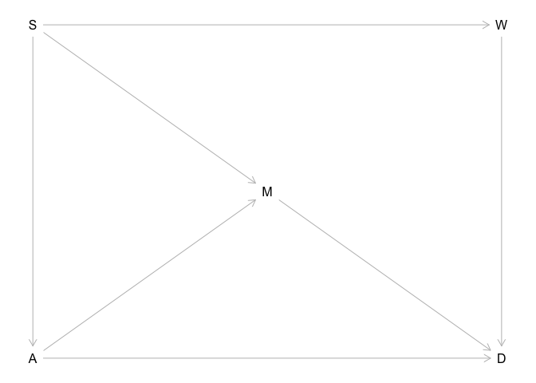<!-- -->
I want to examine effects of waffle house on divorce.

According to chapter, that means I just condition on S first.  That is, I include S in my model, as well as M and D.

So load the data, then make my model

```r
data("WaffleDivorce")
waffle <- WaffleDivorce
```
standardize variables


```r
waffle$D <- scale(waffle$Divorce)
waffle$A <- scale(waffle$MedianAgeMarriage)
waffle$M <- scale(waffle$Marriage)
waffle$W <- scale(waffle$WaffleHouses)

#and to use notation he favors, make South an index variable
# 1 means not South, 2 means South

waffle$S <- ifelse( waffle$South==1 , 2 , 1 )
```

now I think I'm ready to make a model, coditioning on S

see pages 151/153 for use of indicator varaible

modified from page 130

Do I need an alpha at all?  Or can I just use S as the alpha?  p 149
I htink so - 2 alphas means I am assuming two different mean divorce rates, south and not south
 
divorce ~ normal(mu, sigma) 
mu = alpha[south] + beta.waffle(W)   


```r
m6h1 <- quap(
  alist(
    D ~ dnorm(mu, sigma),
    mu <- a[S] + beta.waffle*W , 
    a[S]  ~ dnorm( 0, 0.5),
    beta.waffle ~ dnorm(0, 0.5),
    sigma ~ dexp(1)
  ),
  data = waffle)

precis(m6h1, depth = 2)
```

```
##                    mean         sd        5.5%      94.5%
## a[1]        -0.16222878 0.15956452 -0.41724369 0.09278614
## a[2]         0.36742527 0.26263116 -0.05231005 0.78716059
## beta.waffle  0.08385801 0.16033644 -0.17239059 0.34010661
## sigma        0.92232863 0.09125194  0.77649040 1.06816685
```

```r
plot(precis(m6h1, depth = 2))
```

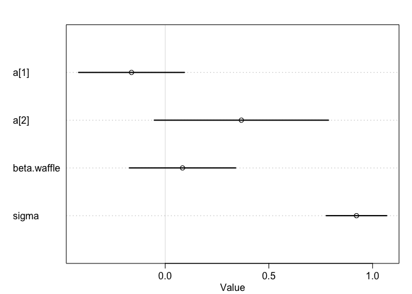<!-- -->
Remember 1 means not South, 2 means South
a trend for mean to be negative for not south, positive for south.  But crosses zero.

Beta.waffle mean is positive: 0.08.  slight positive effect on divorce?  But interval is from -0.17 to 0.34, so no confidence in its effect.


I'll remake my DAG, removing connection between W and D

```r
dag_6h1b <- dagitty( "dag {
S -> A -> D
S -> M -> D
S -> W 
A -> M
}")

coordinates( dag_6h1b ) <- list( x=c(S=0,A = 0, M = 1, W = 2, D = 2) ,
y=c(S = 0, W = 0, A = 2, M = 1, D = 2) )
plot( dag_6h1b )
```

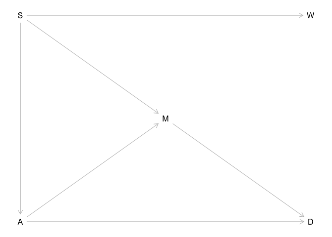<!-- -->

## problem 6H2.  Build a series of models to test the implied conditional independencies 
of the causal graph you used in the previous problem. If any of the tests fail, how do you think the graph needs to be amended? Does the graph need more or fewer arrows? Feel free to nominate variables that aren’t in the data.

First, look at association between S and W

```r
m6h2.SW <- quap(
  alist(
    W ~ dnorm(mu, sigma),
    mu <- a[S]  , 
    a[S]  ~ dnorm( 0, 0.5),
    sigma ~ dexp(1)
  ),
  data = waffle)

precis(m6h2.SW, depth = 2)
```

```
##             mean         sd       5.5%      94.5%
## a[1]  -0.4005765 0.11662527 -0.5869662 -0.2141868
## a[2]   0.9490277 0.18103897  0.6596924  1.2383629
## sigma  0.7190713 0.07184812  0.6042442  0.8338985
```

```r
plot(precis(m6h2.SW, depth = 2))
```

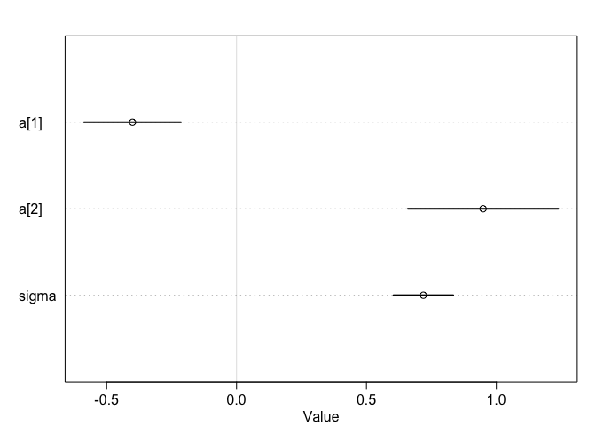<!-- -->
That is clear.  strong positive association between S and Waffle house

Next, look at association between S and M

```r
m6h2.SM <- quap(
  alist(
    M ~ dnorm(mu, sigma),
    mu <- a[S]  , 
    a[S]  ~ dnorm( 0, 0.5),
    sigma ~ dexp(1)
  ),
  data = waffle)

precis(m6h2.SM, depth = 2)
```

```
##              mean         sd       5.5%     94.5%
## a[1]  -0.04564866 0.15486818 -0.2931579 0.2018606
## a[2]   0.10202178 0.23154046 -0.2680246 0.4720681
## sigma  0.97725188 0.09634189  0.8232789 1.1312248
```

```r
plot(precis(m6h2.SM, depth = 2))
```

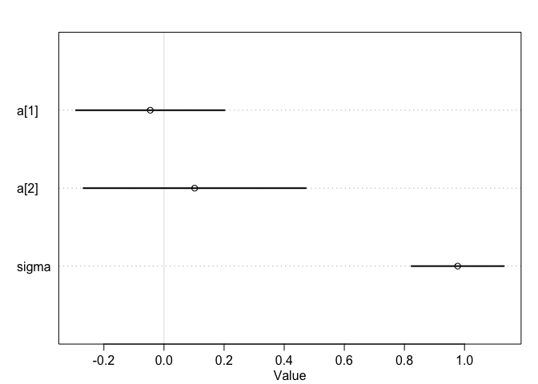<!-- -->
Not sure we can draw that line between S and M.  I"ll remove from DAG

OK, what about S and A?

```r
m6h2.SA <- quap(
  alist(
    A ~ dnorm(mu, sigma),
    mu <- a[S]  , 
    a[S]  ~ dnorm( 0, 0.5),
    sigma ~ dexp(1)
  ),
  data = waffle)

precis(m6h2.SA, depth = 2)
```

```
##             mean         sd       5.5%      94.5%
## a[1]   0.1390298 0.15111854 -0.1024868 0.38054645
## a[2]  -0.3129072 0.22693709 -0.6755965 0.04978215
## sigma  0.9510490 0.09393823  0.8009176 1.10118046
```

```r
plot(precis(m6h2.SA, depth = 2))
```

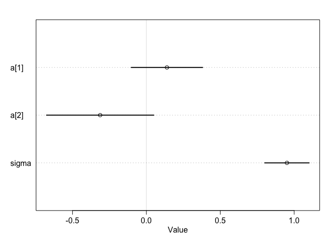<!-- -->
This is also not entirely clear.  but bulk of associations are as suggested. Leave in the DAG

What about A to M?


```r
m6h2.AM <- quap(
  alist(
    M ~ dnorm(mu, sigma),
    mu <- beta.A*A  , 
    beta.A ~ dnorm(0, 0.5),
    sigma ~ dexp(1)
  ),
  data = waffle)
?WaffleDivorce
precis(m6h2.AM, depth = 2)
```

```
##              mean         sd       5.5%      94.5%
## beta.A -0.6947377 0.09572668 -0.8477275 -0.5417480
## sigma   0.6817350 0.06757960  0.5737298  0.7897403
```

```r
plot(precis(m6h2.AM, depth = 2))
```

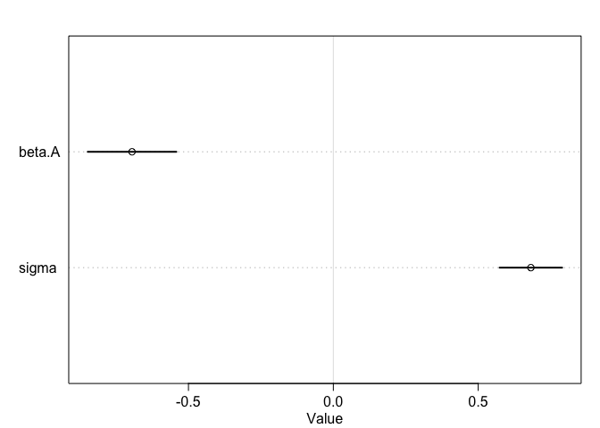<!-- -->
beta.A is strongly negative; the greater the age,the lower the M?  Yep. as expected, really.


```r
plot(waffle$M, waffle$A)
```

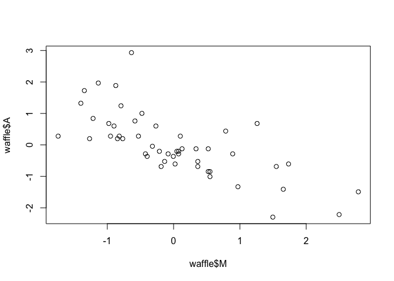<!-- -->
What about A to D?


```r
m6h2.AD <- quap(
  alist(
    D ~ dnorm(mu, sigma),
    mu <- beta.A*A  , 
    beta.A ~ dnorm(0, 0.5),
    sigma ~ dexp(1)
  ),
  data = waffle)

precis(m6h2.AD, depth = 2)
```

```
##              mean         sd       5.5%      94.5%
## beta.A -0.5684034 0.10999982 -0.7442044 -0.3926024
## sigma   0.7883258 0.07801136  0.6636486  0.9130030
```

```r
plot(precis(m6h2.AD, depth = 2))
```

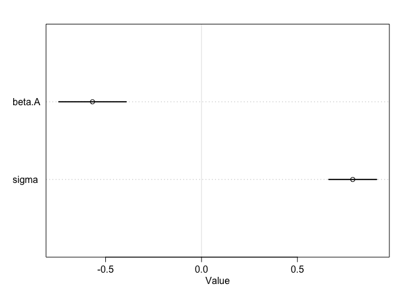<!-- -->
As above.

Shoudl I include a direct S to D??  If so, I need to control for A


```r
m6h2.SDA <- quap(
  alist(
    D ~ dnorm(mu, sigma),
    mu <- a[S] + beta.age*A , 
    a[S]  ~ dnorm( 0, 0.5),
    beta.age ~ dnorm(0, 0.5),
    sigma ~ dexp(1)
  ),
  data = waffle)

precis(m6h2.SDA, depth = 2)
```

```
##                mean         sd        5.5%       94.5%
## a[1]     -0.1245856 0.12423848 -0.32314268  0.07397149
## a[2]      0.2924387 0.19251112 -0.01523125  0.60010866
## beta.age -0.5253588 0.10942531 -0.70024154 -0.35047597
## sigma     0.7629477 0.07556069  0.64218711  0.88370827
```

```r
plot(precis(m6h2.SDA, depth = 2))
```

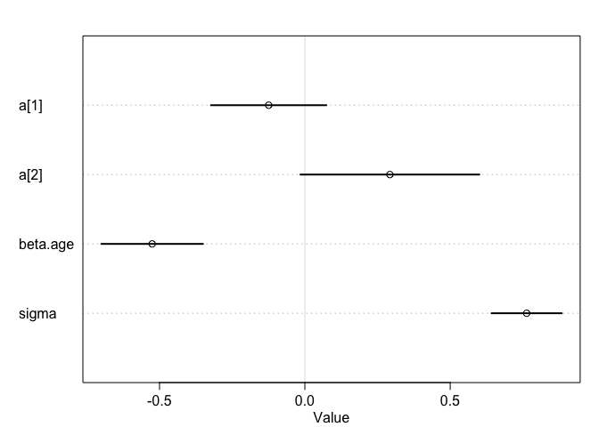<!-- -->

```r
# seems like South has posiitve effect on divorce, although it is a bit close,
# even after controlling for age
```

OK, I think I need to modify my DAG to remove S -> M
I will keep the S to A, though.  And I'll add S -> D


```r
dag_6h2.end <- dagitty( "dag {
S -> A -> D
S -> D
S -> W 
A -> M
}")

coordinates( dag_6h2.end ) <- list( x=c(S=0,A = 0, M = 0, W = 1, D = 1) ,
y=c(S = 0, W = 0, A = .5, M = 1, D = 1) )
plot( dag_6h2.end )
```

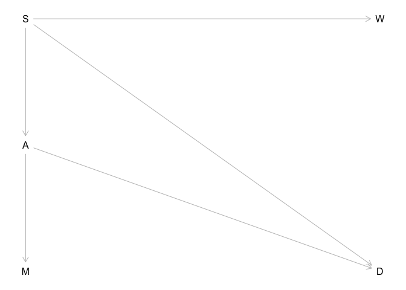<!-- -->

What if I considered the W to D connection using above graph?
I'd still just control on S.


And the three problems at https://github.com/rmcelreath/statrethinking_winter2019/blob/master/homework/week03.pdf

# Github homework - fox data


```r
library(rethinking)
data(foxes)
fox <- foxes
```
Want to model effect of area on weight.  
there is a pipe: area --> food --> weight
and there is a collider: food --> groupsize --> weight

## fox 1

I think he is asking us to simply model weight by area, ignoring other factors

First, scale data 


```r
fox$F <- scale(fox$avgfood)
fox$G <- scale(fox$groupsize)
fox$A <- scale(fox$area)
fox$W <- scale(fox$weight)
```
plot just to get sense

```r
plot(fox$A, fox$W)  # not a very good correpondence
```

<!-- -->

```r
pairs(fox) # food and group size are closely related, as are area and groupsize. 
```

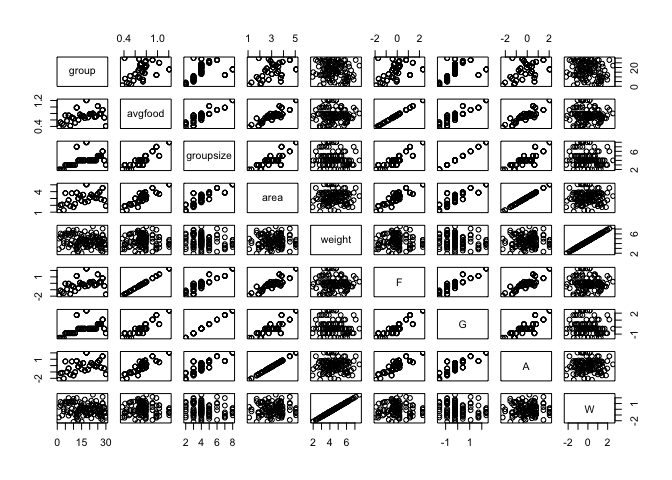<!-- -->

```r
# area and food also.  weight not clearly correlated to any one factor
```

Next, simple model with no additional factors.  Weight as influenced just by area.

```r
fox1 <- quap(
  alist(
    W ~ dnorm(mu, sigma),
    mu <- beta.area*A , 
    beta.area ~ dnorm(0, 0.5),
    sigma ~ dexp(1)
  ),
  data = fox)

precis(fox1)
```

```
##                 mean         sd       5.5%     94.5%
## beta.area 0.01883345 0.09089579 -0.1264356 0.1641025
## sigma     0.99126571 0.06466642  0.8879163 1.0946151
```

```r
plot(precis(fox1))
```

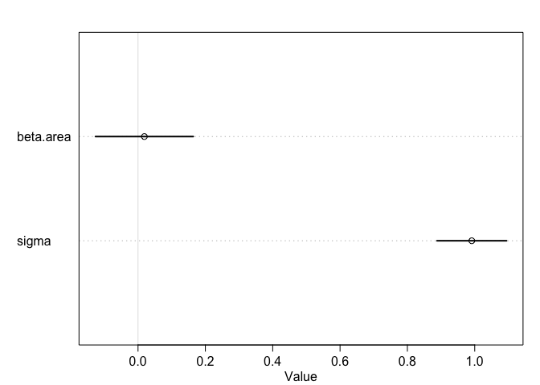<!-- -->
as expected from pairs plot, area doesn't appear explanatory for weight

Oops, I need to examine my priors.  see p 126 in book


```r
set.seed(10)
prior <- extract.prior( fox1 )
mu <- link( fox1 , post=prior , data=list( A=c(-2,2) ) )
plot( NULL , xlim=c(-2,2) , ylim=c(-2,2) )
for ( i in 1:50 ) lines( c(-2,2) , mu[i,] , col=col.alpha("black",0.4) )
```

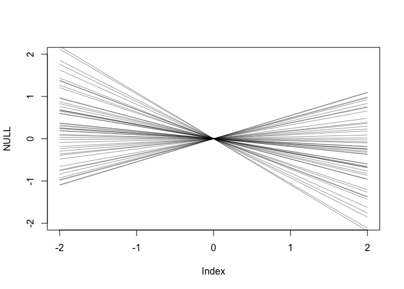<!-- -->
I think this is OK; my input range is from -2.2 to 2

```r
summary(fox)
```

```
##      group          avgfood         groupsize          area      
##  Min.   : 1.00   Min.   :0.3700   Min.   :2.000   Min.   :1.090  
##  1st Qu.:11.75   1st Qu.:0.6600   1st Qu.:3.000   1st Qu.:2.590  
##  Median :18.00   Median :0.7350   Median :4.000   Median :3.130  
##  Mean   :17.21   Mean   :0.7517   Mean   :4.345   Mean   :3.169  
##  3rd Qu.:24.00   3rd Qu.:0.8000   3rd Qu.:5.000   3rd Qu.:3.772  
##  Max.   :30.00   Max.   :1.2100   Max.   :8.000   Max.   :5.070  
##      weight              F.V1                 G.V1        
##  Min.   :1.920   Min.   :-1.9248292   Min.   :-1.5240888  
##  1st Qu.:3.720   1st Qu.:-0.4625154   1st Qu.:-0.8741098  
##  Median :4.420   Median :-0.0843308   Median :-0.2241307  
##  Mean   :4.530   Mean   : 0.0000000   Mean   : 0.0000000  
##  3rd Qu.:5.375   3rd Qu.: 0.2434292   3rd Qu.: 0.4258483  
##  Max.   :7.550   Max.   : 2.3108383   Max.   : 2.3757855  
##          A.V1                 W.V1        
##  Min.   :-2.2395962   Min.   :-2.2040586  
##  1st Qu.:-0.6238331   1st Qu.:-0.6838173  
##  Median :-0.0421584   Median :-0.0926124  
##  Mean   : 0.0000000   Mean   : 0.0000000  
##  3rd Qu.: 0.6499268   3rd Qu.: 0.7139601  
##  Max.   : 2.0475619   Max.   : 2.5509183
```
## fox 2
Now add food to the model. I think that i DO NOT want to add groupsize to the model as adding a collider is problematic.

model weight as effect of area and food availabile. 

```r
fox2 <- quap(
  alist(
    W ~ dnorm(mu, sigma),
    mu <- beta.area*A + beta.food*F, 
    beta.area ~ dnorm(0, 0.5),
    beta.food ~ dnorm(0, 0.5),
    sigma ~ dexp(1)
  ),
  data = fox)

precis(fox2)
```

```
##                 mean         sd       5.5%     94.5%
## beta.area  0.1461369 0.17418817 -0.1322495 0.4245232
## beta.food -0.1490384 0.17418833 -0.4274250 0.1293482
## sigma      0.9874671 0.06444156  0.8844771 1.0904572
```

```r
plot(precis(fox2))
```

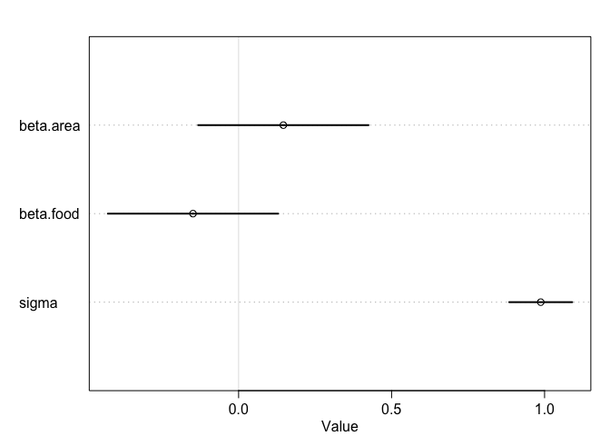<!-- -->

Now area has weakly positve and food has weakly negative effect (?) on weight.  not very reliable effects, however.

What if I add groupsize as well (I think this will muck things up)

```r
fox2b <- quap(
  alist(
    W ~ dnorm(mu, sigma),
    mu <- beta.area*A + beta.food*F + beta.group*G, 
    beta.area ~ dnorm(0, 0.5),
    beta.food ~ dnorm(0, 0.5),
    beta.group ~ dnorm(0, 0.5),
    sigma ~ dexp(1)
  ),
  data = fox)

precis(fox2b)
```

```
##                  mean         sd         5.5%      94.5%
## beta.area   0.2782383 0.17011229  0.006366013  0.5501106
## beta.food   0.2968997 0.20960025 -0.038081954  0.6318814
## beta.group -0.6396202 0.18161485 -0.929875792 -0.3493646
## sigma       0.9312065 0.06100011  0.833716509  1.0286964
```

```r
plot(precis(fox2b))
```

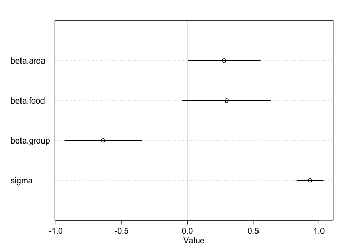<!-- -->
Hey, this looks perfectly reasonable.  now area and food positively associated with weight, and group size is strongly negatively associated.  Why did this work?  I have included things highly correlated with each other (group size and food); isn't this a problem?


```r
cor(fox$groupsize, fox$avgfood) #0.9014829
```

```
## [1] 0.9014829
```

```r
cor(fox$groupsize, fox$area) # 0.8275945
```

```
## [1] 0.8275945
```

```r
cor(fox$avgfood, fox$area) # 0.8831038
```

```
## [1] 0.8831038
```


