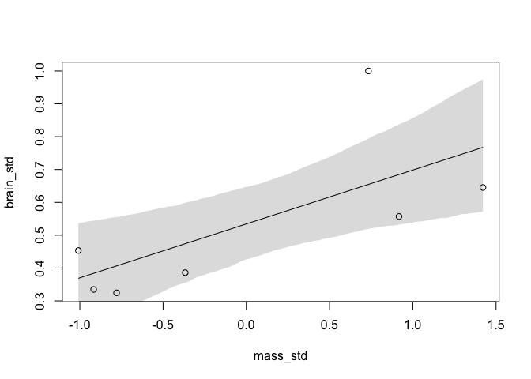

R club week 9 (7/10/2019)

paths: information can walk against the arrows, but causation only flows with the arrows.
implied conditional independence.  
(I think one trick is to see if collider is present)
directed acyclic gaffes (!)  put error into model; residual confounding.

_Video: Ulysses_ Compass https://youtu.be/0Jc6Kgw5qc0 (you may have already watched the first half of this)
starts at minute 43 ish

overfitting  - learning too muchf rom the data.  fit well, but predict worse.
(classic is polynomial regression - wiggles aroudn like carzy when drop out any one point)

underfitting  - learning to littl from the data.  fit and predict poorly.

fit model, dropping out one data point at a time.  insenstiive to exact sample - mayb too little fitting.

(* adding parameters improves fit to sample, although not true of multilevel models & other types)

R-squared - common measure of model fit. = 1 - var(resid)/var(outcome)

Regularization of priors.  (penalized likelihood is same thing)

WAIC - widely applicable information criteria (has replaced AIC).  

_Book: 7.1 and 7.2_

regularizing prior = penalized likelihood.  prior limits how much model relies on the data. 

Information criteria - estimate the predictive accuracy of the model. 

information theory

**7.1 parameters**


```r
sppnames <- c( "afarensis","africanus","habilis","boisei",
               "rudolfensis","ergaster","sapiens")
brainvolcc <- c( 438 , 452 , 612, 521, 752, 871, 1350 )
masskg <- c( 37.0 , 35.5 , 34.5 , 41.5 , 55.5 , 61.0 , 53.5 )
d <- data.frame( species=sppnames , brain=brainvolcc , mass=masskg )
```
now rescale varialbes


```r
d$mass_std <- (d$mass - mean(d$mass))/sd(d$mass) #mean zero, SD =1
d$brain_std <- d$brain / max(d$brain)
summary(d)
```

```
##         species      brain             mass          mass_std      
##  afarensis  :1   Min.   : 438.0   Min.   :34.50   Min.   :-1.0087  
##  africanus  :1   1st Qu.: 486.5   1st Qu.:36.25   1st Qu.:-0.8482  
##  boisei     :1   Median : 612.0   Median :41.50   Median :-0.3668  
##  ergaster   :1   Mean   : 713.7   Mean   :45.50   Mean   : 0.0000  
##  habilis    :1   3rd Qu.: 811.5   3rd Qu.:54.50   3rd Qu.: 0.8253  
##  rudolfensis:1   Max.   :1350.0   Max.   :61.00   Max.   : 1.4214  
##  sapiens    :1                                                     
##    brain_std     
##  Min.   :0.3244  
##  1st Qu.:0.3604  
##  Median :0.4533  
##  Mean   :0.5287  
##  3rd Qu.:0.6011  
##  Max.   :1.0000  
## 
```

code 7.3

```r
library(rethinking)
```

```
## Loading required package: rstan
```

```
## Loading required package: ggplot2
```

```
## Loading required package: StanHeaders
```

```
## rstan (Version 2.18.2, GitRev: 2e1f913d3ca3)
```

```
## For execution on a local, multicore CPU with excess RAM we recommend calling
## options(mc.cores = parallel::detectCores()).
## To avoid recompilation of unchanged Stan programs, we recommend calling
## rstan_options(auto_write = TRUE)
```

```
## Loading required package: parallel
```

```
## rethinking (Version 1.88)
```

```r
m7.1 <- quap(
  alist(
    brain_std ~ dnorm( mu , exp(log_sigma) ),
    mu <- a + b*mass_std,
    a ~ dnorm( 0.5 , 1 ),
    b ~ dnorm( 0 , 10 ),
    log_sigma ~ dnorm( 0 , 1 )
), data=d )
```
***why the exp(log)??***

Rsq tells us 'proportion of variance "explained" by the model'.  
compute posterior predictive distribution for each observation.  then get residuals, and variances.

code 7.4

```r
set.seed(12)
s <- sim( m7.1 )  # this computes posterior predictive distribution for each observation.  
# see figure 3.6 on page 66 for explanation
r <- apply(s,2,mean) - d$brain_std  # r is residual
resid_var <- var2(r) # var2 is actual empirical variance
outcome_var <- var2( d$brain_std )
1 - resid_var/outcome_var
```

```
## [1] 0.4774589
```
write function
code 7.5

```r
R2_is_bad <- function( quap_fit ) {
  s <- sim( quap_fit , refresh=0 )
  r <- apply(s,2,mean) - d$brain_std
  1 - var2(r)/var2(d$brain_std)
}
```


```r
m7.2 <- quap( 
  alist(
    brain_std ~ dnorm( mu , exp(log_sigma) ),
    mu <- a + b[1]*mass_std + b[2]*mass_std^2,
    a ~ dnorm( 0.5 , 1 ),
    b ~ dnorm( 0 , 10 ),
    log_sigma ~ dnorm( 0 , 1 )
    ), data=d , start=list(b=rep(0,2)) )
```


```r
m7.3 <- quap( 
  alist(
    brain_std ~ dnorm( mu , exp(log_sigma) ),
    mu <- a + b[1]*mass_std + b[2]*mass_std^2 + 
      b[3]*mass_std^3,
    a ~ dnorm( 0.5 , 1 ),
    b ~ dnorm( 0 , 10 ),
    log_sigma ~ dnorm( 0 , 1 )
    ), data=d , start=list(b=rep(0,3)) )

m7.4 <- quap( 
  alist(
    brain_std ~ dnorm( mu , exp(log_sigma) ),
    mu <- a + b[1]*mass_std + b[2]*mass_std^2 + 
      b[3]*mass_std^3 + b[4]*mass_std^4,
    a ~ dnorm( 0.5 , 1 ),
    b ~ dnorm( 0 , 10 ),
    log_sigma ~ dnorm( 0 , 1 )
    ), data=d , start=list(b=rep(0,4)) )

m7.5 <- quap( 
  alist(
    brain_std ~ dnorm( mu , exp(log_sigma) ),
    mu <- a + b[1]*mass_std + b[2]*mass_std^2 + 
      b[3]*mass_std^3 + b[4]*mass_std^4 +
      b[5]*mass_std^5,
    a ~ dnorm( 0.5 , 1 ),
    b ~ dnorm( 0 , 10 ),
    log_sigma ~ dnorm( 0 , 1 )
    ), data=d , start=list(b=rep(0,5)) )
```
last model: replace SD with constant

code 7.8

```r
m7.6 <- quap(
  alist(
    brain_std ~ dnorm( mu , 0.001 ),
    mu <- a + b[1]*mass_std + b[2]*mass_std^2 +
      b[3]*mass_std^3 + b[4]*mass_std^4 +
      b[5]*mass_std^5 + b[6]*mass_std^6,
    a ~ dnorm( 0.5 , 1 ),
    b ~ dnorm( 0 , 10 )
    ), data=d , start=list(b=rep(0,6)) )
```

plot

```r
post <- extract.samples(m7.1)
mass_seq <- seq( from=min(d$mass_std) , to=max(d$mass_std) , length.out=100 )
l <- link( m7.1 , data=list( mass_std=mass_seq ) )
mu <- apply( l , 2 , mean )
ci <- apply( l , 2 , PI )
plot( brain_std ~ mass_std , data=d )
lines( mass_seq , mu )
shade( ci , mass_seq )
```

<!-- -->
code 7.10

```r
m7.1_OLS <- lm( brain_std ~ mass_std , data=d )
post <- extract.samples( m7.1_OLS )
```

code 7.11 - no predictor variables


```r
m7.7 <- quap( 
  alist(
    brain_std ~ dnorm( mu , exp(log_sigma) ),
    mu <- a,
    a ~ dnorm( 0.5 , 1 ),
    log_sigma ~ dnorm( 0 , 1 )
    ), data=d )
```

helpful trick - see function brain_loo_plot  
***couldn't find this function***

```r
??brain_loo_plot
```

```
## No vignettes or demos or help files found with alias or concept or
## title matching 'brain_loo_plot' using regular expression matching.
```


**7.2 entropy, accuracy**
what is out of sample deviance?  deviance of model from future observations

7.2.1  
Information Entropy
p 218. "uncertainty in a probability distribution ishte average log-probability of an event"

code 7.13

```r
p <- c(0.3, 0.7)

-sum(p*log(p))  # this is the entropy value.  this quantifies our uncertainty
```

```
## [1] 0.6108643
```
maxent = maximum entropy = family of techniques to find probabliliyt distributions more consistent with our state of knowledge.  

7.2.3  
entropy to accuracy

Divergence = additonal uncertainty introduced by using probabilites from one disribution to describe another.
It is the average differnce in log prob between target (p) and model (q).  the differnece between entropy of hte target distribution p, and the model distribution q.

can use this to contrast different approximations to p.  want to minimize divergence.  model with less divergence is more accurate.

K-L divergence (above) is distance of model from target
can estimate this divergence using deviance

need to compare the average log-probabilities of the two models in question.  

code 7.14

```r
set.seed(1)
lppd( m7.1, n=1e4)
```

```
## [1]  0.6098667  0.6483437  0.5496093  0.6234933  0.4648142  0.4347604
## [7] -0.8444629
```

lppd = log pointwise predictive density.  
sum them up to get total log-prob score for model and data

7.2.5  
scoring the right data


```r
set.seed(1)
sapply( list(m7.1,m7.2,m7.3,m7.4,m7.5,m7.6) , function(m) sum(lppd(m)) )
```

```
## [1]  2.490390  2.566165  3.707343  5.333750 14.090061 39.445390
```
p224 
**confusing**
the 'true' model has non-zero coeff for only first 2 predictors, so the true model has 3 parameters ????

_Problems: 7E1 - 7E4_ 
(actually listed as 6E1 - 6E4 in the book but they are at the end of chapter 7 on PAGE 234/250)

**7E1**
the three motivating criteria that define information entropy.  see p 202
1. we want the relationship between probability and uncertainty to be continuous.  this way, small changes in probability don't cause big changes in undertainty.
2. uncertainty increases with the number of different possible outcomes.
3. uncertainty measurements can be added together so that subsets of conditions always add up so that total uncertainty is unchanged

**7E2**
What is the entropy of a coin that comes up heads 70% of the time?
on page 203, entropy is defined with these probabilites

```r
p <- c(0.7, 0.3)
-sum(p*log(p))
```

```
## [1] 0.6108643
```

**7E3**
As above, but with 4 sides on a dice.

```r
p <- c(0.2, 0.25, 0.25, 0.3)
-sum(p*log(p))
```

```
## [1] 1.376227
```
**7E4**
As above, but with 4 sides on a dice, but one of which never comes up.
on page 203/219, he says just ignore this possible event (as it isn't really possible)


```r
p <- c(0.333, 0.333, 0.333)
-sum(p*log(p))
```

```
## [1] 1.098513
```


