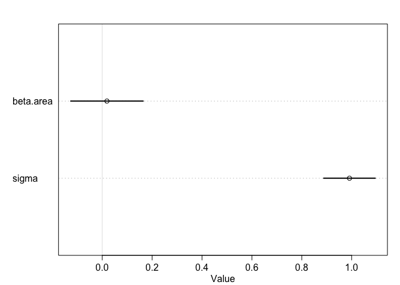

Finish reading chapter 7.5
p 221

Then do the problems at https://github.com/rmcelreath/statrethinking_winter2019/blob/master/homework/week04.pdf

## Video: 08-Jan 18: Model Comparison 
https://www.youtube.com/watch?v=gjrsYDJbRh0&feature=youtu.be

## ch 7.5
fungus example p 168 (now on page 222)

code 6.14

```r
library(rethinking)
```

```
## Loading required package: rstan
```

```
## Loading required package: ggplot2
```

```
## Loading required package: StanHeaders
```

```
## rstan (Version 2.18.2, GitRev: 2e1f913d3ca3)
```

```
## For execution on a local, multicore CPU with excess RAM we recommend calling
## options(mc.cores = parallel::detectCores()).
## To avoid recompilation of unchanged Stan programs, we recommend calling
## rstan_options(auto_write = TRUE)
```

```
## Loading required package: parallel
```

```
## rethinking (Version 1.88)
```

```r
set.seed(71)
# number of plants
N <- 100
# simulate initial heights
h0 <- rnorm(N,10,2)
# assign treatments and simulate fungus and growth
treatment <- rep( 0:1 , each=N/2 )
fungus <- rbinom( N , size=1 , prob=0.5 - treatment*0.4 )
h1 <- h0 + rnorm(N, 5 - 3*fungus)
# compose a clean data frame
d <- data.frame( h0=h0 , h1=h1 , treatment=treatment , fungus=fungus )

precis(d)
```

```
##               mean        sd      5.5%    94.5%    histogram
## h0         9.95978 2.1011623  6.570328 13.07874 ▁▂▂▂▇▃▂▃▁▁▁▁
## h1        14.39920 2.6880870 10.618002 17.93369     ▁▁▃▇▇▇▁▁
## treatment  0.50000 0.5025189  0.000000  1.00000   ▇▁▁▁▁▁▁▁▁▇
## fungus     0.23000 0.4229526  0.000000  1.00000   ▇▁▁▁▁▁▁▁▁▂
```
code 6.15, 6.16

```r
sim_p <- rlnorm( 1e4 , 0 , 0.25 ) 
precis( data.frame(sim_p) )
```

```
##          mean        sd     5.5%    94.5%    histogram
## sim_p 1.03699 0.2629894 0.670683 1.496397 ▁▁▃▇▇▃▁▁▁▁▁▁
```

```r
m6.6 <- quap( 
  alist(
    h1 ~ dnorm( mu , sigma ),
    mu <- h0*p,
    p ~ dlnorm( 0 , 0.25 ),
    sigma ~ dexp( 1 )
    ), data=d )

precis(m6.6)
```

```
##           mean         sd     5.5%    94.5%
## p     1.426626 0.01760992 1.398482 1.454770
## sigma 1.793286 0.12517262 1.593236 1.993336
```

code 6.17

```r
m6.7 <- quap(
  alist(
    h1 ~ dnorm( mu , sigma ),
    mu <- h0 * p,
    p <- a + bt*treatment + bf*fungus,
    a ~ dlnorm( 0 , 0.2 ) ,
    bt ~ dnorm( 0 , 0.5 ),
    bf ~ dnorm( 0 , 0.5 ),
    sigma ~ dexp( 1 )
    ), data=d )
precis(m6.7)
```

```
##               mean         sd        5.5%       94.5%
## a      1.481391468 0.02451069  1.44221865  1.52056429
## bt     0.002412222 0.02986965 -0.04532525  0.05014969
## bf    -0.266718915 0.03654772 -0.32512923 -0.20830860
## sigma  1.408797442 0.09862070  1.25118251  1.56641237
```
code 6.18

```r
m6.8 <- quap( 
  alist(
    h1 ~ dnorm( mu , sigma ),
    mu <- h0 * p,
    p <- a + bt*treatment,
    a ~ dlnorm( 0 , 0.2 ),
    bt ~ dnorm( 0 , 0.5 ),
    sigma ~ dexp( 1 )
    ), data=d )
precis(m6.8)
```

```
##             mean         sd       5.5%     94.5%
## a     1.38035767 0.02517554 1.34012229 1.4205931
## bt    0.08499924 0.03429718 0.03018573 0.1398128
## sigma 1.74631655 0.12191552 1.55147200 1.9411611
```

now compare these models

code 7.28


```r
set.seed(11)
WAIC( m6.7 ) # both treatment and fungus in model
```

```
## [1] 361.4511
## attr(,"lppd")
## [1] -177.1724
## attr(,"pWAIC")
## [1] 3.553198
## attr(,"se")
## [1] 14.17033
```

code 7.27

```r
set.seed(77)
compare( m6.6 , m6.7 , m6.8 )
```

```
##          WAIC    pWAIC    dWAIC       weight       SE      dSE
## m6.7 361.8901 3.839491  0.00000 1.000000e+00 14.26190       NA
## m6.8 402.7757 2.645879 40.88562 1.323732e-09 11.28257 10.47837
## m6.6 405.9139 1.581312 44.02380 2.756471e-10 11.64641 12.22582
```

now compute SE of the differnece between two models


```r
set.seed(91) 
waic_m6.7 <- WAIC( m6.7 , pointwise=TRUE )
waic_m6.8 <- WAIC( m6.8 , pointwise=TRUE )
n <- length(waic_m6.7)  # what is this for?  
diff_m6.7_m6.8 <- waic_m6.7 - waic_m6.8
```

Something got left out here, it seems


```r
plot(compare(m6.6, m6.7, m6.8))
```

<!-- -->

Filled poitns are in sample deviance, open points are WAIC values. lines are SE of each WAIC.  Line with triangle is SE of differnece in WAIC between models.

code 7.31

```r
set.seed(92)
waic_m6.6 <- WAIC( m6.6 , pointwise=TRUE )
diff_m6.6_m6.8 <- waic_m6.6 - waic_m6.8
sqrt( n*var( diff_m6.6_m6.8 ) )
```

```
## [1] 4.854575
```
or


```r
set.seed(93)
compare( m6.6 , m6.7 , m6.8 )@dSE
```

```
##           m6.6     m6.7      m6.8
## m6.6        NA 12.20191  4.930467
## m6.7 12.201914       NA 10.426817
## m6.8  4.930467 10.42682        NA
```


```r
precis(m6.8) # model with treatment only
```

```
##             mean         sd       5.5%     94.5%
## a     1.38035767 0.02517554 1.34012229 1.4205931
## bt    0.08499924 0.03429718 0.03018573 0.1398128
## sigma 1.74631655 0.12191552 1.55147200 1.9411611
```

```r
plot(precis(m6.8))
```

<!-- -->

### 7.5.2   Cebus
Comparing posterior predictions to raw data

code 7.33

```r
data("Primates301")
d <- Primates301

?Primates301
```

Model longevity on th elog of body mass and brain volume

code 7.34

```r
d$log_L <- scale(log(d$longevity))
d$log_B <- scale(log(d$brain))
d$log_M <- scale(log(d$body))
```

Count the missing values


```r
sapply( d[, c("log_L", "log_B", "log_M")], function(x) sum(is.na(x)))
```

```
## log_L log_B log_M 
##   181   117    63
```

Never never never compare models based on different numbers of observations!


```r
d2 <- d[ complete.cases(d$log_L, d$log_M, d$log_B) ,]
nrow(d2)
```

```
## [1] 112
```

code 7.37

```r
m7.8 <- quap( 
  alist(
    log_L ~ dnorm( mu , sigma ),
    mu <- a + bM*log_M + bB*log_B,
    a ~ dnorm(0,0.1),
    bM ~ dnorm(0,0.5),
    bB ~ dnorm(0,0.5),
    sigma ~ dexp(1)
    ) , data=d2 )
```


two simpler models
code 7.38


```r
m7.9 <- quap( 
  alist(
    log_L ~ dnorm( mu , sigma ),
    mu <- a + bB*log_B,
    a ~ dnorm(0,0.1),
    bB ~ dnorm(0,0.5),
    sigma ~ dexp(1)
    ) , data=d2 )
# brain only


m7.10 <- quap(
  alist(
    log_L ~ dnorm( mu , sigma ),
    mu <- a + bM*log_M,
    a ~ dnorm(0,0.1),
    bM ~ dnorm(0,0.5),
    sigma ~ dexp(1)
    ) , data=d2 )

# body only
```

compare


```r
set.seed(301)
compare(m7.8, m7.9, m7.10)
```

```
##           WAIC    pWAIC      dWAIC       weight       SE      dSE
## m7.8  216.2261 3.472685  0.0000000 0.5335026238 14.71922       NA
## m7.9  216.4977 2.603003  0.2715816 0.4657612510 14.83667 1.507168
## m7.10 229.3978 2.465432 13.1716380 0.0007361252 16.30327 7.006331
```


```r
plot(compare(m7.8, m7.9, m7.10))
```

<!-- -->

Now, compare posterior distributions


```r
plot( coeftab( m7.8 , m7.9 , m7.10 ) , pars=c("bM","bB") )
```

<!-- -->

model 7.8 is weird because of colinearity between body mass and brain size


```r
cor(d2$log_B, d2$log_M)
```

```
##           [,1]
## [1,] 0.9796272
```


```r
plot(d2$log_B, d2$log_M)
```

<!-- -->

Whoa! 
see p 229 for preview of homework

"Widely Applicable Information Criterion (WAIC) makes no assumption about the
shape of the posterior.107 It provides an approximation of the out-of-sample deviance that
converges to the leave-one-out cross-validation approximation in a large sample"

code 7.43


```r
waic_m7.8 <- WAIC( m7.8 , pointwise=TRUE )
waic_m7.9 <- WAIC( m7.9 , pointwise=TRUE )

str(waic_m7.8)
```

```
##  num [1:112] 1.336 1.949 0.898 1.873 0.939 ...
##  - attr(*, "lppd")= num [1:112] -0.663 -0.96 -0.444 -0.888 -0.464 ...
##  - attr(*, "pWAIC")= num [1:112] 0.00528 0.01492 0.00498 0.04818 0.00518 ...
##  - attr(*, "se")= num 14.7
```

plot pointwise differneces between the models

code 7.44

```r
# compute point scaling
x <- d2$log_B - d2$log_M
x <- x - min(x)
x <- x / max(x)  # this is now proportional

# draw the plot
plot( waic_m7.8 - waic_m7.9 , d2$log_L ,
      xlab="pointwise difference in WAIC" , ylab="log longevity (std)" , pch=21 ,

      col=col.alpha("black",0.8) , cex=1+x , lwd=2 , bg=col.alpha(rangi2,0.4) )
abline( v=0 , lty=2 )
abline( h=0 , lty=2 )
```

<!-- -->

```r
# why did that plot command work??  
## note x was used to determine size of points
```

OK, what if brain size is outcome of both longevity and body mass?

code 7.45


```r
m7.11 <- quap(
  alist(
    log_B ~ dnorm( mu , sigma ),
    mu <- a + bM*log_M + bL*log_L,
    a ~ dnorm(0,0.1),
    bM ~ dnorm(0,0.5),
    bL ~ dnorm(0,0.5),
    sigma ~ dexp(1)
  ) , data=d2 )

precis( m7.11 )
```

```
##              mean         sd        5.5%       94.5%
## a     -0.04506873 0.01795371 -0.07376224 -0.01637523
## bM     0.93842037 0.02602549  0.89682661  0.98001413
## bL     0.11549564 0.02723920  0.07196215  0.15902914
## sigma  0.18997589 0.01267748  0.16971483  0.21023695
```


```r
plot(precis(m7.11))
```

<!-- -->

## Problems

### 1.  Birb populations.

#### 1A.  compute the entropy of birb populations
p 218 - information entropy.  it is higher for islands with more equal populations of the bird species.
avg log prob of an event.  H is  


```r
isl.1 <- rep(.2, 5)
isl.2 <- c(0.8, 0.1, 0.05, 0.025, 0.025)
isl.3 <- c(0.05, 0.15, 0.7, 0.05, 0.05)

-sum(isl.1*log(isl.1))
```

```
## [1] 1.609438
```

```r
-sum(isl.2*log(isl.2))
```

```
## [1] 0.7430039
```

```r
-sum(isl.3*log(isl.3))
```

```
## [1] 0.9836003
```

OK, as predicted, island 1 has the highest entropy (equal chance of any of the birbs).  island 3 has slightly higher entropy than island 2, because island 2 has one very dominant birb species

#### 1B.  use each island's birb distirbution to predict hte other two

I believe island 1 will be the best predictor for the other two islands.  

OK, use island 1 to compute Dkl for the other islands

```r
# first, isl2 is the target and isl1 the model
-sum(isl.2 * (log(isl.1) - log(isl.2)))  ## 0.9
```

```
## [1] 0.866434
```

```r
# then, isl3 is the target and isl1 the model
-sum(isl.3 * (log(isl.1) - log(isl.3)))  ## 0.62
```

```
## [1] 0.6258376
```

Now, use island 2 to predict the other two targets.  I expect Dkl to be larger


```r
# first, isl1 is the target and isl2 the model
-sum(isl.1 * (log(isl.2) - log(isl.1)))  ## 0.97
```

```
## [1] 0.9704061
```

```r
# then, isl3 is the target and isl2 the model
-sum(isl.3 * (log(isl.2) - log(isl.3)))  ## 1.83
```

```
## [1] 1.838845
```
So island 2 is a much worse predictor for island 3 than it is for island 1.  Makes sense

Last, island 3 as predictor for hte other two islands


```r
# first, isl1 is the target and isl3 the model
-sum(isl.1 * (log(isl.3) - log(isl.1)))  ## 0.64
```

```
## [1] 0.6387604
```

```r
# then, isl2 is the target and isl3 the model
-sum(isl.2 * (log(isl.3) - log(isl.2)))  ## 2
```

```
## [1] 2.010914
```

OK, why is island 3 a better predictor of island 1 than island 2 is?  Makes sense, because Birb A really dominates on island 2 more than Birb C does on island 3.

In general, island 1 is best preditor.  But not as different as I expected.

### 2.  WAIC, for models 6.9 and 6.10

First, load data

```r
library(rethinking)
d_hap <- sim_happiness( seed=1977 , N_years=1000 )
precis(d_hap)
```

```
##                    mean        sd      5.5%     94.5%     histogram
## age        3.300000e+01 18.768883  4.000000 62.000000 ▇▇▇▇▇▇▇▇▇▇▇▇▇
## married    3.007692e-01  0.458769  0.000000  1.000000    ▇▁▁▁▁▁▁▁▁▃
## happiness -1.000070e-16  1.214421 -1.789474  1.789474      ▇▅▇▅▅▇▅▇
```


Scale age range (from 18 to 65)

```r
d2_hap <- d_hap[ d_hap$age>17 , ] # only adults
d2_hap$A <- ( d2_hap$age - 18 ) / ( 65 - 18 )
```


```r
d2_hap$mid <- d2_hap$married + 1

m6.9 <- quap(
  alist(
    happiness ~ dnorm( mu , sigma ),
    mu <- a[mid] + bA*A,
    a[mid] ~ dnorm( 0 , 1 ),
    bA ~ dnorm( 0 , 2 ),
    sigma ~ dexp(1)
    ) , data=d2_hap )
precis(m6.9,depth=2)
```

```
##             mean         sd       5.5%      94.5%
## a[1]  -0.2350877 0.06348986 -0.3365568 -0.1336186
## a[2]   1.2585517 0.08495989  1.1227694  1.3943340
## bA    -0.7490274 0.11320112 -0.9299447 -0.5681102
## sigma  0.9897080 0.02255800  0.9536559  1.0257600
```


```r
plot(precis(m6.9, depth = 2))
```

<!-- -->

Age negatively associated with happiness

Now, model without marraige

```r
m6.10 <- quap(
  alist(
    happiness ~ dnorm( mu , sigma ),
    mu <- a + bA*A,
    a ~ dnorm( 0 , 1 ),
    bA ~ dnorm( 0 , 2 ),
    sigma ~ dexp(1)
    ) , data=d2_hap )
precis(m6.10)
```

```
##                mean         sd       5.5%     94.5%
## a      1.649248e-07 0.07675015 -0.1226614 0.1226617
## bA    -2.728620e-07 0.13225976 -0.2113769 0.2113764
## sigma  1.213188e+00 0.02766080  1.1689803 1.2573949
```


```r
plot(precis(m6.10))
```

<!-- -->
Now compare these models, using WAIC


```r
compare(m6.9, m6.10)
```

```
##           WAIC    pWAIC    dWAIC       weight       SE      dSE
## m6.9  2713.971 3.738532   0.0000 1.000000e+00 37.54465       NA
## m6.10 3101.906 2.340445 387.9347 5.768312e-85 27.74379 35.40032
```

This simple analysis tells me that WAIC thinks model 9 is better, by quite a few units.  

But recall the data is simulated; marriage is a common conseuqence of both age and happiness.  This means marriage status is a collider.  If it is included in teh model, it induces an association between age and happiness. (Recall happier people are more likely to be married, and that older people are more likely to be married. )

If we know both age and marriage status, we are more likely to be able to predict happiness (young married people are on average happier than young unmarried people).  So the model with marriage and age predicts better.  But the collider status of marriage means we can't conclude causality.


### 3.  urban foxes.  

make models
(1) avgfood + groupsize + area
(2) avgfood + groupsize
(3) groupsize + area
(4) avgfood
(5) area


```r
library(rethinking)
data(foxes)
fox <- foxes
```

First, scale the data

```r
fox$F <- scale(fox$avgfood)
fox$G <- scale(fox$groupsize)
fox$A <- scale(fox$area)
fox$W <- scale(fox$weight)
```

(1) avgfood + groupsize + area


```r
fox.m1 <- quap(
  alist(
    W ~ dnorm(mu, sigma),
    mu <- beta.area*A + beta.food*F + beta.group*G, 
    beta.area ~ dnorm(0, 0.5),
    beta.food ~ dnorm(0, 0.5),
    beta.group ~ dnorm(0, 0.5),
    sigma ~ dexp(1)
  ),
  data = fox)

precis(fox.m1)
```

```
##                  mean         sd         5.5%      94.5%
## beta.area   0.2782361 0.17011241  0.006363582  0.5501086
## beta.food   0.2968980 0.20960039 -0.038083904  0.6318799
## beta.group -0.6396167 0.18161500 -0.929872506 -0.3493608
## sigma       0.9312072 0.06100023  0.833717075  1.0286974
```

```r
plot(precis(fox.m1))
```

<!-- -->

(2) avgfood + groupsize


```r
fox.m2 <- quap(
  alist(
    W ~ dnorm(mu, sigma),
    mu <-  beta.food*F + beta.group*G, 
    beta.food ~ dnorm(0, 0.5),
    beta.group ~ dnorm(0, 0.5),
    sigma ~ dexp(1)
  ),
  data = fox)

precis(fox.m2)
```

```
##                  mean         sd       5.5%      94.5%
## beta.food   0.4773758 0.17911621  0.1911135  0.7636381
## beta.group -0.5737025 0.17913405 -0.8599933 -0.2874117
## sigma       0.9420035 0.06174594  0.8433216  1.0406855
```

```r
plot(precis(fox.m2))
```

<!-- -->


(3) groupsize + area


```r
fox.m3 <- quap(
  alist(
    W ~ dnorm(mu, sigma),
    mu <- beta.area*A +  beta.group*G, 
    beta.area ~ dnorm(0, 0.5),
    beta.group ~ dnorm(0, 0.5),
    sigma ~ dexp(1)
  ),
  data = fox)

precis(fox.m3)
```

```
##                  mean         sd       5.5%      94.5%
## beta.area   0.4058547 0.14536220  0.1735379  0.6381716
## beta.group -0.4820109 0.14537216 -0.7143437 -0.2496781
## sigma       0.9419428 0.06159363  0.8435042  1.0403813
```

```r
plot(precis(fox.m3))
```

<!-- -->

(4) avgfood


```r
fox.m4 <- quap(
  alist(
    W ~ dnorm(mu, sigma),
    mu <- beta.food*F , 
    beta.food ~ dnorm(0, 0.5),
    sigma ~ dexp(1)
  ),
  data = fox)

precis(fox.m4)
```

```
##                  mean         sd       5.5%     94.5%
## beta.food -0.02421151 0.09088497 -0.1694632 0.1210402
## sigma      0.99114342 0.06465849  0.8878067 1.0944802
```

```r
plot(precis(fox.m4))
```

<!-- -->

(5) area


```r
fox.m5 <- quap(
  alist(
    W ~ dnorm(mu, sigma),
    mu <- beta.area*A , 
    beta.area ~ dnorm(0, 0.5),
    sigma ~ dexp(1)
  ),
  data = fox)

precis(fox.m5)
```

```
##                mean         sd       5.5%     94.5%
## beta.area 0.0188337 0.09089579 -0.1264353 0.1641027
## sigma     0.9912657 0.06466642  0.8879163 1.0946151
```

```r
plot(precis(fox.m5))
```

<!-- -->

So it looks like area alone, or food alone, aren't great predictors

Now comare the WAIC scores


```r
compare(fox.m1, fox.m2, fox.m3, fox.m4, fox.m5)
```

```
##            WAIC    pWAIC      dWAIC      weight       SE      dSE
## fox.m1 321.2317 3.846214  0.0000000 0.418316037 16.23974       NA
## fox.m2 321.8704 2.734364  0.6386851 0.303959561 15.90485 3.530219
## fox.m3 322.0782 2.810456  0.8465046 0.273960770 15.59975 2.968406
## fox.m5 331.9565 1.755270 10.7248411 0.001961710 13.62226 7.265209
## fox.m4 332.1264 1.740674 10.8947676 0.001801921 13.91604 7.155657
```

WAIC likes the most complex model best. but models 1, 3, and 2 are all very similar to each other in terms of WAIC scores.  And models 4 and 5 are indistinguishable from each other. (models 3 and 2 are very close to each other.  REcall that model 3 is group size and area; model 2 is groupsize and food). I bet food and groupsize are corr


```r
cor(fox$G, fox$A)
```

```
##           [,1]
## [1,] 0.8275945
```

Yes, that is true.

the dSE between models 1 and 2, and between 1 and 3, are greater than the dWAIC scores.  So really WAIC doesn't have strong preferneces for model 1.

