## Video: Conditional Manatees, up until 32:55  
(you can stop when he gets to "Interactions are symmetric")
https://www.youtube.com/watch?v=QhHfo6-Bx8o

Interaction effects.  (not just independent, additive terms)
collider.  
don't split data. instead, keep all in same model but then split in some way.

index variable for Africa?  assign same prior for all continents.  but doesn't work.

instead, allow slope to be different for each continent.  this is an interaction model!  intercept is differnet for each continent too.

center the variables!!!
Z score: subtract the mean, divide by the SD

## Book: 8.1

Interaction - when the importance of one predictor depends on another predictor.

code 8.1

```r
library(rethinking) 
```

```
## Loading required package: rstan
```

```
## Loading required package: ggplot2
```

```
## Loading required package: StanHeaders
```

```
## rstan (Version 2.18.2, GitRev: 2e1f913d3ca3)
```

```
## For execution on a local, multicore CPU with excess RAM we recommend calling
## options(mc.cores = parallel::detectCores()).
## To avoid recompilation of unchanged Stan programs, we recommend calling
## rstan_options(auto_write = TRUE)
```

```
## Loading required package: parallel
```

```
## rethinking (Version 1.88)
```

```r
data(rugged)
d <- rugged
# make log version of outcome
d$log_gdp <- log( d$rgdppc_2000 )
# extract countries with GDP data
dd <- d[ complete.cases(d$rgdppc_2000) , ]
# rescale variables
dd$log_gdp_std <- dd$log_gdp / mean(dd$log_gdp)
dd$rugged_std <- dd$rugged / max(dd$rugged)
# split countries into Africa and not-Africa
d.A1 <- dd[ dd$cont_africa==1 , ] # Africa
d.A0 <- dd[ dd$cont_africa==0 , ] # not Africa
```

code 8.2

```r
m8.1 <- quap(
  alist(
    log_gdp_std ~ dnorm( mu , sigma ) ,
    mu <- a + b*( rugged_std - 0.215 ) ,
    a ~ dnorm( 1 , 1 ) ,
    b ~ dnorm( 0 , 1 ) ,
    sigma ~ dexp( 1 )
  ) , data=d.A1 )
```


Now check out the priors; use link

code 8.3

```r
set.seed(7)
prior <- extract.prior( m8.1 )

# set up the plot dimensions
plot( NULL , xlim=c(0,1) , ylim=c(0.5,1.5) ,
      xlab="ruggedness" , ylab="log GDP" )
abline( h=min(dd$log_gdp_std) , lty=2 )
abline( h=max(dd$log_gdp_std) , lty=2 )

# draw 50 lines from the prior
rugged_seq <- seq( from=-0.1 , to=1.1 , length.out=30 )
mu <- link( m8.1 , post=prior , data=data.frame(rugged_std=rugged_seq) )
for ( i in 1:50 ) lines( rugged_seq , mu[i,] , col=col.alpha("black",0.3) )
```

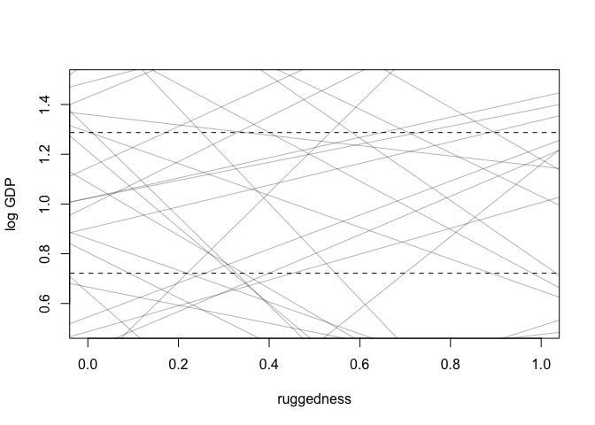<!-- -->


code 8.4

```r
#sum( abs(prior$b) > 0.6 ) / length(prior$bR)

sum( abs(prior$b) > 0.6 ) / length(prior$b)
```

```
## [1] 0.545
```

code 8.5

```r
m8.1 <- quap(
  alist(
    log_gdp_std ~ dnorm( mu , sigma ) ,
    mu <- a + b*( rugged_std - 0.215 ) ,
    a ~ dnorm( 1 , 0.1 ) ,
    b ~ dnorm( 0 , 0.3 ) ,
    sigma ~ dexp(1)
  ) , data=d.A1 )
```

code 8.6.  non-african countries


```r
# Non-African nations
m8.2 <- quap(
  alist(
    log_gdp_std ~ dnorm( mu , sigma ) ,
    mu <- a + b*( rugged_std - 0.215 ) ,
    a ~ dnorm( 1 , 0.1 ) ,
    b ~ dnorm( 0 , 0.25 ) ,
    sigma ~ dexp(1)
    ) ,
  data=d.A0 )
```


```r
plot(precis(m8.1))
```

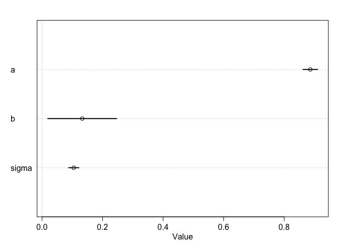<!-- -->


```r
plot(precis(m8.2))
```

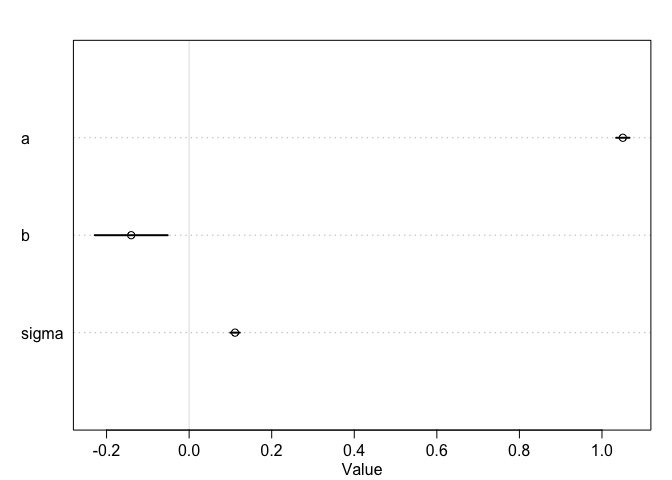<!-- -->
code 8.7


```r
m8.3 <- quap( 
  alist(
    log_gdp_std ~ dnorm( mu , sigma ) ,
    mu <- a + b*( rugged_std - 0.215 ) ,
    a ~ dnorm( 1 , 0.1 ) ,
    b ~ dnorm( 0 , 0.3 ) ,
    sigma ~ dexp( 1 )
  ) ,
  data=dd )
```


```r
plot(precis(m8.3))
```

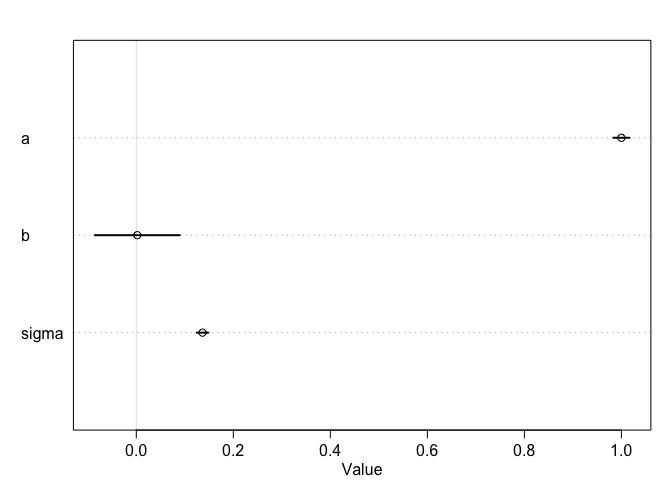<!-- -->

code 8.8


```r
# make variable to index Africa (1) or not (2) 8.8
dd$cid <- ifelse( dd$cont_africa==1 , 1 , 2 )
```

code 8.9


```r
m8.4 <- quap(
  alist(
    log_gdp_std ~ dnorm( mu , sigma ) ,
    mu <- a[cid] + b*( rugged_std - 0.215 ) ,
    a[cid] ~ dnorm( 1 , 0.1 ) ,
    b ~ dnorm( 0 , 0.3 ) ,
    sigma ~ dexp( 1 )
  ) ,
  data=dd )
```

now compare

code 8.10

```r
compare(m8.3, m8.4)
```

```
##           WAIC    pWAIC   dWAIC       weight       SE      dSE
## m8.4 -252.2793 4.251978  0.0000 1.000000e+00 15.29497       NA
## m8.3 -188.7519 2.693455 63.5274 1.603984e-14 13.28923 15.14053
```

code 8.11

```r
plot(precis(m8.4, depth = 2))
```

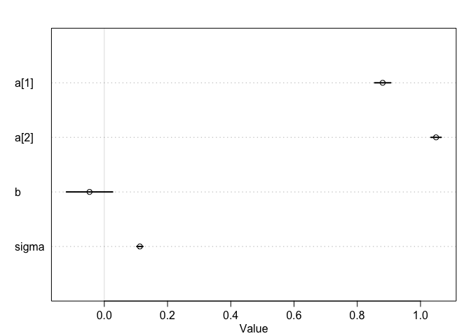<!-- -->

code 8.12
plot posterior predictions

```r
rugged.seq <- seq( from=-0.1 , to=1.1 , length.out=30 )

# compute mu over samples, fixing cid=2
mu.NotAfrica <- link( m8.4 ,
                      data=data.frame( cid=2 , rugged_std=rugged.seq ) )

# compute mu over samples, fixing cid=1
mu.Africa <- link( m8.4 ,
                   data=data.frame( cid=1 , rugged_std=rugged.seq ) )

# summarize to means and intervals
mu.NotAfrica_mu <- apply( mu.NotAfrica , 2 , mean )
mu.NotAfrica_ci <- apply( mu.NotAfrica , 2 , PI , prob=0.97 )
mu.Africa_mu <- apply( mu.Africa , 2 , mean )
mu.Africa_ci <- apply( mu.Africa , 2 , PI , prob=0.97 )
```

now add an interaction effect: slope conditional on continent
(in a DAG, an interaction is two arrows entering a varaible:   R -->  G  <--  C  )
this is same as G = f(R, C)

code 8.13


```r
m8.5 <- quap(
  alist(
    log_gdp_std ~ dnorm( mu , sigma ) ,
    mu <- a[cid] + b[cid]*( rugged_std - 0.215 ) ,
    a[cid] ~ dnorm( 1 , 0.1 ) ,
    b[cid] ~ dnorm( 0 , 0.3 ) ,
    sigma ~ dexp( 1 )
  ) ,
  data=dd )
```

code 8.14


```r
plot(precis(m8.5, depth = 2))
```

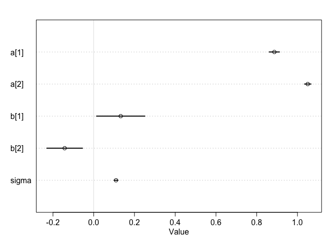<!-- -->

compare!  code 8.15


```r
compare(m8.3, m8.4, m8.5)
```

```
##           WAIC    pWAIC     dWAIC       weight       SE       dSE
## m8.5 -258.2581 5.608769  0.000000 9.544522e-01 15.26863        NA
## m8.4 -252.1734 4.288529  6.084752 4.554778e-02 15.29425  6.764469
## m8.3 -188.9108 2.616449 69.347319 8.340176e-16 13.34484 15.593212
```

Now look at the WAIC point by point.  
"the simplest approximation of how sensitive a model is the sample, and therefore the overfitting risk, is just hte variance in log-probability"

code 8.16


```r
waic_list <- WAIC( m8.5 , pointwise=TRUE )
```

BUT what are we supposed to do with this?

code 8.17 - plot hte interaction

```r
# plot Africa - cid=1
plot( d.A1$rugged_std , d.A1$log_gdp_std , pch=16 , col=rangi2 ,
      xlab="ruggedness (standardized)" , ylab="log GDP (as proportion of mean)" ,
      xlim=c(0,1) )
mu <- link( m8.5 , data=data.frame( cid=1 , rugged_std=rugged_seq ) )
mu_mean <- apply( mu , 2 , mean )
mu_ci <- apply( mu , 2 , PI , prob=0.97 )
lines( rugged_seq , mu_mean , lwd=2 )
shade( mu_ci , rugged_seq , col=col.alpha(rangi2,0.3) )
mtext("African nations")
```

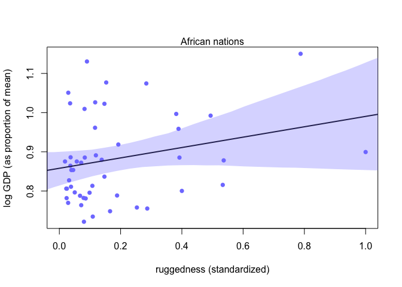<!-- -->

And, 

```r
# plot non-Africa - cid=2
plot( d.A0$rugged_std , d.A0$log_gdp_std , pch=1 , col="black" ,
      xlab="ruggedness (standardized)" , ylab="log GDP (as proportion of mean)" ,
      xlim=c(0,1) )
mu <- link( m8.5 , data=data.frame( cid=2 , rugged_std=rugged_seq ) )
mu_mean <- apply( mu , 2 , mean )
mu_ci <- apply( mu , 2 , PI , prob=0.97 )
lines( rugged_seq , mu_mean , lwd=2 )
shade( mu_ci , rugged_seq )
mtext("Non-African nations")
```

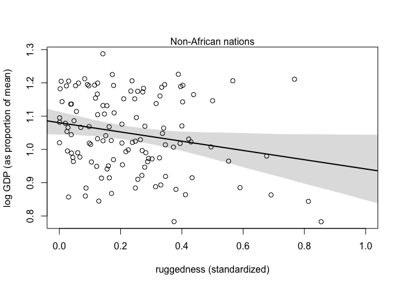<!-- -->


## Problems: 

(note that these are labelled as "7" in chapter 8)

### 7E1  For each of the causal relationships below, name a hypothetical third variable that would lead to an interaction effect.

#### (1) Bread dough rises because of yeast.
The composition of the dough (e.g. salt content) affect rise as well.    Y -->  rise <-- D

#### (2) Education leads to higher income.
And the country of residence affects income as well.     E -->  income   <- C

#### (3) Gasoline makes a car go
Tires matter also.                    G --> motion <-- T


### 7M3
In parts of North America, ravens depend upon wolves for their food. This is because ravens are carnivorous but cannot usually kill or open carcasses of prey. Wolves however can and do kill and tear open animals, and they tolerate ravens co-feeding at their kills. This species relationship is generally described as a “species interaction.” Can you invent a hypothetical set of data on raven population size in which this relationship would manifest as a statistical interaction? Do you think the biological interaction could be linear? Why or why not?

OK, let's consider.  At least to some degree, more wolves will mean more food for ravens will mean more ravens (larger raven population).  But too many wolves will lead to a population crash of their prey, also affecting the raven population.  And I imagine even in the complete absence of wolves there would be some ravens (lets say they eat roadkill).  So the relationship between wolf and raven could be linear up to a point, but not above that

I could invent a dataset with base raven population of 1,000 (no wolves).  In nearby areas, wolf population would increase raven population, up to a certain level.  Above that level, the prey and raven populations would decrease.

wolf -->     ravens   <-- prey


```r
library(dagitty)
dag.7m3 <- dagitty( "dag {
                    wolf -> raven
                    prey -> raven
                    wolf -> prey
                    prey -> wolf
                    }")

coordinates(dag.7m3) <- list( x=c(wolf=0,prey=1,raven=2) , y=c(wolf=0,prey=1,raven=0) )
plot(dag.7m3)
```

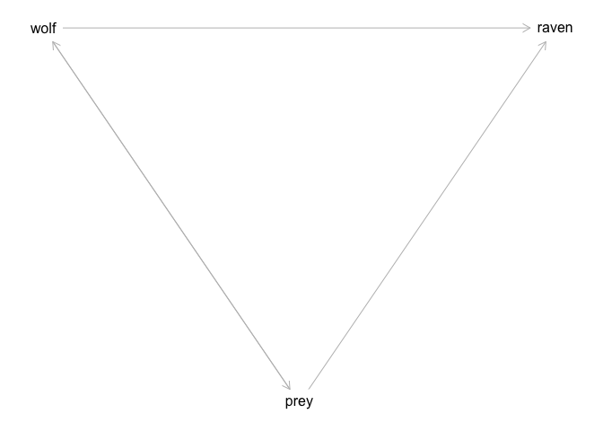<!-- -->
I don't really like that, since I think wolf only affects raven through prey


```r
dag.7m3.2 <- dagitty( "dag {
                    prey -> raven
                    wolf -> prey
                    prey -> wolf
                    }")

coordinates(dag.7m3.2) <- list( x=c(wolf=0,prey=1,raven=2) , y=c(wolf=0,prey=1,raven=0) )
plot(dag.7m3.2)
```

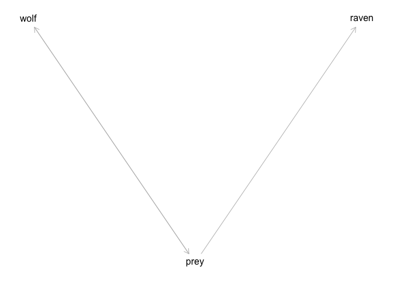<!-- -->

Here, the prey population is the collider.  Best model would be of raven population vs dead prey.

Try again

```r
dag.7m3.3 <- dagitty( "dag {
                    dead.prey -> raven
                    wolf -> dead.prey
                    live.prey -> dead.prey
                    wolf -> live.prey
                    live.prey -> wolf
                    }")

coordinates(dag.7m3.3) <- list( x=c(wolf=0,live.prey=1,dead.prey=2, raven=3) , y=c(wolf=0,live.prey=1,dead.prey =0, raven=0) )
plot(dag.7m3.3)
```

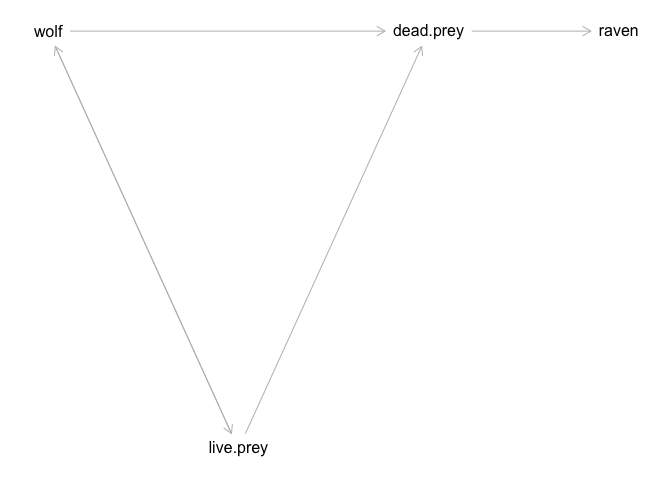<!-- -->


### 7H3
Consider again the data(rugged) data on economic development and terrain ruggedness,
examined in this chapter. One of the African countries in that example, Seychelles, is far outside
the cloud of other nations, being a rare country with both relatively high GDP and high ruggedness.
Seychelles is also unusual, in that it is a group of islands far from the coast of mainland Africa, and
its main economic activity is tourism.


### Plus, use the tomato.csv (attached) data set and evaluate whether hypocotyl length ("hyp") is affected by shade ("trt"), species ("species") and their interaction.
