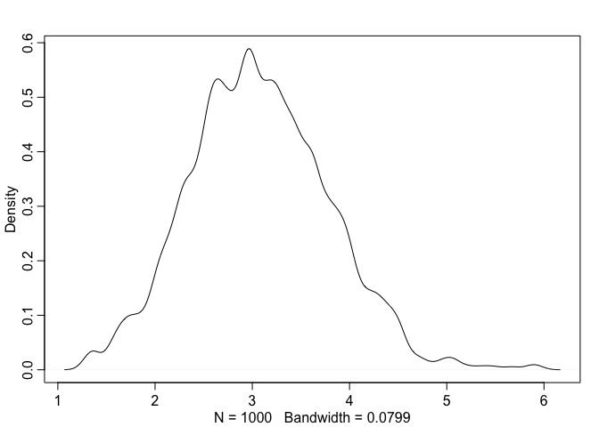

#Video, lecture 10 
https://www.youtube.com/watch?v=v-j0UmWf3Us
up through  32:30 "Metropolis gets stuck"

previously: used quadratic approximation (quap - works really well for many simple models. and same methods as max likelihood estimations)

next: new way to estimate posterior distribution. Markov chain Monte Carlo

simple Metropolis algorithm for King Markov. proposal island vs current island.  coin flip. probabilty of moving depends upon ratio of the pop of the two islands.  In long run, visit length proportional to population size.

advantage: don't need to know a prior the poterior distirution (that is, the population on each island)

ex works, but slow and inefficient.  takes a lot of iterations, though.  proposals must be symmetric (moving left or right)

Metropolis algorithm - developed to simulate fusion inside bombs.
simplest version of MCMC
chain = sequence of draws from distribution.  
Markov chain = history doesn't matter, only current state.

quap - uses optimizaiton.  but this not good wiht high dimensions.  if too many parameters, it just doesn't work.  (mode no longer relevant)

Metropolis-Hastings - more general (doesn't require symmetric propsals)
Gibbs sampling = efficient version of MH
Both are 'guess and check' strategies.  (quality of proposals is key.)
smart proposals = faster solution.  (want all proposals to be accepted to accelerate touring)

Hamiltonian Monte Carlo (HMC) is differnet!  
not guess and check, so more efficient.  use gradient instead.  
if distribution not even, movemnet very inefficient.  long run is now very long indeed.  doesnt' know anything about distribution so works inefficiently.

Problem = guessing and checking.

# Book

## 9.1 

```r
runif(1)
```

```
## [1] 0.830183
```

```r
sample( c(-1,1) , size=1 )
```

```
## [1] -1
```

code 9.1

```r
num_weeks <- 1e5 
positions <- rep(0,num_weeks)
current <- 10

for ( i in 1:num_weeks ) {
  # record current position
  positions[i] <- current
  
  # flip coin to generate proposal
  proposal <- current + sample( c(-1,1) , size=1 )
  # now make sure he loops around the archipelago
  if ( proposal < 1 ) proposal <- 10
  if ( proposal > 10 ) proposal <- 1

  # move?
  prob_move <- proposal/current
  current <- ifelse( runif(1) < prob_move , proposal , current )
}
```

## 9.2

### Gibbs sampling

requires conjugate priors (combinations of prior distributions and likelihoods)

models with many parameters usually have regions of high correlation in the posterior - hard to sample effectively.

code 9.2


```r
library(rethinking)
```

```
## Loading required package: rstan
```

```
## Loading required package: ggplot2
```

```
## Loading required package: StanHeaders
```

```
## rstan (Version 2.18.2, GitRev: 2e1f913d3ca3)
```

```
## For execution on a local, multicore CPU with excess RAM we recommend calling
## options(mc.cores = parallel::detectCores()).
## To avoid recompilation of unchanged Stan programs, we recommend calling
## rstan_options(auto_write = TRUE)
```

```
## Loading required package: parallel
```

```
## rethinking (Version 1.88)
```

```r
D <- 10 
T <- 1e3
Y <- rmvnorm(T,rep(0,D),diag(D))

rad_dist <- function( Y ) sqrt( sum(Y^2) )
Rd <- sapply( 1:T , function(i) rad_dist( Y[i,] ) )
dens( Rd )
```

<!-- -->

I don't really get the arguemnt about probability mass and mode.

p 297
## problems 

### 8E1 
Simple Metropolis algoroithm:  proposal distribution must be symmetric

### 8E2

Gibbs is more efficient than Metropolis because it samples posterior effectively using fewer samples.  How?  it's clever enought to adjust the proposed parameter values depending upon current parameter values.  It does this by using 'conjugate pairs': specific combinations of prior distributions and likelihoods.
